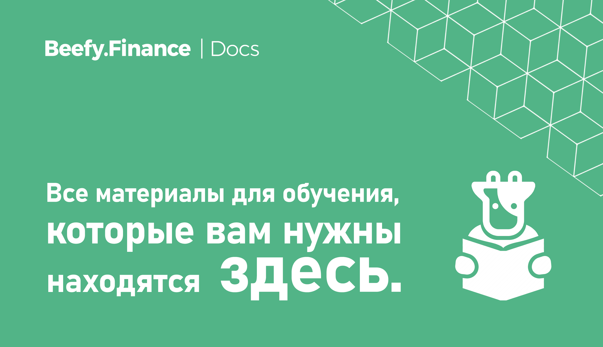

# Обзор

## Что такое Beefy Finance?

[Beefy Finance](https://beefy.finance/) - это Децентрализованная Кросс-чейн платформа по Оптимизации Доходности, которая дает возможность своим пользователям зарабатывать сложный процент по их криптоактивам.

Благодаря комплексу инвестиционных стратегий, защищенных и исполняемых смарт-контрактами, Beefy Finance автоматически максимизирует прибыль пользователей от участия в различных пулах ликвидности \(LPs\),‌ ‌ проектах автоматического маркет-мейкинга \(AMM\),‌ ‌и‌ ‌от других возможностей доходного фермерства‌ ‌в экосистеме DeFi.

Главным продуктом, предлагаемым Beefy Finance, являются 'Хранилища', в которые вы вносите свои токены. Инвестиционная стратегия, будучи привязанной к конкретному хранилищу, автоматически будет увеличивать количество внесеных токенов, реинвестируя прибыль с доходного фермерства обратно в депозит. Термин "Хранилище" не предполагает централизованного хранения ваших средств в каком либо хранилище Beefy Finance. Вы всегда в праве вывести свои средства из хранилища в любой момент.

Уникальность DeFi приложений заключается в том, что ими могут пользоваться все без исключений и им не надо доверять. Любой у кого есть кошелек, поддерживаемый приложением, может пользоваться им без нужды доверять свои средства третьей стороне. Пока ваши средства находятся в хранилище, они все еще остаются под вашим полным контролем.

## Что такое $BIFI?

$BIFI токены - это доля в Beefy Finance, которая дает право на получение дохода от прибыли, формируемой протоколом. Кроме того, держатели токена имеют право голоса при принятии важных решений в платформе.

Для всех хранилищ на разных блокчейнах у Beefy Finance есть свой нативный токен управления - $BIFI. Прибыль платформы формируется за счет небольшого процента, взимаемого со всех хранилищ. Эта прибыль распределяется между теми держателями токенов $BIFI, которые их стейкают.

Общая эмиссия $BIFI ограничена 80,000-ми единицами. Токен торгуется на крупнейших децентрализованных и централизованных биржах, таких как: Binance, 1inchexchange и PancakeSwap.

