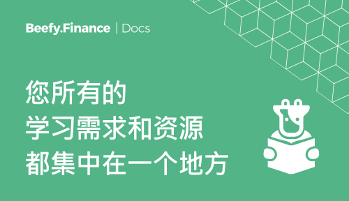

# 概要

## Beefy Finance 是什么？

[Beefy Finance](https://beefy.finance) 是一个去中心化多链收益优化平台，能使用户从其数字资产中持续获得复利。

通过一套由智能合约保护和执行的投资策略，Beefy Finance 自动从各种流动性池 (LPs)、自动化做市 (AMM) 项目和 DeFi 生态系统中的其他流动性挖矿机会中自动最大化用户奖励。

Beefy Finance 提供的主要产品是“金库”，您可以在其中质押您的加密代币。 与特定金库挂钩的投资策略将通过复利的方式，把任意收益农场获得奖励的代币，复合回您最初存入的资产来自动增加您存入的代币数量。 尽管名称为“金库”，但您的资金永远不会被锁定在 Beefy Finance 的任何金库中：您总是可以在任何时间提出您的资产。

DeFi 应用程序的独创性在于它无需获取授权和信任，这意味着任何拥有受支持钱包的人都可以与其进行交互，而无需一位受信任的中间人。 当您将资金存入金库时，您仍然100%控制着您的加密货币。

## BIFI币是什么？

$BIFI 代币是 Beefy Finance 中“符合派息条件”的收入份额，持有者通过这些代币赚取 Beefy Finance 产生的利润，并有权对重要的平台决策进行投票。

对于部署在每个区块链上的所有金库，Beefy Finance 以其原生治理代币 $BIFI 为核心。 平台收入来自所有金库利润的一小部分，并分配回给那些持有 $BIFI 的人。

收益分享机制意味着您可以在 BIFI Maxi 金库中质押 $BIFI 以赚取更多 $BIFI。您也可以质押在各网络的治理池中以赚取该网络的治理代币，如 $ETH, $BNB, $FTM, $MATIC, $AVAX, $HT, $ONE, $CELO 或 $MOVR。

$BIFI 的供应量仅限于 80,000 个代币，可在 Binance、1inch exchange 和 PancakeSwap 等顶级去中心化交易所获得。
