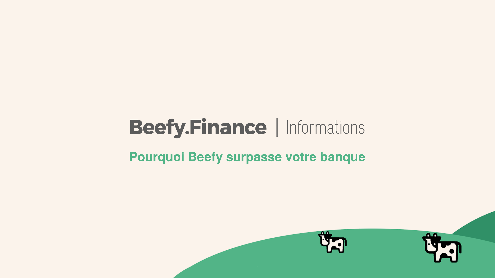

# Why Beefy Beats Your Bank

A question the wealthiest people in the world obsess over:

**"What is the biggest opportunity for investors right now?"**

It would be imprudent to mention more than superficial details, but it's common knowledge that there are financial benefits, investment vehicles and tax advantages accessible to high net-worth individuals that are closed to everyone else.

_What we can talk about is how traditional banks work, and demonstrate clearly why Beefy.Finance is a better option._

When you give money to a bank, it lends that money out to other people at a higher rate than you get for "saving".

**The bank pockets the difference as revenue.**

And that money is used to pay for things like staff, rent, call centers, security guards and a myriad of other operating expenses that may or may not be justified.

**Meanwhile Beefy is a decentralized autonomous organisation, collectively owned and managed by its users.**

Decisions are not a top-down event. So instead of the earnings going to a small clique of champagne-quaffing executives, they can only be redistributed with the approval of the organization. DAOs like Beefy are governed by proposals and voting. Code automates the everyday actions banks pay clerks to execute, while cryptography protects your funds.

**So, there are two things happening here:**

First, a DAO is significantly more efficient than a bank. Second, there is a huge demand for better APY than the 0.1% currently on offer by most institutions, which is significantly less than the current inflation rate of 2%.

When you learn that there is a new and safe way to store your money with an APY that is **at least 70x** as good as your bank...

And you appreciate that this APY is available because DAOs are fundamentally better organized to pass on efficiency savings to their users...

You might reasonably ask how soon you can get started.

And the answer to that is today.

**Because, unlike banks, there's no approval process.**
