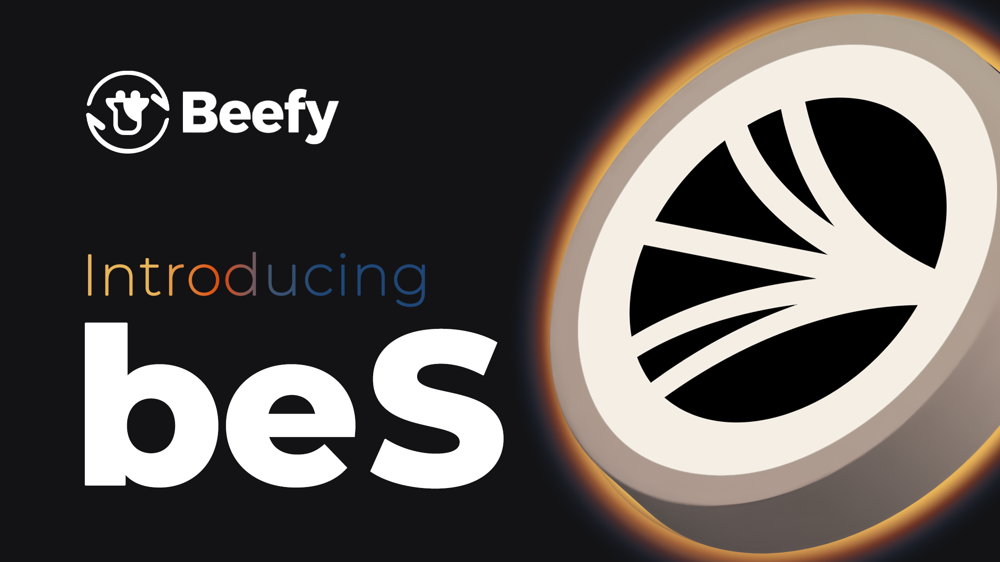

# beS

Beefy-escrowed Sonic (or _**"beS"**_) is a liquid-staking token that supports the Sonic ecosystem. It aims to deliver the benefits of native staking on Sonic to Beefy's users, while increasing the quantity of staked Sonic securing the ecosystem.

In this section, we explore the functionality and details of beS' operations, and provide links to various resources to help you learn more.

<figure><figcaption></figcaption></figure>

## How does beS work?

New beS tokens are issued when users deposit wS tokens into the beS smart contract, whether directly or through the Beefy UI. Those wS tokens are automatically staked to generate rewards, which accrue to the beS tokenholders without further action — meaning beS is a yield-bearing token.

Behind the scenes, rewards are regularly claimed and redistributed to beS holders through the beS vault when the _`harvest()`_ function is called. The harvest is automated by Beefy's Cowllector to occur at least every 24 hours. Unlike some Beefy products, beS does not have unconstrained harvests or harvest-on-deposit functionality, because a minimum quantity of tokens is needed for an effective restaking. The contract stores a _`lockDuration()`_  variable (initially set to 1 day), during which no additional S can be staked. This prevents denial of service attacks.

When a user is finished with the product and wishes to exit, they initiate a withdrawal either directly to the contract or through the Beefy UI.

## How do beS withdrawals work?

Sonic withdrawals are configured to last 14 days, so beS withdrawals inherit an unavoidable 14-day delay period. Users can trigger a withdrawal either directly through the smart contract or through the Beefy UI.&#x20;

Withdrawals can be made in whole or in part, meaning multiple withdrawals can be run in parallel. All current withdrawals associated with the user's address will be displayed when accessing the Beefy UI with that address connected.

The quantity selected by the user for withdrawal will include the nominal share of yield generated on those assets, meaning users will always withdraw with a larger quantity of wS per wS deposited (or _`pricePerFullShare()`_ ) than when they deposited (provided beS has harvested between withdrawal and deposit). However, validators do not earn wS rewards while in the withdrawal process, so the amount of yield generated will be fixed when the withdrawal is triggered.

## Is beS always staked in Beefy's Sonic Validator?

No! Beefy's [Sonic Validator](https://my.soniclabs.com/stake/validators/0x1f/add-stake) has a limited capacity for staking, so it's foreseeable that the demand for beS may exceed the capacity of the validator. In such circumstances, additional validators can be added to beS' configuration, so that when all existing validators have zero capacity, the additional validator will receive any balance. This gives the product complete scalability.

In terms of the user experience, there is no impact of splitting staking across multiple validators. All the rewards are pooled and split equally among all users, so differences in the performance of different validators will affect all beS users equally. Likewise, if any of the validators used are slashed for any reason, the impact of that event on aggregate rewards will be socialised (or split equally) among all beS users.

Working with other partner validators opens up the possibility of deals and collaborations where Beefy is delivering significant volume. It also helps to encourage validator diversity across the ecosystem.

## What fees do I pay for using beS?

beS imposes two fees at the smart contract level through the _`_chargeFees()`_  internal method. The two fees are both taken as a percentage of the staking yield generated by beS through staking user deposits. The two fees are:

* **the standard Beefy fee of 9.5%** - which is distributed to tokenholders and treasury;
* **a new&#x20;**_**"liquidity fee"**_**&#x20;of 10%** - which is indirectly distributed back to users through activities which support beS' liquidity, as described below.

## What is the _"liquidity fee"_?

The liquidity fee is a new mechanism introduced for beS, aimed at building a competitive and well-adopted product.&#x20;

Liquid-staking products thrive on scale economics, and often require large amounts of bootstrapping (via issuer-led liquidity, incentives and partner deals) to build up momentum. Products that fail to scale typically perform worse. Where there is an element of chance in who is selected to propose new blocks, large staking operations with more validators are much more likely to be selected, and the benefits of being selected are shared with everyone, meaning users get much more frequent exposure to proposal rewards (even if those are spread more thinly).

beS' liquidity fee works by taking 10% of all earnings from its staking efforts and reinvesting them. The fees are sent to a [Liquidity Fee Safe](https://sonicscan.org/address/0xA3018Fd7ca0a3BA414cF52f06A6F1Be39b93b94E) wherein they are managed by members of the Beefy Treasury Council. These will then be used for bribes, boosts and other liquidity incentives whenever sufficient rewards have accrued. Decisions on how best to use the liquidity fee will be taken by the Treasury Council, always seeking to maximise uptake, liquidity and available yields for users. Where appropriate, the Treasury Council will seek to locate and make use of strategic deals with partners that leverage the liquidity fee to achieve an outsized benefit for users.

## How will the liquidity fee program benefit beS users?

As described in the [previous subsection](bes.md#what-is-the-liquidity-fee), liquid-staking products thrive on scale economics, so — in driving beS adoption forward — the liquidity fee should increase the likely yields of the product. Beyond that big picture goal, the liquidity fee provides a number of possible benefits to users:

* Increased yields for beS liquidity providers on exchanges;
* Increased liquidity for traders buying or selling beS on exchanges;
* Increased yields and liquidity for users of beS lending markets;
* Increased yields for Beefy users using beS products on Beefy;
* Increased yields for Beefy users participating in beS-related boosts on Beefy;
* A greater range of liquidity and integrations for beS;&#x20;
* Increased price stability through greater depth and diversity of liquidity;
* A route for instant entry or exit without delay through exchanges; and
* Increased yields on beS through growing adoption of the token.

## Do I need to buy wS in order to access beS?

Not necessarily. Beefy is partnering with various exchanges across the ecosystem to add liquidity for beS. This means users will be able to go to a variety of major exchanges or aggregators and swap from the tokens of their choosing into beS. However, this does not increase the supply beS, but rather takes advantage of existing liquidity. There may also be price differentials between the market price of beS on exchanges and the underlying value of beS in terms of the wS tokens the user is entitled to, so it's always best to verify the market value before swapping.

## Is beS pegged to wS?

Not in a strict sense, no. beS can always be redeemed for more wS, but with the 14-day withdrawal. Beyond this mechanism, other means of accessing beS are subject to market forces, and price may vary substantially depending on factors outside of Beefy's control. As such, there is the possibility for arbitrage, either where beS is overpriced (in which case more wS can be staked to sell beS), or where beS is underpriced (in which case beS can be purchased and withdrawn to wS for a profit).

## Is beS Audited?

Yes! Electisec delivered a thorough audit of the beS code base in late March/early April 2025. Their findings are published in their [beS audit report](https://github.com/beefyfinance/beefy-audits/blob/master/2025-04-05-Beefy-Electisec-beS-Audit.pdf).

## Where can I find the beS contracts?

The addresses and links for the deployed contracts on Sonic are in the table below:

<table><thead><tr><th width="194.265625">Contract</th><th width="422.83203125">Address &#x26; Link</th></tr></thead><tbody><tr><td>beS (Proxy)</td><td><a href="https://sonicscan.org/address/0x871A101Dcf22fE4fE37be7B654098c801CBA1c88">0x871A101Dcf22fE4fE37be7B654098c801CBA1c88</a></td></tr><tr><td>beS (Implementation)</td><td><a href="https://sonicscan.org/address/0x207c0693df0aa6f615e39482c1d183cd0b15c173">0x207c0693df0aa6f615e39482c1d183cd0b15c173</a></td></tr><tr><td>Liquidity Fee Safe</td><td><a href="https://sonicscan.org/address/0xA3018Fd7ca0a3BA414cF52f06A6F1Be39b93b94E">0xA3018Fd7ca0a3BA414cF52f06A6F1Be39b93b94E</a></td></tr></tbody></table>

