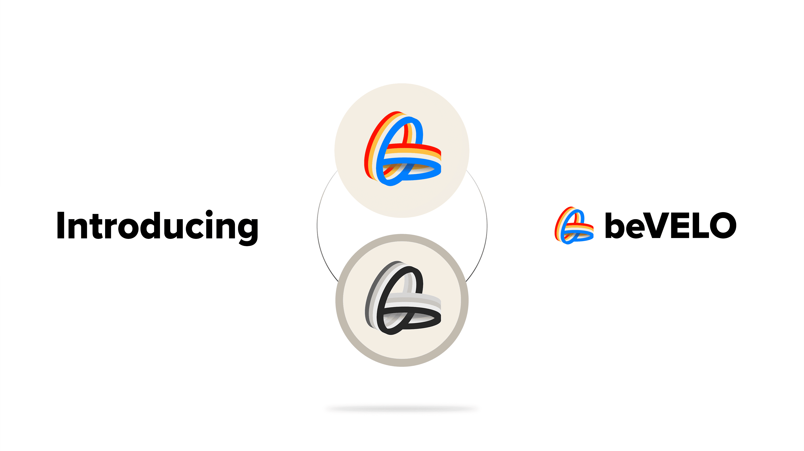

# beVELO


From June 2023, Velodrome has [migrated](bevelo.md#whats-this-i-hear-about-migration) to its V2 protocol, and $VELO V1 has been retired in favour of $VELO V2. To continuing earning from $beVELO, all users are advised to redeposit in the [beVELO Migration Pool](https://app.beefy.com/vault/beefy-bevelo-v2-earnings), where earnings are paid out in $VELO V2.


## What is $VELO?

$VELO is the native token of Velodrome Finance, a decentralised trading and liquidity marketplace native to the Optimism blockchain. It rewards holders with a share of the platform's revenues and also acts as a governance token for its weekly pool incentives gauge. $VELO has a fixed supply and decaying emissions model.

Users can stake and lock their $VELO tokens on Velodrome for a fixed period between 1 week and 4 years, to receive a vote escrow NFT ("**veNFT**"), which is used to record the amount of veVELO held by the user. Accumulating veVELO provides users with three benefits: (1) a share of the trading fees from swaps using the platform's liquidity pools; (2) the ability to direct $VELO emissions distributed to platform liquidity providers; and (3) the opportunity to earn bribes from external parties by voting for their incentivised liquidity pools. $VELO staking can can be done through Velodrome's [web app](https://velodrome.finance/).

veVELO is non-transferrable and the amount held by a given user decreases steadily to zero as the lock period moves towards its completion. Users also cannot liquidate or transfer their locked $VELO positions until the end of the time lock.

In June 2023, Velodrome [migrated](bevelo.md#whats-this-i-hear-about-migration) from $VELO V1 to $VELO V2.

## What is beVELO?

$beVELO is a Beefy-escrowed version of $VELO V1, staked for veVELO to take advantage of the various benefits offered to Velodrome stakers.

The token is fully backed 1:1 by $VELO V1, which can be redeemed where tokens are available in the reserve. This reserve fills up on several circumstances:

1. when new users deposit $VELO into $beVELO, if below the required reserve amount at the time; and
2. if the contract's staked $VELO V1 is left to gradually unlock.

<figure><figcaption>
beVELO is designed to capture the maximum possible rewards and benefits from Velodrome's vote escrow tokenomics.
</figcaption></figure>

## How does one get $beVELO?

You can mint $beVELO on the $beVELO [vault page](https://app.beefy.finance/vault/beefy-bevelo) at a 1:1 ratio. There is also a Velodrome [liquidity pool](https://optimistic.etherscan.io/address/0xC6c7B143295b2920DA41369e9627245FaB8c1CcE) for swapping between $beVELO and $VELO V1, though in light of the [migration](bevelo.md#whats-this-i-hear-about-migration) to $VELO V2, there is limited liquidity and a risk of high slippage when using this pool.

## How does $beVELO work?

When you mint $beVELO, the contract will immediately try to stake and lock the deposited $VELO into veVELO, subject to the required reserve being maintained.

If the contract's $VELO reserves at the time of minting exceed the required reserve amount (which is currently 20% of the contract's veVELO), the contract can stake any excess $VELO into veVELO. If the $VELO reserves are under the required reserve amount, then the deposited $VELO will be added to the reserve to cover the current shortfall.

Once the contract's $VELO is staked and locked into veVELO, it receives $VELO V2 rewards paid out by Velodrome's protocol. As the $beVELO contract perpetually re-locks its $VELO V1 deposits, it always strives for the maximum amount of voting power and benefits. $VELO V2 rewards are regularly harvested and returned to holders in the [beVELO Migration Pool](https://app.beefy.com/vault/beefy-bevelo-v2-earningshttps://app.beefy.com/vault/beefy-bevelo-v2-earnings).

## How can I earn with my $beVELO?

Once you're holding $beVELO, you can stake it in our [beVELO Migration Pool](https://app.beefy.com/vault/beefy-bevelo-v2-earnings) to earn $VELO V2. $VELO V2 rewards are paid out directly rather than autocompounded as the underlying $VELO V1 has been retired.

<figure><figcaption>
$beVELO can be deposited into our beVELO Migration Pool to earn $VELO V2
</figcaption></figure>

## But what about fees?

Beefy strives to maintain some of the lowest yield-optimizing fees, and charges standard fees on its $beVELO vault.

## Can I vote with my $beVELO?

No. All $VELO voting power will be used by Beefy to vote in the weekly liquidity pool incentives gauge.&#x20;

Votes will typically be directed either to the liquidity pools offering the most in trading fees and bribes, or to the liquidity pools which support our $BIFI token (e.g. BIFI-OP LP). Voting on Velodrome's incentivised liquidity pools takes place on its [web app](https://app.velodrome.finance/vote).

If you are interested in proposing a bribe to Beefy, please reach out to the Core team on Discord, Telegram or Twitter to find out more.

## What's this I hear about migration?

In June 2023, Velodrome retired their original $VELO V1 token as part of the upgrade to their V2 web app, and adopted the new $VELO V2, which provides a range of additional features. As a result, Beefy has retired and redeployed many of the existing Beefy Velodrome vaults. Users can swap their V1 tokens for V2 at a 1:1 ratio on the [Velodrome app](https://velodrome.finance/).

For $beVELO, the new protocol design does not include functionality for $VELO V1 liquid-staking derivatives, meaning the product cannot be upgraded. Instead, Beefy has implemented a [$beVELO Migration Pool](https://app.beefy.com/vault/beefy-bevelo-v2-earnings), which allows users to get the benefit of the its $VELO V1 voting power, and rewards paid out in $VELO V2. All users are urged to redeposit their $beVELO into the Migration Pool to continue earning following the migration.
