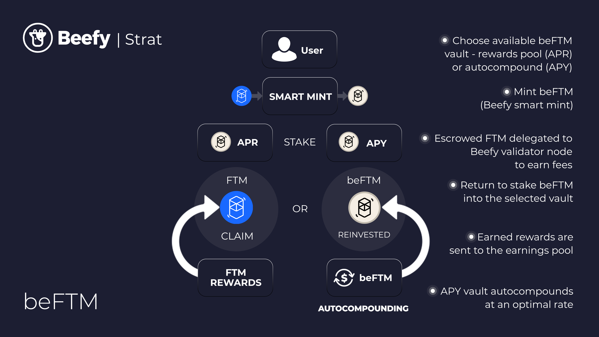

# beFTM


Note that following the passage of [\[BIP-67\]](https://snapshot.org/#/beefydao.eth/proposal/0x895f2b854b98eef94acf5e2f77bea7e2e9bdabde7167b9de280f33f872a2bc1e), the current version of beFTM will be gradually deprecated with all existing FTM deposited to be unlocked by 3 April 2024. Beefy's developer team is exploring a replacement V2 beFTM, to be released closer to the end of the deprecation period.


## What is beFTM?&#x20;

beFTM is short for Beefy-escrowed Fantom. beFTM gives stakers access to maximized Validator Node rewards that typically aren’t available to the individual investor without locking FTM for 1 year. The beFTM token is 1:1 backed by FTM and can be staked on the Beefy platform and in farms on major DEXes.

## How does one get beFTM?

To get your hands on beFTM, users must first deposit their FTM in the Beefy Delegator Vault. The FTM is then used to buy beFTM from a liquidity pool or minted 1:1 depending on which is most profitable for the user.

.jpg>)

beFTM can also be manually purchased on many DEXes such as Solidly, BeethovenX, SpiritSwap, and SpookySwap. One might need the beFTM contract address for trading: [0x7381eD41F6dE418DdE5e84B55590422a57917886](https://ftmscan.com/token/0x7381eD41F6dE418DdE5e84B55590422a57917886)

## How does beFTM delegation work?&#x20;

The collective pool of FTM is delegated to [Beefy’s Validator Node](https://ftmscan.com/address/0xe97a5292248c2647466222dc58563046b3e34b18#validatorinfo) and perpetually locked as long as possible (51 weeks) to earn maximum validator rewards. We supply 1/15 of the deposit to our validator so we never hit the delegation limit. By staking our users’ FTM together, the Cowmoonity enjoys a much higher rate of return.&#x20;

## beFTM Earnings Pool and beFTM Vault

After depositing FTM to get beFTM, the FTM gets delegated to Beefy's Validator Node. The validator stakes the FTM tokens to help secure the Fantom network, and earns WFTM tokens as a reward. The WFTM rewards will be collected and distributed daily to the beFTM Earnings Pool where users can stake beFTM to earn WFTM. The beFTM Vault deposits the beFTM in the Earnings Pool and uses the share of the vault to buyback beFTM with the WFTM rewards. By doing so, the beFTM vault adds a continuous buying pressure to the beFTM token price.

## What can I do with beFTM?&#x20;

* Deposit beFTM in the beFTM Vault for compounded interest in the form of more beFTM;
* Deposit beFTM in the WFTM Earnings Pool for simple interest with WFTM rewards;
* Stake in beFTM-FTM liquidity pools on all the major DEXes on Fantom.

## How does the beFTM strategy work?

## How does beFTM keep its peg?


While beFTM is backed 1 to 1 by FTM, it is not designed to keep a 1 to 1 peg with FTM: ultimately its price determined by the market.


There are several mechanisms in place to help beFTM maintain peg against FTM. First of all, Beefy's Smart Minter will not issue new beFTM tokens when the price of beFTM is below the price of FTM, it will instead buy beFTM from a liquidity pool helping to restore the peg and giving the user a more profitable option. Secondly, the beFTM vault adds a continuous buying pressure to the beFTM token price. Lastly, arbitrageurs will either buy and sell beFTM depending on the peg.

In a hypothetical situation where the peg crashes to 0 with no signs of recovery, Beefy's Validator Node can be paused, forfeiting all pending rewards, and after waiting 1 full week everyone will be able to redeem their beFTM for the delegated FTM.

## V1 Deprecation

In late March 2023, the Beefy Core team proposed the deprecation of the existing version of beFTM, to allow all FTM deposited in the current version to be unlocked and an improved V2 to be developed and deployed. The [\[BIP-67\] proposal](https://snapshot.org/#/beefydao.eth/proposal/0x895f2b854b98eef94acf5e2f77bea7e2e9bdabde7167b9de280f33f872a2bc1e) called to initiate an unlock on 3 April 2023, with the full unlock being completed by 3 April 2024. The proposal also calls for a V2 to be developed closer to the time in include better redemption capabilities. The proposal passed with a 99% margin on 2 April 2023.&#x20;
