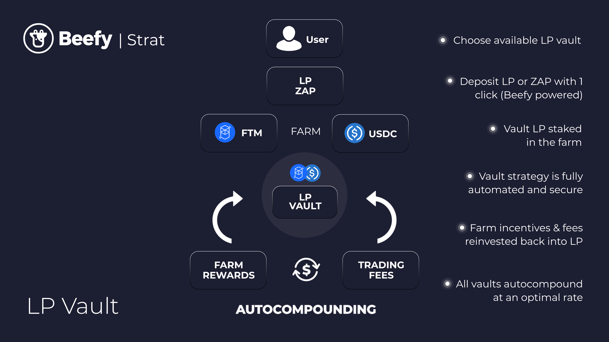
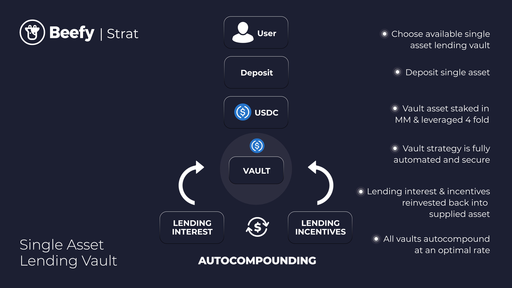

# Strategies

### What is a Strategy?

Beefy strategies are modular smart contracts which direct the user funds deposited into [vaults.md](vaults.md "mention") towards liquidity pools and farms in order to generate the yield which Beefy compounds. Where sufficient rewards have amassed in the strategy contract for Beefy to profitably reinvest them, the strategy executes the compounding workflow (or [#harvest](../developer-documentation/strategy-contract/#harvest "mention")), which automatically claims the rewards, swaps them for the principal assets and redeposits them into the liquidity pool and farm.

Strategies are the core product which of Beefy's protocol, as - unlike the vault contract - each strategy is generally unique. Because each strategy involves a different combination of assets, pools, protocols and chains, each requires [individual testing](../safety/beefy-safu-practices.md#new-vault-testing-procedure) to ensure it is working as intended before it can be pushed into production.

As strategies are the component of a Beefy Vault which interact with external protocols, they are also the component which contains exposure to extrinsic risks beyond Beefy's control (e.g. flaws of the contracts of other protocols). Because of this, strategies contain additional functionality to respond to extrinsic risk, including the ability to [#panic](../developer-documentation/strategy-contract/#panic "mention") the vault - i.e. withdraw all funds from third party contracts to be held safely in the strategy - or [#pause-unpause](../developer-documentation/strategy-contract/#pause-unpause "mention") - i.e. halt the operation of all of the contract's functions.

### How do liquidity pool strategies work?

Beefy's most common product is a standard liquidity pool vault, often built on the Uniswap V2 standard (i.e. a 50/50 balance of two assets with uniform concentration across the pool).&#x20;

Taking this as an example, the workflow of the strategy starts with user deposits, which can be either the LP token, the underlying assets of the vault, or (with [ZAP V2](https://beefy.finance/articles/revolutionizing-beefy-zap-in-partnership-with-1inch/)) any supported bluechip asset or stablecoin. The deposit is secured in the vault to handle the deposit/withdrawal workflows, before being transmitted to the strategy.

The strategy then deposits the assets into the liquidity pool, and in turn the LP tokens into a farm, which begins to accrue both trading fees and farm rewards for the user.&#x20;

The vault then regularly claims the accrued rewards, routes them to a core liquidity pool for swap them back into the underlying asset, and then redeposits the underlying asset into the Beefy vault and strategy.

### How do lending strategies work?

Standard lending vaults work in a very similar way, taking assets deposited in the vault and deploying them into the lending pool of choice.&#x20;

Instead of trading fees and farm rewards, lending pools pay out interest on deposits and lending incentives, which need to be redeemed, exchanged and redeposited by the strategy.

### **Who is in control of the strategies?**

Each vault and strategy link is hardcoded, and the code has been built to be immutable, so once they are released, they become unalterable. No one can modify the vaults and strategies.

Modern Beefy strategies do however rely on the standard set out in EIP-1167, known as ["minimal proxy" contracts](https://blog.openzeppelin.com/deep-dive-into-the-minimal-proxy-contract). Minimal proxies reduce deployment costs for repetitive contracts (e.g. strategies) by maintaining the vast majority of core functionality in a single implementation contract. They then configure the individual characteristics of the specific strategy (e.g. the relevant tokens and pools) through the minimal proxy contract - which is a much smaller contract to deploy - which directs instructions through to the implementation contract.

Users should be aware of the distinction between minimal proxy contracts and the proxy pattern used to upgrade contracts. **Beefy's minimal proxy contracts are not upgradeable**, so Beefy cannot take your funds by a sly upgrade. The proxy is only used to reduce deployment costs.

With that said, all vault contracts do contain the functionality to change the strategy where - for example - an underlying DEX replaces its liquidity pool with an upgraded version. Strategy changes allow user funds to be retained in the vault (avoiding imposing migration costs on the user), but allow the strategy to be kept up to date. Strategies are replaced using the [#upgradestrat](../developer-documentation/vault-contract.md#upgradestrat "mention") function, and the [#proposestrat](../developer-documentation/vault-contract.md#proposestrat "mention") functions of the vault as a precursor, both of which emit trackable events to monitor strategy replacements.

### **How can I make a strategy?**

For users looking to get more involved and become a part of Beefy's team of strategists, you can post and discuss your strategy ideas in Beefy’s Discord in the #🎯-strategy-devs channel. Please make sure to provide detail of what pool and farm you're considering, what type of protocol they're on and what the APY is. There will be a template to help you get started.

### **What is APR and APY?**

APR reflects the simple interest rate over a year’s time, while APY describes the rate with the effect of compoundin&#x67;**.**

### **Is APY/365 the right way to determine daily gains?**

No, the effect of compounded interest is exponential, not linear. A daily compounded interest of 1% would yield 3678.34% a year. The correct formula for daily yield is: _Daily Yield = ((1 + Annual Yield) ^ (1/365.25)) - 1_.

### **How does Beefy optimize APY?**

Beefy automates the entire compounding process, making it close to optimal as possible. The key factor is the frequency of compounding events, which depends on different variables in the system, like current gas prices, rewards accrued and liquidity for swaps. Beefy's sophisticated harvesting automation technology is watching all of the protocol's vaults around the clock, waiting eagerly for the next optimal opportunity to harvest.
