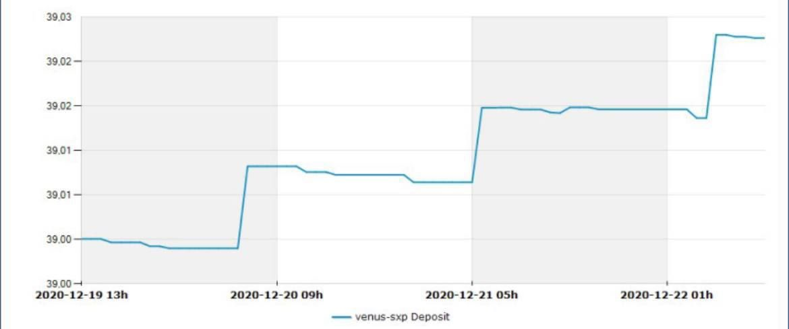

# Vaults

### What is a Vault?

Vaults are investment instruments that employ a specific set of [strategies](strategies.md) for yield farming or [CLM](clm.md). They make use of automation to invest and manage deposited funds, which help to achieve high levels of compounding interest. By using a Beefy vault to compound your gains, you save countless small transactions and their associated gas costs, and precious personal time. Instead of manually managing your position our vaults do that all automatically and at a higher frequency.

Vaults are the core of the Beefy ecosystem. In a Beefy vault, you earn more of the asset you stake in it, regardless if this is an liquidity pool (LP) token or a single asset. For example, vaults where one can stake BTC-BNB LP will result in more BTC-BNB LP over time, effectively growing your share in the liquidity pool and thus allowing for more and more fees and rewards over time.

Despite the name 'Vault' suggests, user funds are never locked in any vault on Beefy. One could always withdraw from a vault at any moment in time. Beefy also does not own user funds staked in vaults. However, it is generally best to view vaults as investment tools to store funds for the medium to long term in order to have the effects of compounding really kick in.

When browsing the vaults on the platform, you will see the annual percentage yield (APY), which takes the frequent compounding into consideration compared to annual percentage rate (APR) which does not. You will also see daily interest percentages and the total amount invested in a vault by all users (TVL). Furthermore, one can see what underlying platform the vault is using as a source of revenue.

Each vault can either refer to a pair of tokens invested in liquidity pools, such as CAKE-BNB LP tokens within the Binance Smart Chain ecosystem, or a single token invested in lending platforms or single stake reward pools. After depositing tokens to a vault, the user is supplied with vault specific mooTokens which represent their share in the vault. We will elaborate on mooTokens in the next section.

Anyone in the Cowmoonity can work together to build new strategies and submit them to the Beefy team for review. However, a new vault will not be accepted if the underlying platform does not adhere to the [beefy-safu-practices.md](../safety/beefy-safu-practices.md "mention").

Summarizing, vaults can:

* Efficiently execute yield farming strategies.
* Compound rewards into the initially deposited token amount.
* Use any asset as liquidity.
* Provide one asset as collateral for another.
* Manage collateral at a safe level to mitigate liquidation.
* Put any asset to work to generate a yield.
* Reinvest earned profits.

Users can sit back and relax, and watch their investment grow!

### **What are mooTokens?**

A mooToken is an interest-bearing, tokenized proof of deposit that you will receive at the moment you deposit in a Beefy vault. A mooToken is unique per vault, e.g. you get $mooBIFI tokens when depositing $BIFI into the BIFI Vault. One can view mooTokens as the receipt of your vault deposit.


Beefy users should hold on tightly to their mooTokens and not sell or exchange it, since you would lose ownership of your staked vault assets if you did so!


### How do mooTokens earn interest?

Beefy's vaults automatically create more of your deposited asset in the form of compound interest. By holding mooTokens in your wallet, they are increasing in value against its corresponding vault asset. The number of mooTokens in your wallet will remain constant, but the quantity of the vault tokens they can be redeemed for increases. This is also the reason why mooTokens do not 1:1 match with the token amount initially deposited.

### How do I redeem mooTokens for the initially deposited tokens?

Whenever you want to withdraw the tokens that are staked for you in Beefy's vault, you simply initiate a withdrawal transaction to exchange them. The mooTokens are then taken from your wallet and burned, and your deposited assets plus yield will be given back to you.

### What are the advantages of the mooToken system?

Beefy's mooToken system has a few major advantages:&#x20;

1. mooTokens allow any user to withdraw their fair share of deposited funds;
2. the system allows you to deposit the mooToken receipt to a cold or hardware wallet for ultimate safety;
3. your privacy is maintained, as you remain anonymous to Beefy. Your funds in the vault are not tied to the wallet address from which you made the deposit, since the mooTokens are the only evidence of your share in the vault. Therefore, you could withdraw your share of funds from a different address if you moved your mooTokens to it;
4. mooTokens can have tax benefits. Not only do our mooTokens make bookkeeping super simple, but since you're not selling off your rewards or receiving staking rewards direct to your wallet, (in many jurisdictions) you will not be incurring tax liabilities in the same way you would with farming your own yield; and
5. Lastly, mooTokens can be used as interest-bearing collateral.

### **How often do the vaults harvest their profits and reinvest?**

Vaults are normally harvested multiple times daily and profits are automatically reinvested (compounded). You can check the harvesting and compounding rate of a vault using [this how-to guide](../faq/how-to-guides/how-to-check-harvesting-compounding-rate.md).

### Why can't someone just do this themselves?

They could, but vaults help you save on personal time and transaction fees, maintain healthy collateral to debt ratios, self-optimize for the best possible yields, and automatically reinvest earnings. Attempting to do this manually would result in large inefficiencies. At Beefy we like to say: "Sit back and relax, the vault does all the work for you."

### **What is the vault fee structure?**

Most vaults have a performance fee structure, taking a percentage cut of all harvest rewards. This fee on profits is split up and distributed back to $BIFI tokenholders, allocated to Beefy's treasury, sent to the strategist that developed the vault and sent to the one calling the vault's harvest function. These fees are already built into the APY of each vault and daily rate. You do not need to calculate it yourself. The performance fee and the fee structure breakdown are presented inside the Deposit and Withdraw module in a vault.

The performance fee on additional yield, i.e. vault profits, is in part distributed back to $BIFI tokenholders and is the main source of Beefy's platform revenue. A part of it also funds Beefy's treasury which is used to further fund platform development, security and other initiatives. The performance fee was also implemented to promote community engagement and governance participation. A successful and engaged community is critical for our future growth, which in turn rewards platform users even more.

Furthermore, some vaults have a withdrawal fee. The main purpose of this fee is to prevent possible exploits from bad-faith actors. Without the fee, somebody could deposit just before the harvest() function execution and withdraw straight after that event, taking a % of the gains generated by legitimate stakers. Withdrawal fees stay in the vault and are shared amongst vault funds.

Finally, entering or exiting vaults using our Beefy ZAP V2 tool will incur a 0.05% zap fee on your deposited amounts. These fees are returned to the Beefy treasury by way of a intermediate batching treasury, which allows fees to be aggregated and swapped into stables before being deposited. See [how-to-beefy-zap.md](../faq/how-to-guides/how-to-beefy-zap.md "mention") for more details on the ZAP V2 tool.

### What is harvesting on deposit?

Many of Beefy's vaults "Harvest on Deposit". This means that when you deposit into the vault, you are also calling the harvest function of the vault's strategy. By calling the harvest function, you trigger the collection of pending farm rewards and compounding of those rewards back into the vault tokens for everyone.&#x20;

Beefy does this so that it is impossible for malicious actors to steal yield, so a withdrawal fee is not required. This greatly benefits long-term investors.

Almost all of the vaults on more inexpensive chains like Fantom and Polygon harvest on deposit. You can tell if a vault harvests on deposit if there is no withdrawal fee.

For depositing, and thus calling the harvest function, you will receive a reward in the form of the native chain token (e.g. WFTM or WMATIC) due to the harvest call fee.

### Harvesting on Ethereum

As transaction fees on Ethereum are expensive, Beefy has introduced a few rules that determine the vault's harvesting frequency.

* Vault TVL is above $100k: vault will be harvested every 3 days.
* Vault TVL is below $100k but above $10k: vault will be harvested every 15 days.
* Vault TVL is below $10k: community harvest.

Community harvest implies that the harvest function on the strategy contract has to be manually called, and the transaction fees for doing so will not be subsidized by Beefy.

Another rule watches the gas prices on Ethereum. If `maxGasPrice` is 20 GWei or more, harvests will not be executed as they will become too expensive. This is regardless of a vault's TVL.

The Gelato Off-Chain Resolver that handles the harvests on Ethereum based on the aforementioned rules can be found following this link: [Gelato Automate](https://app.gelato.network/functions/task/0xe919ca3bd22d6779ed2a329a436dc428644396913586d006688acf0361942d9f:1). The smart contract and its parameters, as well as past Executions and Task Logs, are also easily accessible there.

### Harvesting on BNB Chain

BNB Chain also has a harvesting constraint in place:

* Vault TVL is below $10k and older than 2 weeks: community harvest.

### **Does the performance fee get taken out when I withdraw my funds?**

No, the performance fees are on profits and are taken every time someone calls the harvest() function.

### Does the vault page show the APY?

Yes. Our displayed APY values reflect the predicted rate earned on a vault in a year. This rate is determined by the underlying platform it uses, the strategy that it is interacting with at the time, the total amount of funds in the vault and also takes into account the effect of compounding. As a unique feature, we have also included all vault fees in the APY calculation. What you see is what you get!

### What risks do the vaults have?

Beefy vaults are audited, but this does not mean that a vault is entirely risk free. Below are some of the general vault risks:

* Assets deposited into the vault have no risk of decreasing in quantity but can decrease in monetary value.
* As with any smart contract, the ultimate risk is that an investor's funds can end up stolen or unable to be withdrawn. The team does take steps to quantify the security risks of smart contracts and will only interact with ones that meet a specific set of requirements after excessive testing to make sure the underlying platform does not contain so called 'rug-pull' functions. For a detailed breakdown of the steps Beefy takes before adding new vaults, please consult [beefy-safu-practices.md](../safety/beefy-safu-practices.md "mention").

More detailed vault risks, or better yet, information on Beefy's vault safety expressed by the Beefy Safety Score can be found here: [Beefy Safety Score](../safety/beefy-safety-score.md).

### **Who is in control of the vault?**

Each vault and [strategy](strategies.md) is hardcoded, and the code has been built to be immutable, so once they are released, they become unalterable. No one can modify the vaults and strategies.

Modern Beefy vaults do however rely on the standard set out in EIP-1167, known as ["minimal proxy" contracts](https://blog.openzeppelin.com/deep-dive-into-the-minimal-proxy-contract). Minimal proxies reduce deployment costs for repetitive contracts (e.g. vaults) by maintaining the vast majority of core functionality in a single implementation contract. They then configure the individual characteristics of the specific strategy (e.g. the relevant tokens and pools) through the minimal proxy contract - which is a much smaller contract to deploy - which directs instructions through to the implementation contract.

Users should be aware of the distinction between minimal proxy contracts and the proxy pattern used to upgrade contracts. **Beefy's minimal proxy contracts are not upgradeable**, so Beefy cannot take your funds by a sly upgrade. The proxy is only used to reduce deployment costs.

### **What are the different vaults?**

* **Money Market :** Utilizes lending platforms, such as Venus on BNB Chain or Scream on Fantom, to generate the highest possible yield for these coins (e.g. BUSD, BNB, LINK, DOT, DAI, USDT, ETH, or BTCB).&#x20;
* **Native Token Farming :** Takes advantage of the high yield on popular farms by depositing another asset to earn, sell and compound profits of the native reward token.

### What will I get out when I make a vault withdrawal?

The default is that you withdraw the token type that you deposited, because at Beefy you earn what you stake. You will get the amount you deposited plus the yield generated (minus a potential vault withdrawal fee). For vaults supporting Beefy ZAP, users can withdraw directly into other assets, including any assets forming part of the in the relevant liquidity pool for ZAP V1, and any of the bluechip, native or stable assets supported for ZAP V2.

### **How do LP vaults work?**

Liquidity pool (LP) vaults work by reinvesting the fees awarded to LP participants. In return for providing liquidity to the pool, many platforms reward investors with tokens. Our vaults regularly harvest these rewards, sell it, buy more of the LP’s underlying assets, and then reinvest to complete the cycle.

This compounds the rewards gained from a liquidity pool. Beefy creates strategies that automate this process, saving you time and gas fees in comparison to farming manually. This is all done for a tiny fee that is distributed back to those who deposit $BIFI into the BIFI Pool or BIFI Vault. A small percentage also goes to the Beefy treasury.

### **How often are balances updated in the vaults?**

Pending rewards are not reflected in the balance until they are swapped for the initial deposited token. This can vary depending on the strategy running.&#x20;

### **How do vaults get added to Beefy?**

New potential vaults can be discussed in our Discord. Our strategists then add the potential investment strategy to our strategy list. A priority is assigned to each new, potential strategy based on its APY, TVL and sustainability. Our developers/strategists then attack the list from top priority to bottom. The official forum is used for submitting actual [vault requests](https://forum.beefy.finance/c/vault-requests).

Then the platform which the vault is potentially going to deposit into, is very thoroughly screened if it has safe smart contracts and no other dangerous traits. For more info on that, please read [beefy-safu-practices.md](../safety/beefy-safu-practices.md "mention").

### **What’s your vault naming process?**

Each vault on the platform is named after the token that users can deposit in it. For example, the CAKE-BNB LP vault uses CAKE-BNB LP tokens for its investment strategy. A BTC vault uses the BTC token, etc.

Underneath the vault name, you can find the platform used for investing the token and farming its yields. For example, Uses: Venus means that that particular vault invests the token in Venus, a DeFi algorithmic money market and synthetic stablecoin protocol.

### **How do lending vaults work?**

_The following applies to: Aave, Banker Joe, Blizz, Geist, Scream, Venus, and similar lending platforms._

Most Beefy single asset vaults utilize decentralized marketplaces for lenders and borrowers. By depositing your initial asset in the vault, Beefy deposits it into the lending marketplace and borrows against your token at safe levels of collateral.

The borrowed tokens are redeposited into the platform, and once again used as collateral to borrow more tokens. This cycle is repeated multiple times to generate as much interest as possible from the lending interest and the reward token, which is used to buy more of your originally deposited assets. This strategy is also known as a folding strategy. It is noteworthy that this "leveraged" multi lending and multi borrowing is only with the deposited vault token, so there is no liquidation risk due to token price swings.&#x20;


Transaction fees: because of the multi supply and borrow cycle, the transaction fee for a deposit into or withdrawal from these vaults is generally higher as compared to other vaults.



Marketability risk: when the underlying token on the lending platform becomes overborrowed, it can prevent the vault's strategy from deleveraging (unfolding) to accommodate a withdrawal. This usually happens when the market is most volatile, or when there is an ongoing event for which people want to borrow funds from the lending platform. The overborrowed condition will naturally resolve once liquidity returns to the lending platform, a process which can take hours or, sometimes, a few days. Meanwhile, funds always remain safe.


Due to accruing debt/supply interest, one may notice that the deposited token amount may decline ever so slightly in between harvests. After the harvest event, you will see your deposited token amount increase as the yields are compounded back into it. The change in deposited token amount over time of a typical lending style vault looks as follows:

