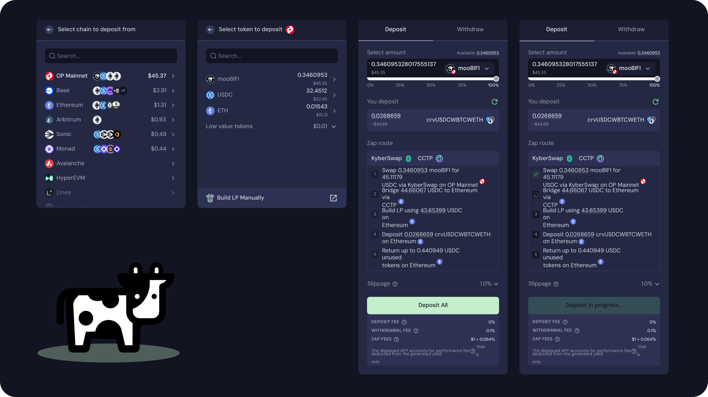

# Zap

Zap tools are a category of smart contract that bundle a variety of different functionality into a single straightforward workflow (or even one atomic transaction). They aim to deliver the smoothest user experience from decision to executed onchain action.

Beefy's array of zap tooling sits at the heart of our mission to make DeFi easy. It's is a key differentiator between Beefy and other DeFi projects. Beefy's goal is to enable users of all skill levels to discover and access yields from across the EVM world. With zap, Beefy complements its thousands of products by making it as easy as possible for users to navigate from one to another.

<figure><figcaption></figcaption></figure>

### Beneath The Hood

Zap tools aggregate an array of different processes, abstracting the various steps from the user. Underneath the hood, Beefy's core zap processes are:

* **Simulating a deposit or withdrawal into the product** to ascertain what balance of assets is expected. Where UniV2-style LPs reliably require 50/50 deposits/withdrawals, more complex products like Beefy CLM typically deal with an unequal and unpredictable balance of assets.
* **Fetching quotes from all available aggregators** for each required swap. This step ensures that Beefy offers users the best price possible from Beefy's active integrations.
* **Calculating the precise swaps** needed to maximise the amount of deposit assets in accordance with the deposit simulation.
* **Relaying messages** to bridge funds between chains where the user is seeking to deposit or withdraw to other chains.&#x20;
* **Executing the swaps** by submitting orders to each aggregator and paying the relevant fee.
* **Executing the deposit or withdrawal** by executing the relevant functions on the different Beefy smart contracts. In our more complex products like CLM, this can involve multiple interactions with different nested contracts to complete the required action.
* **Charging any fee** that Beefy stipulates for the relevant zap product. Not all zap products incur fees. See [Fees](zap.md#fees) below to learn more about those which do.
* **Returning any unused assets** directly to the user wallet. Often the act of swapping or depositing will alter the simulated values, meaning slightly more or less of each is received. Beefy returns all received assets to the user.

Beefy's systems and interfaces receive user specifications for products and assets to zap between and then generate the bespoke payloads required, which are fed to the [BeefyZapRouter contract](../developer-documentation/zap-contracts.md#beefyzaprouter-contract) on the source chain. This includes a precise combination of the relevant items in the above list, and sometimes covers multiple of the same step (e.g. multiple quotes and swaps).

See [Zap Contracts](../developer-documentation/zap-contracts.md) for a full breakdown of the underlying Beefy contracts that deliver these various processes as part of zap.


For more specific questions and answers relating to crosschain zaps, see the [Crosschain Zaps FAQ](../faq/crosschain-zaps.md) page.


### Versions

Over time, the functionality and complexity of Beefy's zap infrastructure has evolved to make use of new technologies to improve user experience. This is reflected in the different versions of zap.

Though the codebase of Beefy's zap tooling is not formally versioned (and indeed has been split across multiple repositories over time), Beefy nonetheless adopts informal version names to differentiate between distinct generations of its zap tools:

<table><thead><tr><th width="119.74609375">Version</th><th width="155.91796875">Introduced</th><th>Description</th></tr></thead><tbody><tr><td>Zap V1</td><td>March 2021</td><td>Enter LP products on the chain with one of the LP tokens, swapping through the LP to obtain the other deposit asset.</td></tr><tr><td>Zap V2</td><td>January 2023</td><td>Enter any product on the chain with any supported token, swapping through 1inch to obtain all the necessary deposit assets.</td></tr><tr><td>Zap V3</td><td>December 2023</td><td>Enter any product on the chain with any supported token, swapping at the best price from several distinct DEX aggregators to obtain all the necessary deposit assets. </td></tr><tr><td>Zap V4</td><td>March 2026</td><td>Enter any product on any supported chain with any supported token, swapping at the best price from several distinct DEX aggregators to obtain all the necessary deposit assets.</td></tr></tbody></table>

Though each generation fully replaces the previous, community members may from time to time hear reference to a _"V3-style zap"_ or _"V1 only, no V4 yet"_. In practice, Beefy's UI operates with a range of different options for zap to suit user needs. Not all products support all generations of zap. And sometimes users only need the most basic V1 style of zap.

### Integrated Services

To facilitate swapping and bridging as part of these zap processes, Beefy has partnered with a range of industry-leading providers:

| Service                      | Type            |
| ---------------------------- | --------------- |
| 1inch Swap API               | Swap Aggregator |
| KyberSwap Aggregator API     | Swap Aggregator |
| LiquidSwap Route Finding API | Swap Aggregator |
| Circle CCTP                  | Bridge          |

Where issues arise with any of these components during a zap, Beefy and its users may need to rely on the systems of these external providers and raise issues directly with them. However, Beefy makes a point of integrating neutral protocols which operate with a high degree of independence and neutrality, not blocking or excluding any portion of our user base.

For services looking to explore an integration into Beefy zap, please reach out in the #partnership-requests channel on the [Beefy Discord server](https://beefy.finance/discord).

### Fees

To fund the use and ongoing development of zap tooling, Beefy introduced new **Zap Fees** as part of zap workflows in the V2, V3 and V4 releases. There are currently three types of fees that together comprise the total Zap Fees charged to the user:

<table><thead><tr><th width="113.80462646484375">Type</th><th width="134.5806884765625">Minimum</th><th width="113.2838134765625">Maximum</th><th>Description</th></tr></thead><tbody><tr><td>Swap Fee</td><td>0 Swaps @ 0.05%</td><td>2 Swaps @ 0.05%</td><td>Charged only on swapped assets where swaps are required. Can approach $0 where only minor swaps are needed. Can require 2 full swaps of all assets where zaps are required on 2 chains. Fee charged by Beefy.</td></tr><tr><td>Bridge Fee</td><td>
No Fee or

0.01%
</td><td>0.14%</td><td>Charged on bridged assets where bridging is required. Fee charged by CCTP and subject to change. See <a href="https://developers.circle.com/cctp/concepts/fees#fee-tables">Fees Table</a> for latest update.</td></tr><tr><td>Relay Fee</td><td>$0.10</td><td>$1</td><td>Charged as flat fee where bridging is required. Fee charged by Beefy to cover the cost of claiming bridged assets and initiating deposits.</td></tr><tr><td><strong>Zap Fees</strong></td><td><strong>$0.10 + 0%</strong></td><td><strong>$1 + 0.24%</strong></td><td>Aggregate fees; sum total of the above.</td></tr></tbody></table>

**The Swap Fee** is set and received by Beefy, and is the only payment Beefy receives from the swap. In some cases, this is recovered in partnership with the swap aggregator as part of their workflow. The swap aggregators also seek to gain something from these swaps, and each swap aggregator is different: in some cases, they are compensated for the integration by deducting any positive slippage from the trade; in others, they incorporate additional hidden fees into the quotes offered; finally, some are also subject to agreements with Beefy for the payment of API charges or subscriptions, or for a share of the revenue Beefy generates.&#x20;

**The Bridge Fee** is set and received by Circle only as part of CCTP for fast transfers. On most chains, fast transfers are necessary to ensure swap quotes do not expire before the bridging process completes. On chains where fast transfers are not required, no Bridge Fee is charged. Beefy has no control over the fee mechanism of CCTP and accepts whatever fees are adopted by the protocol at the time of its operation. These fees may be subject to change by Circle without notice to Beefy or our users. Check the [Fees Table](https://developers.circle.com/cctp/concepts/fees#fee-tables) in the CCTP documentation for the latest rates.

**The Relay Fee** is set and received by Beefy to cover the cost of claiming the bridged funds, triggering the zap deposit workflow on the destination chain, and to cover the gas costs of both operations. The precise amount of the Relay Fee varies from chain to chain in accordance with gas costs on the destination chain. Beefy implements this as a static fee per chain: low-cost chains are $0.10 in fees; Ethereum and Linea are set at $1. The precise current breakdown of the fees is available in the `beefy-v2` repository under [`cctp-config.ts`](https://github.com/beefyfinance/beefy-v2/main/src/config/cctp/cctp-config.ts).

Applying these components to a few different circumstances for Beefy zap transactions, we can see how the breakdown of these fees varies from one action to the next:

<table><thead><tr><th width="150.0849609375">Zap Type</th><th width="267.247314453125">Zap Fees</th><th>Explanation</th></tr></thead><tbody><tr><td>Same-chain Zap with Swap</td><td>0.05% of assets swapped</td><td>Some or all of the deposited assets are swapped with a 0.05% fee charged only on assets being swapped.</td></tr><tr><td>Crosschain Zap From USDC</td><td>
0.01% - 0.14% of assets bridged

$0.10 - $1 relay fee

0.05% of assets swapped
</td><td>USDC deposits are bridged with a variable percentage fee charged by CCTP. Beefy charges a static relay fee to claim the assets and submit a deposit. Some or all of the received USDC is swapped with a 0.05% fee charged only on USDC being swapped.</td></tr><tr><td>Other Crosschain Zaps</td><td>
0.05% of assets swapped

0.01% - 0.14% of assets bridged $0.10 - $1 relay fee 0.05% of assets swapped
</td><td>All of the deposited assets are swapped for USDC with a 0.05% fee charged. USDC deposits are bridged with a variable percentage fee charged by CCTP. Beefy charges a static relay fee to claim the assets and submit a deposit. . Some or all of the received USDC is swapped with a 0.05% fee charged only on USDC being swapped.</td></tr></tbody></table>

Ultimately, the aggregate Zap Fees that users incur are highly dependent on the products and chains they're seeking to use. A few examples illustrate the different factors in the calculation of fees:


A user deposits **Base** **USDC** into a **Base** USDC-WETH CLM.&#x20;

The CLM is unbalanced so that more of its assets are WETH, and the user can deposit most of their USDC without any corresponding WETH. Only 10% of the deposited USDC is swapped for WETH, and a 0.05% Swap Fee is charged on the 10%.&#x20;

The total fee is just 0.005% of the total assets deposited (0.05% x 10%= 0.005%).



A user deposits **Base** **USDC** into an **Ethereum** USDC-WETH CLM.&#x20;

The user first pays a Bridge Fee of 0.013% of assets to bridge out of Base. Next, a $1 Relay Fee is paid to claim the USDC on Ethereum, and relay the deposit into the CLM. The CLM is unbalanced so that more of its assets are in USDC, and the user must swap most of their USDC to WETH to deposit. 90% of the deposited USDC is swapped for WETH, and a 0.05% Swap Fee is charged on the 90%.&#x20;

The total fee is 0.0463% of the total assets deposited (0.013% + (0.05% x 90%)= 0.013% + 0.045% = 0.0463%) plus the $1 Relay Fee.



A user deposits **Base** **WETH** into an **Ethereum** USDC-ETH CLM.&#x20;

The user first must swap their WETH entirely to USDC, so a 0.05% Swap Fee is charged on all of the deposited assets. The user then pays a Bridge Fee of 0.013% of assets to bridge out of Base. Next, a $1 Relay Fee is paid to claim the USDC on Ethereum, and relay the deposit into the CLM. The CLM is unbalanced so that more of its assets are in WETH, and the user must swap most of their USDC to WETH to deposit. 90% of the deposited USDC is swapped back to WETH, and a 0.05% Swap Fee is charged on the 90%.&#x20;

The total fee is 0.0963% of total assets deposited ((0.05% x 100%) + 0.013% + (0.05% \* 90%)= 0.05% + 0.013% + 0.045% = 0.0963%) plus the $1 Relay Fee.


As shown in the fee table above, the maximum aggregate Zap Fees for a user are $1 + 0.24%, involving the most expensive combination of chains with two full zaps of all deposited assets. By contrast, zap fees will approach zero for same-chain zaps requiring small swaps to acquire a secondary deposit asset (as shown in Scenario 1 above).

### Audits

As described more fully in our [Audits & Bounty page](../safety/bug-bounty-program.md), our Zap V3 codebase — particularly the core [`BeefyZapRouter` contract](../developer-documentation/zap-contracts.md#beefyzaprouter-contract) — was [audited](https://github.com/beefyfinance/beefy-audits/blob/master/2023-12-15-Beefy-OZ-Zap-Audit.pdf) by OpenZeppelin.

