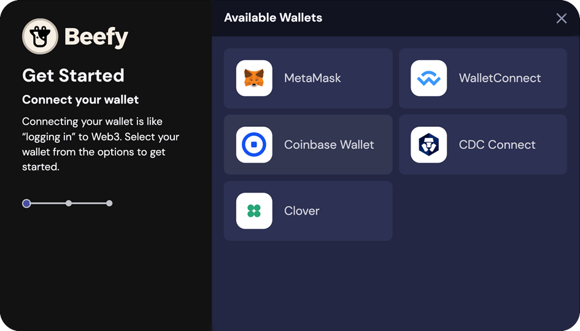

# Conectando a carteira à Beefy

Agora que você já criou a sua carteira e já depositou suas criptos nela, é hora de conectá-la à Beefy!

## 1. Clique no botão "Connect Wallet"

O botão pode ser encontrado no topo da página:

## 2. Selecione a sua carteira entre as opções

<figure><figcaption></figcaption></figure>

## 3. Aprove a conexão

<figure><figcaption></figcaption></figure>

Tudo pronto! :cow: Você agorea está pronto para explorar os cofres da Beefy e outras oportunidades de rendimento.
