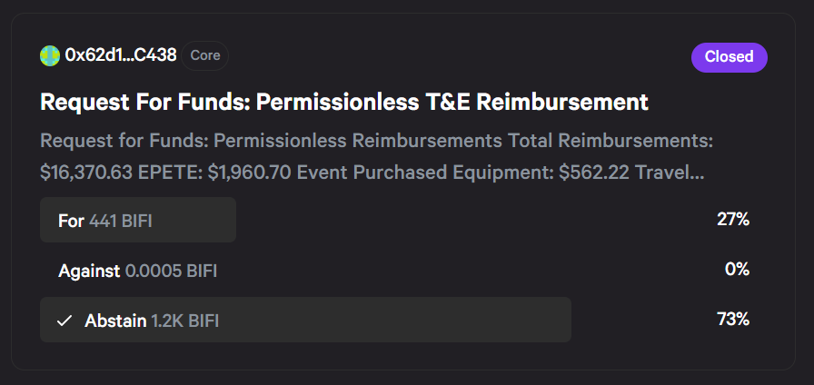

# Governance

Beefy is run as a decentralised autonomous organisation (DAO), meaning it is controlled and directed by a decentralised network of contributors and community members, who enable Beefy to function on its own. This page outlines how the governance process behind our DAO works, and how you can get involved.

## How is Beefy governed?

As a decentralised organisation, Beefy is proudly governed by our $BIFI token holders. This includes our founders, Core contributors and the wider Cowmoonity, as well as some external holders. Most major decisions that Beefy takes are put to and voted on by our $BIFI holders, including how our fees are set, how the protocol and its contributors are funded, how we market Beefy and what direction we should take on certain decisions. Think of our BIFI holders as members of the Beefy legislature.

The key mechanism for this is governance voting, which is undertaken through our [Snapshot page](https://vote.beefy.finance/). BIFI holders are entitled to raise proposals (if they hold at least 1 $BIFI) and vote on them. Discussion of all proposals is actively encouraged on our social media channels. In particular, we would encourage you to head to the #🏛-proposals and #🗣-proposal-discussion channels on the [Beefy Discord](https://discord.gg/yq8wfHd) server. In the threads for the #🏛-proposals channel, you'll find a dedicated space for discussion of individual proposals, or #🗣-proposal-discussion serves as a more general forum.

In addition, the day-to-day operations of Beefy are governed by our Core contributor team, who take the role of the executive wing, and are tasked with carrying out the will of our BIFI holders. As with any growing organisation, it's impossible to run every decision through formal governance, so our Core team have been delegated the necessary authority to look after the protocol. That said, any area of Core's decision-making can instead be raised through governance voting, to ensure that they may be held to account.

## **How do I take part in governance?**

By simply holding $BIFI, even if staked in the native token Earnings Pool or BIFI Maxi vault, a user earns the right to create proposals and vote in them. Voting sway and power are derived from the $BIFI holdings of the participant. The reasoning behind this follows that those holding more $BIFI are more invested in the project, and therefore have a larger incentive for the platform itself to succeed and prosper.

Beyond voting for yourself, you can also register to participate as a delegate, so others can delegate their voting power to you for inclusion with your own vote. Through this mechanism, trusted voices in the community can leverage their support with a small amount of effort on the part of their supporters. It also allows those short on time to ensure that their $BIFI is participating in governance, without requiring them to engage with every proposal. See below and the [delegateregistry-contract.md](../developer-documentation/third-party-contracts/delegateregistry-contract.md "mention") page for further details.

You can see proposals and vote on them yourself by heading to [vote.beefy.finance](https://vote.beefy.finance/).

.png>)

## **How do I vote?**

Voting requires you to hold $BIFI, which can either simply be held in your wallet or staked in the native token Earnings Pool or BIFI Maxi vaults. You do not need to remove your stake either to vote. Voting power is based directly on the amount of $BIFI each voter holds.

To submit your vote, simply head to to our [Snapshot page](https://vote.beefy.finance/), connect your wallet to Snapshot and then head to an open proposal you wish to vote on. Here you'll find an interface to "Cast your vote" by selecting your preferred option(s) and clicking "Vote". You'll then be required to sign a transaction through your wallet to formally submit your vote.

.png>)

## How do I delegate my vote?

You can delegate your vote on any chain by interacting directly with the DelegateRegistry contract on that chain. A full tutorial of how to delegate is available in the [delegateregistry-contract.md](../developer-documentation/third-party-contracts/delegateregistry-contract.md "mention") page at [#delegation-walkthrough](../developer-documentation/third-party-contracts/delegateregistry-contract.md#delegation-walkthrough "mention").&#x20;

Please note that you must delegate separately for every chain which you hold $BIFI on. Otherwise, your delegation will only be effective on the chains on which you submitted your delegation call(s).

## How do I become a delegate?

If you'd like to represent the Cowmoonity by acting as a delegate for others to direct their voting power to, you can do so by reaching out to us and providing your name and public wallet address. A full list of the current delegates offering to represent your interests is maintained in this [Google sheet](https://docs.google.com/spreadsheets/d/1sJH4jg3eEEJDpbws55qUmzPeLDiDuL\_5OAQobSn7m2Y/edit?usp=sharing). We'd recommend that budding delegates seek to provide as much information as they can for the sheet, for the benefit of users who may delegate to them.

## How are votes counted?

For each proposal, a snapshot of the blockchain is taken at the time of posting and used to calculate how many $BIFI tokens are held by each voter. This voting power is locked from the time of posting, so you can't buy more $BIFI to influence a live vote.

Through our Snapshot page, proposals can take a number of different forms, each of which weigh votes slightly differently. The different options include:

* Basic voting - voters can either approve, reject or abstain from the vote, with the majority (absent abstentions) winning the vote.
* Single choice voting - voters can choose one of several choices, with the option with the largest proportion of votes winning.
* Weighted voting - voters can spread their voting power across multiple choices, with the option with the largest proportion of voting power winning.
* Quadratic voting - weighted voting, but with voting power adjusted logarithmically, so that smaller voters have more voting power per token than larger voters. The option with the largest proportion of voting power wins.
* Ranked choice voting - voters can select several options by an order of preference, with votes then counted by eliminating the option with the least highest preference votes, and reallocating those votes to their next highest preference, until only one option remains.


Please note that for all Beefy governance votes which include an "abstain" option, a vote to abstain will be counted for the purposes of the quorum (if applicable) for that proposal, but will otherwise be interpreted as a vote for the side that has the most votes, when ignoring the "abstain" votes. Where a quorum is applied and is met only through the inclusion of "abstain" votes, this remains a valid proposal, and the outcome will be accepted.&#x20;

Snapshot may recognise the outcome of a vote as "abstain" where this receives the most votes, though the outcome will in fact be the option with the most votes otherwise. See for example the outcome of the Permissionless 2022 reimbursement proposal below.


<figure><figcaption>
Where abstain receives the most votes, the outcome with the second most will be adopted.
</figcaption></figure>

## What is the quorum for voting?

To ensure that proposals that don't receive much interest aren't passed by default, Snapshot includes an option for a voting quorum, where a proposal needs to receive more than a specified proportion of total available votes in any direction to be considered valid.&#x20;

At the time of writing, no formal quorum has been adopted by Beefy, though our Snapshot page refers to an 800 $BIFI quorum (equivalent to 1% of total $BIFI supply) for every proposal. Where a vote fails to meet the Snapshot referenced quorum, **it will still be adopted** unless a quorum has been formally put in place.

## **How do I create a proposal?**

Proposals can be created if the submitter holds or stakes at least 1 $BIFI. Simply visit [https://vote.beefy.finance/#/](https://vote.beefy.finance/#/) and click New Proposal.

Each proposal is made up of a question to pose to the community, along with the option of choices that others can vote on in response to your question. Simply set a start and end date for your proposal and publish it.

## What types of proposals are there?

As our governance process has developed, we have adopted a number of different forms of proposal for different purposes. These include:

* Beefy Improvement Proposals (BIPs) - the default form of proposal, for an issue aimed at improving the protocol in some way.
  * This now includes proposals for [reoccurring contributor payments](../community/contributor-compensation.md#reoccurring-payments).
* Beefy Signally Proposals (BSPs) - an alternative, non-binding proposal, aimed at establishing consensus amongst $BIFI holders, or demonstrating their opinions/preferences.
* [Requests for Funds / Retroactive Payments](../community/contributor-compensation.md#retroactive-payments) - a simple request for funding from the Beefy treasury for a particular work stream or contributors. These are typically a form of expense, rather than an investment.
* [Grant Proposals](../community/contributor-compensation.md#beefygrants) - a more detailed request for funding from the treasury, typically relating to a large project that requires significant funding and input, but is aimed at delivering future revenues or cost-savings to Beefy (so is an investment, rather than an expense).

## How do we protect against malicious votes?

It's no secret that open governance brings a range of risks, including malicious votes aimed at hacking the protocol or damaging our Cowmoonity. To protect against this possibility, our Core team actively moderates the governance process, looking to take down any potentially harmful proposals.

This include proposals that are: (1) clearly harmful or malicious; (2) unfair, impossible or fundamentally irrational; (3) don't allow sufficient time to vote; or (4) which lack sufficient clarity or comprehensibility to be executed.  It may also include attempts to force through a proposal by changing the voting system or parameters for a failed vote (e.g. moving to quadratic voting to circumvent large $BIFI holders), or leaving too little time for voting.

## Where can I find details of past votes?

Recent votes are stored on the our [Snapshot page](https://vote.beefy.finance/). At the end of 2021, Beefy transitioned from a custom Snapshot fork running exclusively on Binance Smart Chain (BSC) to a modern instance of Snapshot, capable of supporting each of Beefy's chains. As a result of the transition, proposals ending before the start of 2022 were not carried forward to the new site. Instead, an archived copy of the original site has been preserved.


Note that access to the archived Beefy voting site is available at [https://vote-archive.beefy.finance/](https://vote-archive.beefy.finance/). The archived site requires users to connect their wallet to both the site and the BSC Mainnet to display historic proposals. The current voting site is available live at [https://vote.beefy.finance/#/](https://vote.beefy.finance/#/).


Alternatively, we have prepared and maintain a [proposal repository](../community/proposal-repository.md) here in our docs, where you can quickly get access to any of the major proposals on either voting site throughout our history.
