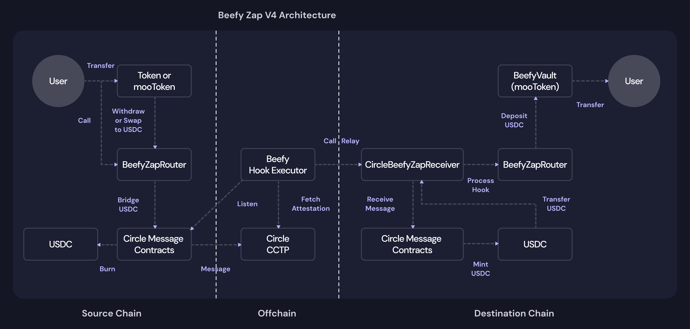
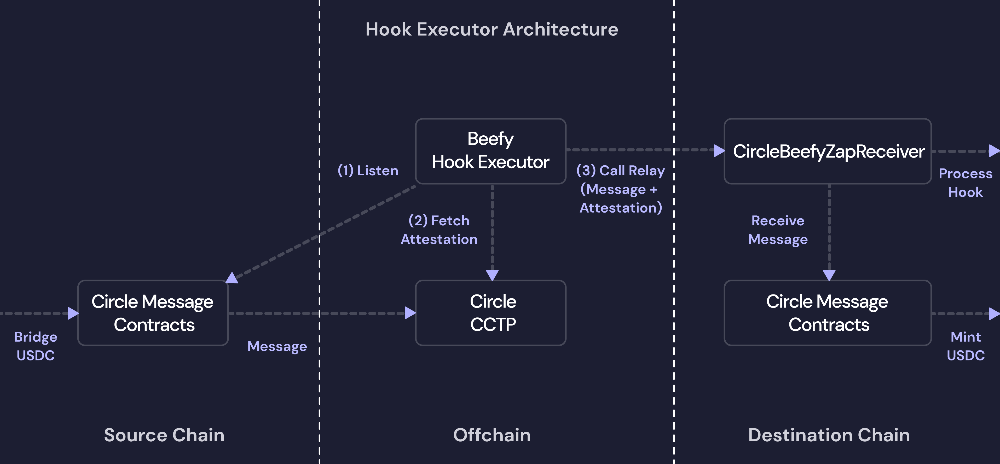
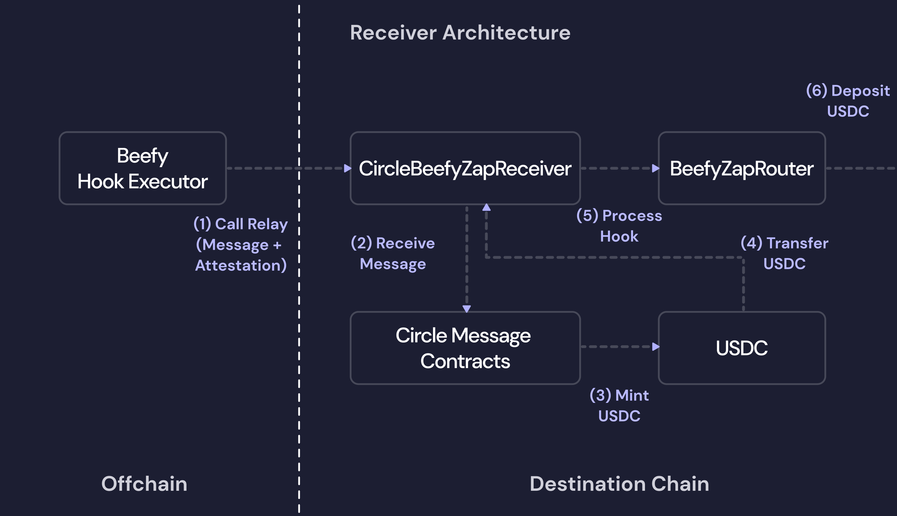

# Zap Contracts

Zap contracts facilitate the delivery of Beefy's ease-of-access [zap tooling](../beefy-products/zap.md) and form a key part of the user experience for most users of the Beefy protocol and web application.&#x20;

The vast majority of Beefy deposits and withdrawal interactions actually take place between the user and these zap contracts, with the [vault](vault-contract.md) and [strategy contracts](strategy-contract/) being handled indirectly in the logic of the zap.

As described in the main [zap documentation](https://app.gitbook.com/o/-MJZ1VQaoU5elNanhqbV/s/-MJZ0tXJc-hdgL-YTlPk-887967055/~/edit/~/changes/346/beefy-products/zap#versions), Beefy has iterated across multiple generations of zap contracts. The below technical documentation deals exclusively with the most recent versions as at the date of the last update - that being Zap V4.

### Core Architecture

Zap V4 is designed to facilitate deposits and withdrawals from Beefy products on any supported chain from any supported token on any other supported chain using [Circle's Cross-Chain Transfer Protocol](https://www.circle.com/cross-chain-transfer-protocol) (**CCTP**).&#x20;

V4 is a significant step forward from all previous generations, where zap services were constrained to the local chain only. This has necessitated a total redesign of the zap architecture:

<figure><figcaption><p>Zap V4 Architecture - integrated crosschain deposits and withdrawals via Circle CCTP.</p></figcaption></figure>

This architecture relies on three core zap smart contracts to deliver the services (shown in the middle line of the above diagram):

1. [**The Router**](zap-contracts.md#beefyzaprouter-contract) - a general-purpose contract that can receive and execute arbitrary logic in the form of a message, and therefore coordinates the various actions required to execute the zap;
2. [**The Receiver**](zap-contracts.md#circlebeefyzapreceiver-contract) - a destination-chain contract that receives the user's deposit and instructions after bridging, and triggers the Router using them.
3. [**The Relay**](zap-contracts.md#swappingrelay-contract) - a destination-chain contract controlled by the [Hook Executor](zap-contracts.md#hook-executor) to trigger the Receiver once a bridging message is initiated and an attestation is issued by CCTP.

Beyond the smart contracts, Beefy also relies on the [Hook Executor](zap-contracts.md#hook-executor) offchain service to prompt activity on the destination chain once an activity on the source chain is successfully submitted.

### BeefyZapRouter Contract

The BeefyZapRouter contract is the core router infrastructure through which all Beefy zap transactions pass. It was introduced for Zap V3 to facilitate the move to an aggregator-agnostic model that supports multiple external providers, and remains unchanged as part of V4.

The contract can process arbitrary logic, allowing for new products, assets and paths to be incorporated without changing the core contract logic. This enables Beefy to alter swapping and bridging providers, introduce new components to the zap workflow, and even change the types of assets that can be zapped on the go and without redeploying the router contracts.

The address of the BeefyZapRouter varies from chain to chain. An exhaustive list is maintained as part of the [`blockchain-addressbook` package](https://www.npmjs.com/package/blockchain-addressbook).

#### executeOrder()

The `executeOrder` function serves to receve and execute custom orders to meet the user's requested deposit or withdraw workflow. It receives calldata as to the required order (the input and output structure) and the required route (the steps needed to transform the input into the output), as well as a permit and signature for Permit2-style zaps:


```solidity
// BeefyZapRouter.sol

// Zap With Existing Approval
function executeOrder(Order calldata _order, Step[] calldata _route) external payable nonReentrant whenNotPaused {
    if (msg.sender != _order.user) revert InvalidCaller(_order.user, msg.sender);

    IBeefyTokenManager(tokenManager).pullTokens(_order.user, _order.inputs);
    _executeOrder(_order, _route);
}

// Zap with Signed Permit from Permit2
function executeOrder(
    IPermit2.PermitBatchTransferFrom calldata _permit,
    Order calldata _order,
    bytes calldata _signature,
    Step[] calldata _route
) external nonReentrant whenNotPaused {
    IPermit2(permit2).permitWitnessTransferFrom(
        _permit,
        _getTransferDetails(_order.inputs),
        _order.user,
        keccak256(abi.encode(ORDER_TYPEHASH, _order)),
        ORDER_STRING,
        _signature
    );
    _executeOrder(_order, _route);
}
```


### Hook Executor

Beefy maintains a private Hook Executor to support V4 crosschain zaps via Circle CCTP. Its purpose is to observe the passing of messages and trigger the necessary actions on the destination chain.

The Hook Executor's operations are divided into three services: (i) listening for `MessageSent` events on the source chain, then (ii) fetching the relevant attestation via [Circle's Iris API](https://developers.circle.com/cctp/v1/cctp-apis) offchain, and finally (iii) calling `relay` on the [`SwappingRelay.sol` contract](zap-contracts.md#swappingrelay-contract) on the destination chain.

<figure><figcaption><p>Beefy's Hook Executor is the offchain system that identifies crosschain zaps, fetches attestations from CCTP and relays the zap message and attestation to the Receiver contract on the destination chain.</p></figcaption></figure>

Though each step in the Hook Executor's workflow is fully public and visible, the Executor's code is closed source to maintain its security and upgradeability.

### SwappingRelay Contract

The SwappingRelay contract was added for Zap V4 to facilitate crosschain messaging via Circle CCTP, as the onchain extension of the [Hook Executor](zap-contracts.md#hook-executor).

Its purpose is two-fold: (i) to trigger the relay process in the [Receiver](zap-contracts.md#circlebeefyzapreceiver-contract) contract; and (ii) to acquire the chain's native token by swapping USDC to then pay the bridging fee to Circle CCTP.

Where the [Receiver](zap-contracts.md#circlebeefyzapreceiver-contract) is an independent piece of public infrastructure that users can interact with directly, the Relay contract is private, owned by an externally-owned account operated by the [Hook Executor](zap-contracts.md#hook-executor). This separation of concerns ensures the [Receiver](zap-contracts.md#circlebeefyzapreceiver-contract) is not hosting privileged functions or directly interfacing with the Hook Executor. It also allows multiple relayers to operate at once, meaning the relaying service can be decentralized whilst relying on Beefy's core Receiver and Router infrastructure.

<table><thead><tr><th width="190.40625">Contract Name</th><th>Address</th></tr></thead><tbody><tr><td>SwappingRelay</td><td>0xfA572f5563411BbF20fC40b0A6A0D5A9fA1aF00D</td></tr></tbody></table>

#### relay()

The `relay` function primarily serves to call the [Receiver](zap-contracts.md#circlebeefyzapreceiver-contract)'s own `relay` function, which triggers action on the destination chain. This only occurs when the [Hook Executor](zap-contracts.md#hook-executor) has identified a message onchain and fetches the associated attestation from CCTP.

As a secondary function, it also offers the ability to top up gas for the execution of relay calls through the `doSwap` function. This first swaps USDC for the wrapped native token and then unwraps the native


```solidity
// SwappingRelay.sol

function relay(bytes calldata message, bytes calldata attestation) external onlyOwner {
    bool zapSuccess = receiver.relay(message, attestation);
    (bool swapSuccess, uint256 nativeSent) = _doSwap();
    emit Relayed(zapSuccess, swapSuccess, nativeSent);
}
```


### CircleBeefyZapReceiver Contract

The CircleBeefyZapReceiver contract was added for Zap V4 to deliver crosschain zaps on the destination chain. Its purpose is to take receipt of the bridged assets, conduct the zap deposit into the desired product and return the deposit token to the user.

<figure><figcaption><p>Beefy's Receiver contract receives a relay call from the Hook Executor to trigger receiverMessage from a local Circle MessageTransmitter</p></figcaption></figure>

<table><thead><tr><th width="221.4957275390625">Contract Name</th><th>Address</th></tr></thead><tbody><tr><td>CircleBeefyZapReceiver</td><td>0xBeef940035C062bb8bEe892087aBa6Cde4F9BeEF</td></tr></tbody></table>

#### relay()

The `relay` function primarily serves to receive and process Circle CCTP messages, distribute any configured USDC fee to the caller, and attempt execution of a downstream zap workflow.&#x20;

The Receiver accepts the raw message and attestation from the Relayer, verifies and mints funds via Circle’s MessageTransmitter, pays a relayer fee in USDC to the caller, and then invokes a hook to process the zap logic. The zap execution is wrapped in a try/catch so failures do not revert the relay; instead, failures trigger a recovery path and emit appropriate execution events reflecting success, refund, or recovery outcomes.


```solidity
// CircleBeefyZapReceiver.sol

function relay(
    bytes calldata message,
    bytes calldata attestation
) external nonReentrant returns (bool zapStatus) {
    CircleBeefyReceiverStorage storage $ = getCircleBeefyReceiverStorage();
    bytes32 nonce = _getNonce(message);
    IReceiver($.messageTransmitter).receiveMessage(message, attestation);

    uint256 _fee = $.fee;
    if (_fee > 0) IERC20($.usdc).safeTransfer(msg.sender, _fee);
    emit FeePaid(nonce, msg.sender, _fee);

    uint256 amountIn = IERC20($.usdc).balanceOf(address(this));
    try this.processHook(message) returns (address recipient, bool _zapSuccess) {
        uint256 refundedAmount = _zapSuccess ? 0 : amountIn;
        emit ZapExecuted(nonce, recipient, _zapSuccess, amountIn, refundedAmount, 0);
        return _zapSuccess;
    } catch {
        uint256 recoveredAmount = _recoverUsdc();
        emit ZapExecuted(nonce, $.recovery, false, amountIn, 0, recoveredAmount);
        return false;
    }
}
```


### CircleBeefyZapStorage Contract

The CircleBeefyZapStorage contract supported the [CircleBeefyZapReceiver contract](zap-contracts.md#circlebeefyzapreceiver-contract) by providing a global, unique storage slot that works across upgrades and will not collide with other contracts.

It contains a single function, which retrieves the stored data:


```solidity
// CircleBeefyZapStorage.sol

function getCircleBeefyReceiverStorage() internal pure returns (ICircleBeefyZapReceiver.CircleBeefyReceiverStorage storage $) {
    assembly {
        $.slot := CircleBeefyReceiverStorageLocation
    }
}
```


The structure of the stored data is defined in the receiver's interface contract:


```solidity
// ICircleBeefyZapReceiver.sol

struct CircleBeefyReceiverStorage {
    address usdc;
    address messageTransmitter;
    address zap;
    address tokenManager;
    address recovery;
    uint256 fee;
}
```

