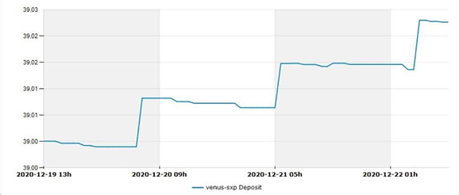

# Vaults

## Qu'est-ce qu'un vault ?

Les vaults Beefy sont des outils d'investissement qui appliquent un ensemble spécifique de stratégies aux Fermes de Rendement (Yield Farming). Ils sont automatisés pour investir et réinvestir en permanence les fonds déposés, ce qui permet d'atteindre des niveaux élevés d'intérêts composés. En utilisant un vault Beefy, vous économisez votre temps ainsi que le coût en gaz de milliers de transactions. Au lieu de récolter et de vendre vos récompenses, d'acheter plus de jetons et de les réinvestir, tout cela manuellement, un vault s'en occupe pour vous automatiquement, à une fréquence élevée, et cela durant les 24 heures de la journée.\
\
Les vaults sont au cœur de l'écosystème Beefy.Finance. Dans un vault Beefy, vous ne recevrez que de l'actif que vous y déposez, qu'il s'agisse d'un jeton de Réserve de Liquidité (LP) ou d'un seul actif. Par exemple, les vaults où l'on peut déposer du BTC-BNB LP vous rapporteront exclusivement plus de BTC-BNB LP, augmentant ainsi votre dépôt dans le vault et vous faisant ainsi gagner de plus en plus de récompenses au fil du temps.\
\
Malgré le fait que le nom, "Vault" (coffre-fort en français), le suggère, les fonds des utilisateurs ne sont jamais bloqués dans un vault sur Beefy.Finance. Tout le monde peut retirer se retirer d'un vault à tout moment. Beefy.Finance ne possède pas les fonds des utilisateurs stakés dans les vaults. En règle générale, il faut considérer les vaults disponibles sur la plateforme comme des outils d'investissement moyen et long terme, afin de profiter au mieux des intérêts composés.

En parcourant les vaults sur la plateforme, vous pourrez observer le pourcentage correspondant au Rendement Annuel en Pourcentage (**APY**), qui prend en compte la composition des intérêts, (contrairement au Taux Annuel en Pourcentage (**APR**)), ainsi que le rendement journalier, le montant total investi dans le vault par les utilisateurs (**TVL**), et la plateforme utilisée par le vault en tant que source de revenus.

Chaque vault concerne soit une paire de jetons déposée dans une Réserve de Liquidité, tel que les jetons CAKE-BNB LP sur l'écosystème Binance Smart Chain, soit un jeton déposé sur une plateforme de prêt ou une Réserve de Récompenses (Single Stake Reward Pool). Après avoir déposé des jetons dans un vault, l'utilisateur reçoit des mooTokens spécifiques au vault qui représentent sa part dans le vault. Nous développerons les mooTokens dans la section suivante.

N'importe qui dans la Cowmunauté peut créer de nouvelles stratégies et les soumettre à la gouvernance par vote. Nous examinons les demandes de vault via notre forum officiel où tout le monde est libre de soumettre des [demandes de création de vault](https://forum.beefy.finance/c/vault-requests/6). Toutefois, la demande d'un nouveau vault ne sera pas accepté si la plateforme sous-jacente n'adhère pas aux [beefy-safu-practices.md](../safu-protocol/beefy-safu-practices.md "mention").

En résumé, les vaults peuvent:&#x20;

* Exécuter efficacement les stratégies sur les Fermes de Rendement.
* Transformer les récompenses dans le jeton initialement déposé et les composer.
* Utilisez n'importe quel actif comme liquidité.
* Fournir un actif en collatéral d'un autre.
* Gérer les collatéraux afin de réduire le risque de liquidation
* Faire travailler n'importe quel actif pour en générer un rendement.
* Réinvestir les bénéfices gagnés.

Ainsi, nos utilisateurs n'ont plus qu'à observer leur investissement croître automatiquement !

## Les MooTokens, qu'est ce que c'est ?

Un mooToken est un jeton portant intérêt ainsi qu'une preuve de dépôt tokenisée que vous recevrez lorsque vous déposerez des fonds dans n'importe quel vault Beefy. Par exemple, vous recevez des jetons mooBIFI lorsque vous déposez des BIFI dans le vault BIFI Maxi.&#x20;


ATTENTION : Les utilisateurs de Beefy.Finance doivent conserver précieusement leurs mooTokens, et ne pas les vendre ou les échanger à des inconnus, sous peine de perdre la propriété de leurs actifs déposés dans les vaults !


## Comment les mooTokens rapportent-ils des intérêts ?

Les vaults Beefy génèrent automatiquement une plus grande quantité de votre actif déposé sous la forme d'intérêts composés. En détenant des mooTokens dans votre portefeuille, leur valeur augmente par rapport à son actif correspondant déposé dans le vault. Le nombre de mooTokens dans votre portefeuille restera constant, mais la quantité de jetons du vault contre lesquels vous pouvez les échanger augmente. C'est aussi la raison pour laquelle les mooTokens ne correspondent pas 1:1 au montant du jeton initialement déposé.

## Comment échanger des mooTokens contre les jetons initialement déposés ?

Lorsque que vous souhaitez retirer les jetons qui sont stakés dans le vault Beefy, il vous suffit d'initier une transaction de retrait pour les échanger. Les mooTokens sont ensuite retirés de votre portefeuille et brûlés, et vos actifs déposés ainsi que le rendement du vault vous seront restitués.

## Quels sont les avantages des mooTokens ?

Ce système de mooTokens présente quelques avantages majeurs:\
\
1\. Les mooTokens permettent à tout utilisateur de retirer sa juste part des fonds déposés;

2\. Le système vous permet de retirer vos mooTokens sur un portefeuille à froid (Cold Wallet, par exemple, une clé Ledger) pour une sécurité optimale;

3\. Votre vie privée est préservée, car vous restez anonyme vis-à-vis de Beefy. Vos fonds dans le vault ne sont pas liés à l'adresse du portefeuille à partir de laquelle vous avez effectué le dépôt, seuls les mooTokens sont la preuve de votre part dans le vault. Par conséquent, il est tout à fait possible de retirer vos fonds depuis une adresse différente si vous y transférez vos mooTokens;

4\. Les mooTokens présentent des avantages fiscaux : puisque vous ne vendez pas de récompenses, et que vous ne recevez pas de récompenses de staking directement à votre adresse, vous ne générez donc d'événements imposables lorsque vous avez des fonds stakés dans un vault;

5\. Enfin, les mooTokens peuvent être utilisés comme collatéral portant intérêt.

## À quelle fréquence les vaults récoltent-ils leurs profits et les réinvestissent ?

Les profits des vaults sont normalement récoltés plusieurs fois par jour et sont automatiquement réinvestis. Vous pouvez vérifier la fréquence de récolte et de composition d'un vault à l'aide de [ce guide pratique](../faq/how-to-guides/how-to-check-harvesting-compounding-rate.md).

## Pourquoi ne pas le faire soi-même ?

Bien qu'il soit possible de le faire manuellement, les vaults vous aident à économiser du temps et des frais de transaction, à maintenir des ratios de collatéral sur dette sains, à obtenir les meilleurs rendements possibles et à réinvestir automatiquement les bénéfices. Il serait compliqué de faire tout cela par vous-même, et honnêtement, inefficace. Chez Beefy, on aime dire : "Détendez-vous, nos vaults font le travail pour vous."

## **Comment sont répartis l**es frais d'un vault ?

La plupart de nos vaults ont des frais de performance, prélevant un pourcentage sur les récompenses de la récolte. Ces frais sont divisés et redistribués entre les stakers $BIFI, la trésorerie de Beefy, le stratège qui a développé le vault et à celui qui appelle la fonction de récolte. Ces frais sont déjà intégrés dans l'APY et le taux journalier affichés sur chaque vault. Vous n'avez donc pas besoin de les calculer vous-même. Le détail des frais de performance liés à un vault sont présentés à l'intérieur du module de dépôt et de retrait.

Les frais de performance appliqués sur le rendement supplémentaire, c'est-à-dire sur les bénéfices du vault grâce à sa stratégie, sont largement redistribués aux stakeurs $BIFI Maxi et constitue la principale source de revenus de la plateforme de Beefy.Finance. Une partie de ces frais financent également la trésorerie qui est utilisée pour financer le développement et la sécurité de la plateforme et d'autres initiatives. Les frais de performance ont également été mis en place pour promouvoir l'engagement communautaire et la participation à la gouvernance. Le succès et l'engagement de la communauté sont essentiels pour notre croissance future, car cela permet de récompenser encore plus les utilisateurs de la plateforme.

De plus, les vaults ont des frais de retrait. L'objectif principal de ces frais est d'empêcher d'éventuels actions d'utilisateurs ayant de mauvaises intentions. Sans les frais de retrait, quelqu'un pourrait déposer ses jetons juste avant l'exécution de la fonction harvest() et les retirer juste après, en prenant un pourcentage des gains générés par les stakers légitimes. Les frais de retrait restent dans le vault et sont partagés entre les fonds du vault.

## Qu'est-ce que la "récolte au dépôt" (Harvesting on Deposit) ?

De nombreux vaults Beefy "Récoltent au dépôt". Cela signifie que lorsque vous déposez dans le vault, vous appelez également la fonction de récolte (Harvest()) de sa stratégie. En appelant la fonction de récolte, vous déclenchez la collecte des récompenses en attente et la composition de ces récompenses dans les jetons du vault pour tous ses utilisateurs.

Beefy fait cela pour qu'il soit impossible aux utilisateurs malveillants de voler le rendement des autres. Ainsi, aucun frais de retrait n'est requis. Cela profite grandement aux investisseurs long terme.

Presque tous les vaults des chaînes les moins coûteuses comme Fantom et Polygon récoltent au dépôt. Vous pouvez savoir si un vault récolte au dépôt s'il n'y a pas de frais de retrait.

Lorsque vous déposez, et donc appelez la fonction de récolte, vous recevez une récompense sous la forme du jeton de chaîne natif (par exemple, WFTM ou WMATIC) en raison des frais d'appel de la fonction de récolte.

## Les frais de performance sont-ils déduits lorsque je retire mes fonds ?

Non, les frais de performance sont basés sur les bénéfices et sont prélevés chaque fois que quelqu'un appelle la fonction de récolte (harvest()).

## La page du vault affiche-t-elle correctement l'APY ?

Oui. Nos APYs affichés reflètent le taux qu'il est prévu de gagner sur un vault en un an. Ce taux est déterminé par la plateforme sous-jacente qu'il utilise, la stratégie employée à ce moment-là, le montant total des fonds dans le vault ainsi que la composition des intérêts. Nous avons également inclus tous les frais dans notre calcul. Ainsi, ce que vous voyez est ce que vous obtenez !

## Quels risques les vaults présentent-ils ?

Les vaults Beefy sont audités, mais cela ne signifie pas qu'un vault est entièrement sans risque. Voici quelques-uns des risques potentiel d'un vault :

* Les jetons déposés dans le vault ne peuvent pas diminuer en quantité mais peuvent diminuer en valeur monétaire.
* Comme pour tout contrat intelligent, le risque ultime est que les fonds d'un investisseur soient  volés ou ne puissent pas être retirés. L'équipe prend toutes les mesures possibles pour quantifier les risques de sécurité des contrats intelligents et n'interagira qu'avec ceux qui répondent à un ensemble spécifique d'exigences et ayant subit des tests approfondis pour s'assurer que la plateforme sous-jacente ne contient pas de fonctions de Rug Pull (En français, nous pourrions dire « de fonctions permettant d'aspirer les fonds »). \
  \
  Pour une description détaillée des étapes suivies par Beefy avant d'ajouter de nouveaux vaults, veuillez consulter les [beefy-safu-practices.md](../safu-protocol/beefy-safu-practices.md "mention").

Plus de détails sur les risques d'un vault, ou mieux encore, des informations sur la sécurité des vaults Beefy via le score de sécurité de Beefy peuvent être trouvées ici: [Score de Sûreté Beefy](../safu-protocol/beefy-safety-score.md).

## Quels sont les différents type de vaults ?

* **Money Market :** Utilise des plateformes de prêt, telles que Venus sur la BSC, pour générer le rendement le plus élevé possible pour ces jetons (par exemple, BUSD, BNB, LINK, DOT, DAI, USDT, ETH ou BTCB).
* **Native Token Farming :** Tire parti du rendement élevé des plateformes populaires en y déposant un actif différent de celui de la plateforme afin de profiter des récompenses en jeton natif, puis en les composant en plus de l'actif initialement déposé.

## Que vais-je récupérer lorsque j'effectue un retrait d'un vault ?

Vous récupérerez toujours le type de jeton que vous avez déposé. Chez Beefy, vous gagnez ce que vous stakez. Vous obtiendrez le montant que vous avez déposé plus le rendement généré (moins les potentiels frais de retrait du vault). Dans le cas des vaults de jetons LP, vous pouvez également utiliser le Zap Beefy, qui vous permet de récupérer la totalité du montant déposé dans l'un des deux jetons constituant le LP.

## Comment fonctionnent les vaults LP?

Les vaults de Réserve de Liquidités (LP) fonctionnent en réinvestissant les frais récoltés par les utilisateurs fournissant cette Réserve de Liquidité. En échange de la liquidité apportée à la réserve, de nombreuses plateformes récompensent les investisseurs avec des jetons non LP (Par exemple, fournir de la liquidité pour la paire CAKE-BNB LP permet de toucher des récompenses en CAKE). Nos vaults récoltent régulièrement ces récompenses, les vendent, achètent davantage d'actifs sous-jacents de la Réserve de Liquidité, puis les réinvestissent pour compléter le cycle.

Cela compose les intérêts gagnés d'une Réserve de liquidité. Chez Beefy.Finance, nous créons des stratégies qui automatisent ce processus, vous faisant économiser du temps et des frais de transaction. Toutes ces actions sont effectuées en échange d'une modique somme qui est ensuite redistribuée à ceux qui participent à la réserve de gouvernance Beefy ou au vault BIFI Maxi. Un petit pourcentage va également à la trésorerie de Beefy Finance.

## À quelle fréquence l'affichage des soldes sont-ils mis à jour ?

* Les récompenses en attente ne sont pas prises en compte dans le solde tant qu'elles ne sont pas échangées contre le jeton initialement déposé. Cela peut donc varier en fonction de la stratégie appliquée.

## Comment de nouveaux vaults sont-ils ajoutés chez Beefy.Finance?

L'ajout de potentiels nouveaux vaults peut être discuté sur notre Discord. Nos stratèges ajoutent ensuite la stratégie d'investissement potentielle à notre liste de stratégies. Une priorité est attribuée à chaque nouvelle stratégie potentielle en fonction de son APY, de sa TVL et de sa durabilité. Nos développeurs/stratèges attaquent ensuite la liste de la plus haute priorité à la plus basse. Le forum officiel est utilisé pour soumettre les demandes de vault.\
\
\----- The official forum is used for submitting actual [vault requests](https://forum.beefy.finance/c/vault-requests). -----

Ensuite, la plateforme sur laquelle le vault va potentiellement déposer les fonds est très soigneusement examinée afin de s'assurer que ses contrats intelligents soient sûrs et qu'il n'existe aucun danger potentiel. Pour plus d'informations à ce sujet, vous pouvez consulter les[beefy-safu-practices.md](../safu-protocol/beefy-safu-practices.md "mention").

## Quel est le processus utilisé pour nommer les vaults ?

Chaque vault de la plateforme porte le nom du jeton que les utilisateurs peuvent y déposer. Par exemple, le vault CAKE-BNB LP utilise les jetons CAKE-BNB LP pour sa stratégie d'investissement. Un vault BTC utilise le jeton BTC, etc.

Sous le nom du vault, vous pouvez trouver le nom la plateforme utilisée pour investir les jetons déposés.\
\
\----- Par exemple, Uses: Venus signifie que ce vault investit le jeton dans la plateforme Venus, un marché monétaire algorithmique DeFi et un protocole de stablecoin synthétique.\
\
Underneath the vault name, you can find the platform used for investing the token and farming its yields. For example, Uses: Venus means that that particular vault invests the token in Venus, a DeFi algorithmic money market and synthetic stablecoin protocol. -----

## Comment fonctionnent les vaults de Lending (Prêt)?

_Le paragraphe suivant s'applique pour : Aave, Banker Joe, Blizz, Geist, Scream, Venus et les plateformes de Lending similaires._

La plupart des vaults à un seul actif utilisent des marchés décentralisés pour les prêteurs et les emprunteurs. En déposant votre actif dans le vault, Beefy le dépose ensuite sur le marché des prêts et emprunte contre votre jeton à des niveaux de collatéral sûrs.

Les jetons empruntés sont redéposés sur la plateforme et à nouveau utilisés comme collatéral pour emprunter plus de jetons. Ce cycle est répété plusieurs fois pour générer autant d'intérêts que possible de l'intérêt direct du prêt ainsi que du jeton de récompense de la plateforme, qui est utilisé pour acheter davantage de vos actifs initialement déposés. Cette stratégie est également connue sous le nom de stratégie de Folding (Pliage). Il convient de noter que ces prêts et emprunts multiples "à effet de levier" ne concernent que le jeton de vault déposé, il n'y a donc aucun risque de liquidation en raison des fluctuations des prix des jetons.


Concernant les frais de transaction: en raison des multiples cycles d'approvisionnement et d'emprunt, les frais de transaction pour un dépôt ou un retrait dans ces vaults sont généralement plus élevés que ceux des autres vaults.



Risque de négociabilité : lorsque le jeton sous-jacent sur la plateforme de prêt devient sur-emprunté, il peut empêcher la stratégie du vault de se désendetter (Unfolding, dépliage. En lien avec la stratégie de Folding présentée ci-dessus) pour permettre un retrait. Cela se produit généralement lorsque le marché est plus volatil que l'accoutumée ou lorsqu'il y a un événement en cours pour lequel les gens veulent emprunter des fonds à la plateforme de prêt. La condition de sur-emprunt se résoudra naturellement une fois que la liquidité reviendra sur la plateforme de prêt, un processus qui peut prendre des heures ou, parfois, quelques jours. Pendant ce temps, les fonds restent toujours en sécurité.


En raison de l'accumulation de la dette et de l'intérêt d'approvisionnement, vous pouvez remarquer que le montant de jetons déposés dans le vault peut diminuer très légèrement entre chaque récolte. Après la récolte lancée, vous verrez le montant de vos jetons augmenter à mesure que les rendements gagnés sont composés. L'évolution du montant de jetons déposés dans un vault de prêt classique se présente ainsi:

