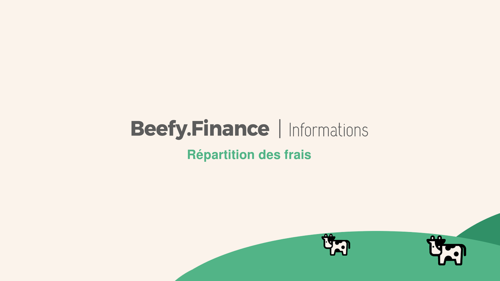

# Beefy Finance Fees Breakdown

**How **_**much**_** do fees matter?**

The answer can be hard to wrap your head around.

* $1M invested for 30 years at 8% with a 1% management fee yields $7.62 million.
* $1M invested for 30 years at 8% with a 2% management fee yields $5.74 million.
* $1M invested for 30 years at 8% with a 3% management fee yields $4.32 million.

**Now, let's throw out modesty for a minute.**

Unlike some platforms flashing their APYs for your attention, there are no catches on Beefy.Finance. For example, they'll promote an APY, but won't mention there's a penalty fee if you withdraw early.

Or the APY is given as a spectacular headline number, but the small print is that you have to _manually_ compound every single day to get that number.

**On Beefy we're proud to be doing things a little more transparently.**

_With our vaults, performance fees are included in the APY._

**So what you see is exactly what you get.**

Most vaults available on Beefy.Finance hold 4.5% of harvest rewards. This performance fee is largely distributed back to $BIFI stakers and is the main source of revenue for the platform.

**Here's what that looks like:**

* 3.0% is distributed back to $BIFI stakers
* 0.5% is allocated to the Beefy Finance treasury
* 0.5% is awarded to the vault strategist
* 0.5% is awarded to the one calling the harvest function

We assign a deposit or withdrawal fee of 0.1% to each vault to protect bad actors from abusing the vaults with too much flipping. We share this amongst all the other stakers in the vault.

Apart from the fees fully listed above, anyone using Beefy should also remember the network transaction fees when adding or removing funds. These small fees go to the operators keeping the blockchain running, not Beefy.

**Bottom line: fees matter.**

With Beefy's Venus vault, you can invest at 14.46% APY with fees already factored in.

$1M invested for 30 years at 14.46 % APY yields…

$57,492,639 million.

**With Beefy, what you see is what you get.**
