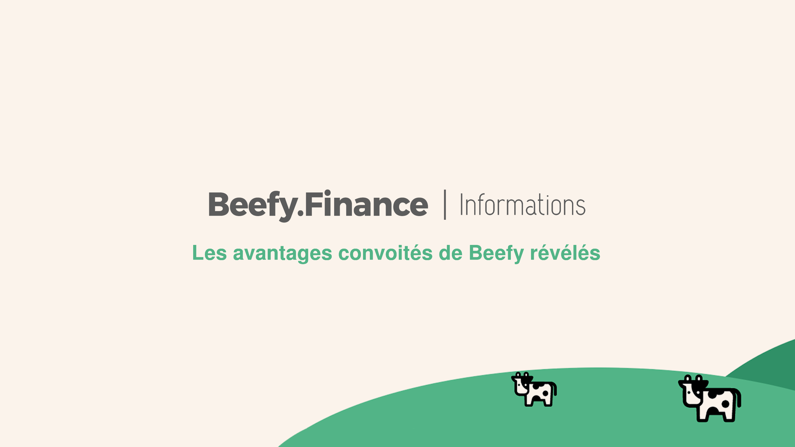

# Beefy's Coveted Advantages Revealed

_"An organization's ability to learn, and translate that learning into action rapidly, is the ultimate competitive business advantage."_

— Jack Welch, former chairman and CEO, General Electric

**In any activity, there are some advantages that have to do with resources and some that have to do with the absence of them.**

That underdogs often come out on top is because the latter has "unseen advantages" against the former.

At Beefy.Finance, we don't consider ourselves underdogs…

And we generally prefer to let what we build do the talking…

However, a core component of our vision for the future is attracting and incentivizing the best coding and creative talent on the planet to join our community.

Through our unique reward system, our developers receive a percentage of Beefy.Finance's revenue from the vaults they build for Beefy.

Because this exists, we have grown an enormous development team quickly — an army of smart contract developers who are ready to create new vaults almost the same day as we finish our due diligence.

The migration from TradFi to DeFi is a marathon rather than a sprint, but it serves the market to be able to act quickly when we need to.

The marathon means having safety as our number one priority.

The sprint is sustainably spinning up new vaults.

_**Code — and the talent that writes it — is the ultimate force multiplier in this arena, and its leverage advantage is compounding at a spectacular rate.**_

If you're a smart contract developer who favors future rewards over legacy resources, you know where to find us.
