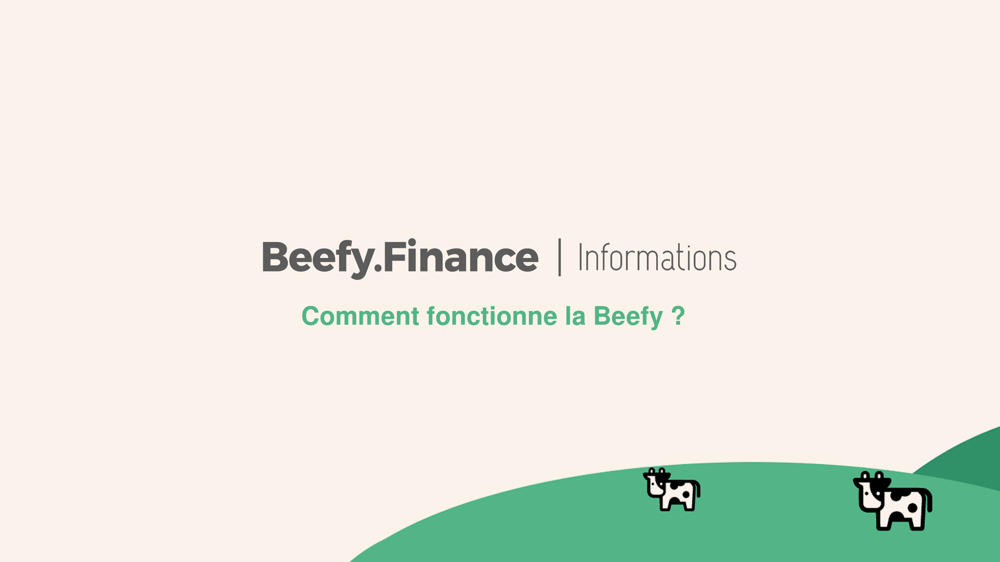

# How Does Beefy Finance Work?

We know that entering the crypto and DeFi arenas can be confusing and disorientating. We know that many have lost money in altcoins and have high levels of scepticism about this new opportunity.

So let's break down what Beefy does in language as close as possible to how the current financial world works.

**1. You know what interest is:**

You have $10,000 in your bank account and you earn a 12.5% annual return on your investment. After 12 months, you receive a deposit of $1,250 as an interest payment. After five years, you have $16,250.

**2. You know what compound interest is:**

It's interest on interest. You get interest on the initial amount you put in, and you get interest on the interest already accumulated from the previous years.

So with compound interest, after 5 years you won’t have $16,250, you'll actually have $18,020.

So far, so good.

_**But what if there was a "third way"?**_

This is the question we asked ourselves as programmers.

**3. Here's what Beefy interest is:**

When you take your crypto and stake it on Beefy we find ways to add to the compounding of your asset. If one of the platforms we use gives away a promotional coin on top of any interest, then we take that promo coin and sell it for more of what you staked.

_**The result is a significantly higher overall annual return.**_

When Beefy combines your 12.5% annual compounding interest with the 14.2% interest of another site's promotional coin, you get 28.02% APY on Beefy.

Beefy's BNB Venus vault is doing just that. At the time of writing, you get 28.02% APY for your BNB.

**After five years, you won't have $18,020, you'll have $34,386; all in the asset you actually staked.**
