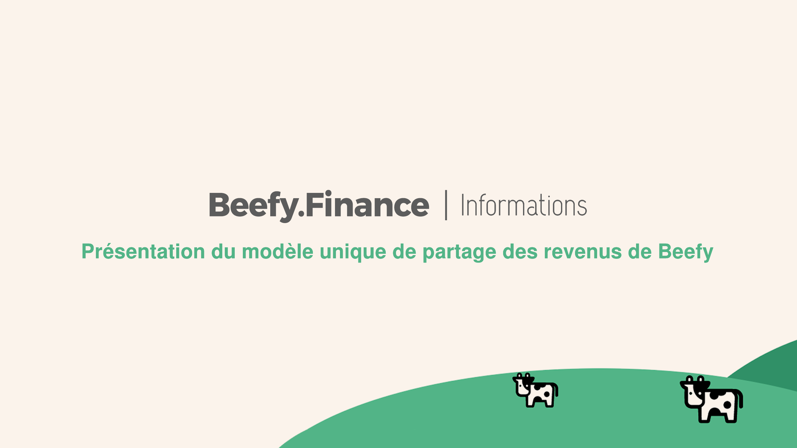

# Introducing Beefy's Unique Revenue Share Model

**At long last DeFi adopters are beginning to realize that it's ridiculous to believe so strongly in a better financial system, and then spoil the whole moment with degenerate gambling.**

Hence, the growing popularity of decentralized projects with sustainable tokenomics and platform governance.

They're in a class by themselves.

These projects are **more efficient**, have **better stability and security** and are more likely to attract the **attention of the market**.

Owning $BIFI not only allows you to participate in platform governance, but also to start earning daily interest payments by staking your holdings in the right place.

Here's where things get _remarkable_ — listen closely.

All the APYs you see on Beefy vaults have the platform fees factored in. These fees are used to buy back more $BIFI from the open market every single day and reward it to those who have their holdings staked in the BIFI Maxi Vault.

So by buying $BIFI and staking in BIFI Maxi, you have something unique:

_Daily revenue from a non-inflationary revenue token where the "company" buys shares off the market every day, and gives you more of them._

This creates a financial "flywheel" for your money, where a continuously improving set of repeatable, tactical actions scale with decreasing friction to grow your investment.

**In other words, yesterday's gains are tomorrow's capital.**

Beefy is being built by a group of dedicated smart contract codesmen, backed by a community of UI, UX, strategists, statisticians, designers and artists.

That's why the smart money is on [Beefy.Finance](https://www.beefy.finance/).
