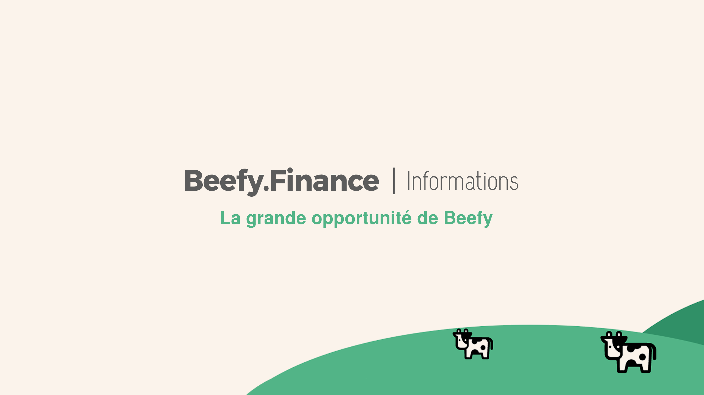

# The Big Beefy Opportunity

There are two types of people in this world: those who have a vague desire to achieve their financial goals, without ever taking any specific and deliberate action to make it happen, and those who "run the numbers" and are ready to seize the opportunity when they see it.

This might sound like a cringe 80's television commercial, but the truth is the strength of Beefy Finance comes from what we BUILD, not what we say.

_So, what have we built?_

Like any other DeFi Yield Farm, Beefy has created an opportunity for its users to both automate AND maximize the ROI of their holdings.

But what is unique to Beefy is a decentralized working hub for people with a vision to come together and build the future of global finance.

Smart contract devs, UI, UX, strategists, statisticians, designers, and artists — anyone can join and contribute (no matter your nationality, sex, or views).

_By investing in Beefy, you are investing in the idea that a group of highly technical individuals can safely, securely and creatively leapfrog the dinosaurs of traditional finance._

The two main variables in wealth generation are:

Time (how long) and yield (how much).

We'll take care of the yield.

**All you have to do is decide how soon you would like to get started.**
