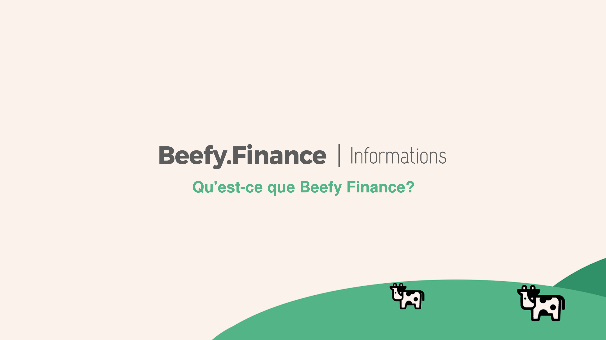

# What is Beefy Finance?

* "The compound interest opportunity of a lifetime"
* "The safest and best way to get started in DeFi"
* "Passive income on steroids"
* "Just a really good, super decentralized investment"

_**But in practical terms, Beefy is a yield farming optimizer that removes the daily actions and regular fees associated with manual optimization.**_

What you're left with is very safe funds and a _very_ good return of investment (ROI).

For those new to decentralized finance (DeFi), yield farming is simply a way to make some interest — as opposed to just "gains" — with your crypto holdings.

Money is one thing, but time is the most important asset of all.

_**Beefy makes it simple to benefit from the upside of complex farming strategies.**_

There are lots of farms to choose from, so Beefy automates and optimizes different investment strategies in the background while you get on with your day.

The project consists of an anonymous team constantly exploring new methods of optimizing automation to secure the largest yields possible.

As a decentralized project with a crypto-mindset, there is a robust governance system in place to put the decision-making power in the hands of those invested in the project.

**This takes place through governance mechanisms related to Beefy's own fixed-supply, revenue earning token, $BIFI.**
