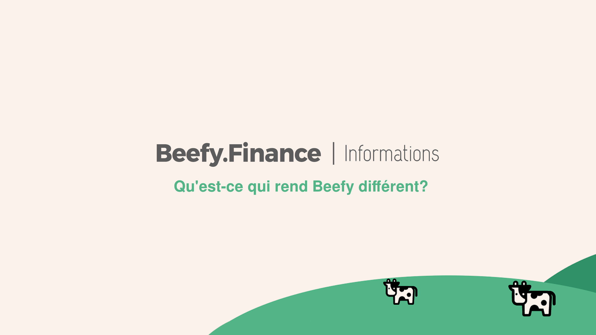

# What Makes Beefy Different?

Investor and crypto evangelist Naval Ravikant was once asked, "What would you be working on if you were 25 again?"

**Naval's reply:**

_"An unstoppable, uncensorable social media platform."_

In other words, he'd be working on a technological platform that puts science and code ahead of cronyism and censorship. This is the foundation of Beefy Finance.

Some other values we align ourselves with:

_Trustless, open-source, decentralized, scalable, transparent, community-driven, cross-chain, autonomous, sustainable, innovation, healthy treasury, contribution rewards, developer bounties, safety._

In practical terms, our sustainable tokenomics mean the day-to-day is unrelentingly focused on the product. We provide the greatest variety of vaults and the highest number of chains. Users can request vaults directly from our developers on Discord and the time it takes to answer these requests is very low.

At the time of writing, we have more than a dozen smart contract developers (and growing) carefully testing and reviewing the vaults, investment strategies and smart contracts before public release.

**Safety is everything.**

And we offer this while saving you time and energy through automation.

_**Be first. Be safe. Be Beefy.**_
