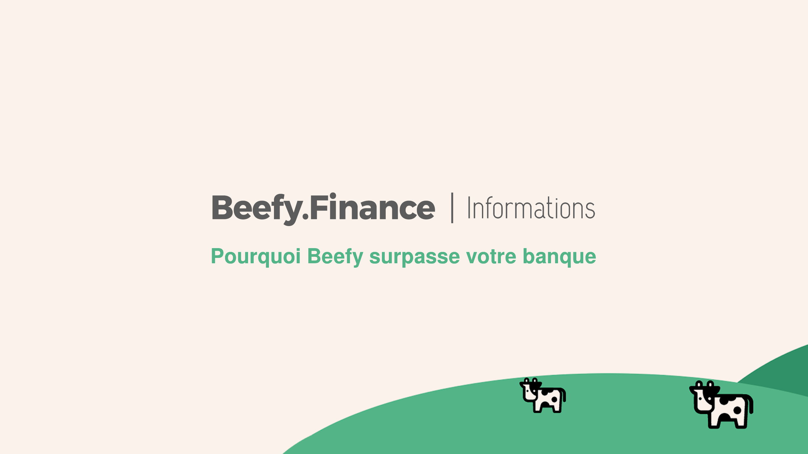

# Perché Beefy batte la tua Banca

Una domanda su cui le persone più ricche sono ossessionate:

**"Qual è la più grande opportunità per gli investitori in questo momento?"**

Sarebbe imprudente citare altri dettagli oltre quelli superficiali, ma è risaputo che ci sono vantaggi finanziari, veicoli di investimento e vantaggi fiscali accessibili ad individui con grandi patrimoni e non accessibili per gli altri.

_Ciò di cui possiamo parlare è come funzionano le banche tradizionali, e dimostrare chiaramente perché Beefy.Finance è un'opzione migliore._

Quando dai soldi ad una banca, presta i soldi ad altre persone ad un interesse maggiore di quello che percepisci tu per "risparmiare".

**La banca intasca la differenza come rendita.**

Questi soldi vengono usati per pagare cose come lo staff, i call center, le guardie di sicurezza e una miriade di altre spese operative che possono essere giustificate o meno.

**Nel frattempo Beefy è un'organizzazione autonoma decentralizzata, posseduta e gestita dai suoi utenti.**

Le decisioni non sono un evento top-down. Quindi invece di andare ad una piccola cricca di dirigenti che bevono champagne, possono solo essere re-distribuiti con l'approvazione dell'organizzazione. Le DAO come Beefy sono governate da proposte e votazioni. Mentre le banche pagano impiegati per eseguire certe azioni, il codice le automatizza, e  la crittografia protegge i tuoi fondi.

**Ci sono quindi due cose che accadono:**

innanzitutto, una DAO è significativamente molto più efficiente di una banca. Secondo, c'è un'elevata domanda per un miglior APY rispetto allo 0.1% attualmente offerto dalla maggior parte delle istituzione, che è molto più basso del tasso d'inflazione attuale di circa il 2%.

Quando apprendi che c'è un nuovo e sicuro modo, per mettere i tuoi soldi a rendita con un APY che è **almeno 70 volte superiore** rispetto alla tua banca...

E tu apprezzi che questo APY è disponibile perché le DAO sono fondamentalmente organizzate in miglior modo per trasferire i risparmi ai loro utenti...

Potresti ragionevolmente chiedere quanto prima puoi iniziare...

E la risposta è oggi.

**Perché a differenza delle banche, qui non c'è nessun processo di approvazione.**
