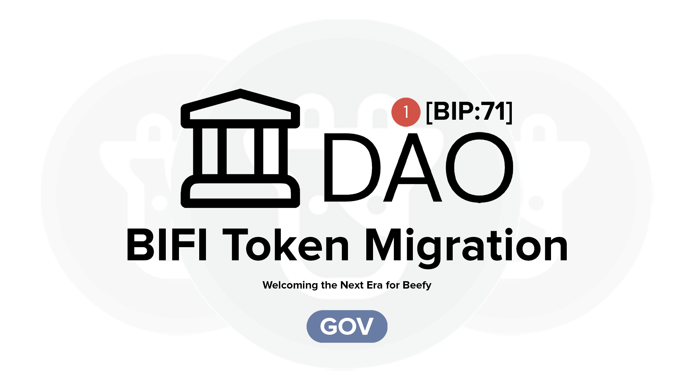

# $BIFI Token


Note that the $BIFI migration discussed in these documents is ongoing, and so information in this page may be liable to change in the final implementation. This page has been released early for informational purposes, to assist users and tokenholders to understand the details of the planned migration.


The $BIFI token is the governance token of the Beefy project. It unites the [protocol](../protocol/ "mention") - which pays out to tokenholders through [governance-pools.md](../protocol/governance-pools.md "mention") - with the Beefy DAO - which conducts the [governance.md](../../dao/governance.md "mention") of the project.

## **What is $BIFI?**

The Beefy token (symbol: BIFI) is an ERC-20 smart contract which records the holdings of $BIFI tokens among our community of tokenholders. The purpose of $BIFI itself revolves are two core use cases:

* **Project Governance** - holders of $BIFI can vote in the [Beefy Snapshot Space](https://vote.beefy.finance/#/) on all of our governance matters, at a rate of 1 vote per token (including fractional amounts); and
* **Stakeholder Incentivization** - through holding the $BIFI token, the project can incentivize the participation by stakeholders in the project and protocol with governance incentives paid through our [governance-pools.md](../protocol/governance-pools.md "mention").

Other external use cases for Beefy have emerged over time, including offering liquidity for trading in $BIFI and using $BIFI as collateral for loans. However, within the Beefy project, the token is purely intended to facilitate and encourage governance of the project.

## How does $BIFI work?

The ERC-20 smart contract for the $BIFI token itself is extremely short and simple:


```solidity
// SPDX-License-Identifier: MIT
pragma solidity 0.8.19;

import {ERC20PermitUpgradeable} from "@openzeppelin/contracts-upgradeable/token/ERC20/extensions/ERC20PermitUpgradeable.sol";
import {ERC20Upgradeable} from "@openzeppelin/contracts-upgradeable/token/ERC20/ERC20Upgradeable.sol";

contract BIFI is ERC20Upgradeable, ERC20PermitUpgradeable {
    
    function initialize(address _treasury) external initializer {
        __ERC20_init("Beefy", "BIFI");
        __ERC20Permit_init("Beefy");
        _mint(_treasury, 80_000 ether);
    }
}
```


The new $BIFI token - launched after the migration in 2023 - builds upon the [original $BIFI token](https://bscscan.com/token/0xCa3F508B8e4Dd382eE878A314789373D80A5190A#code) in a few core ways:

* It removes any minting functionality or permissions, and mints all the token supply there will ever be immediately on initialization;
* It moves to an upgradeable standard, which means you deal with a contract instance but not the underlying logic of the contract; and
* It adopts the permit pattern established by [EIP-2612](https://eips.ethereum.org/EIPS/eip-2612), which allows for gasless permit approvals by way of signatures. This means that users can approve transactions with the bridge without paying gas.

The initial 80,000 $BIFI supply is all minted to the Beefy treasury, for distribution to existing holders as part of the migration.

## How do I verify that $BIFI is safe?

As a \[verified open-source contract]\([https://etherscan.io/address/0xb1f1ee126e9c96231cc3d3fad7c08b4cf873b1f1](https://etherscan.io/address/0xb1f1ee126e9c96231cc3d3fad7c08b4cf873b1f1)) on the Ethereum blockchain, anyone can review the code of the new $BIFI smart contract and its operations through the block explorer.&#x20;

With that said, we are conscious that not all users will feel comfortable verifying the safety of contracts themselves. As such, we've had the token contract audited, and you can view the full audit report \[here]\([https://etherscan.io/address/0xb1f1ee126e9c96231cc3d3fad7c08b4cf873b1f1#code](https://etherscan.io/address/0xb1f1ee126e9c96231cc3d3fad7c08b4cf873b1f1#code)).

## What are the tokenomics of $BIFI?

Beefy prides itself on having some of the simplest tokenomics in all of Web 3.0:&#x20;

* There are 80,000 $BIFI tokens, as determined on deployment of the token contract;&#x20;
* The contract provides no further ability to mint and no officially burn functionality;
* All tokens were fully distributed as of July 2022, though the Beefy [treasury.md](../../dao/treasury.md "mention") does hold $BIFI for various purposes (e.g. protocol-owned liquidity, redemptions of $BIFI which could not be migrated, etc); and
* There are no plans or obvious means to change the token's functionality or add additional tokens to our governance system.

No frills. No gimmicks. What you see is what you get.

## What is the history of the $BIFI token?

The $BIFI token was launched together with the project and the [protocol](../protocol/ "mention") back in September 2020. After an initial distribution period of around two months back in Q4 2020, 72,000 tokens were supplied to the community with 8,000 being locked for the founding team. All 80,000 BIFI were officially in circulation as of July 2022. The distribution via the "governance pools" and detailed info about the timelocks are found [here](https://github.com/beefyfinance/beefy-gov).

<figure><figcaption><p>The $BIFI token migration was approved </p></figcaption></figure>

In July 2023, issues with the Multichain project - Beefy's bridging provider who had issued the $BIFI token on all non-native chains - caused critical failures with the Multichain bridge. Shortly after this, the decision was taken to seek to migrate the $BIFI token away from Multichain, to protect user funds. A more detailed account of the events leading up to the Migration is provided \[here]\([https://beefy.com/articles/bifi-migration/](https://beefy.com/articles/bifi-migration/)).

Through \[BIP:71] - the $BIFI Migration Plan - Beefy's core team sought approval for a comprehensive plan involving moving the token's base to Ethereum, restructure the [governance-pools.md](../protocol/governance-pools.md "mention") and building a new [revenue-bridge.md](../protocol/revenue-bridge.md "mention") and [token-bridge.md](token-bridge.md "mention"). After several months of work to prepare for the change over, the migration was implemented in September 2023.
