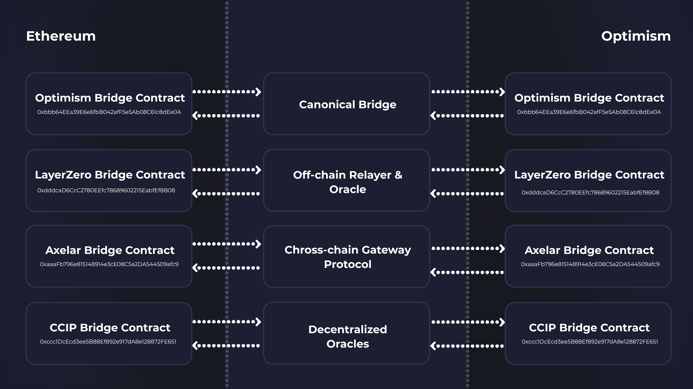

# Token Bridge

The Beefy Token Bridge refers to the bridge built by Beefy to handle our $BIFI token's implementation across various different chains. To ensure that the Beefy DAO retains foremost control over how the $BIFI token dispersed, the Token Bridge and all of its contracts have been built by Beefy and remain within its control, relying on bridging and messaging services only handle the exchange across chains.

## What can I bridge with the Token Bridge?

On launch, the Token Bridge serves only to bridge the staked $mooBIFI token.

The Token Bridge is designed to enable holders on different blockchains to gain exposure to $BIFI on their preferred chain, without the need to handle the token itself on Ethereum - which is an expensive exercise due to the high gas fees.&#x20;

The previous bridge (prior to the $BIFI token migration in 2023) enabled copies of $BIFI on every chain that the project launched on, enabling users to select which chain's [incentive-programmes.md](../protocol/incentive-programmes.md "mention") they wanted to stake their $BIFI on, to take advantage of the fees on that chain and the consequential level of governance incentives.

However, after the migration, the reorganisation of Governance Pools to live only on Ethereum means there is no need to have $BIFI on every chain. It also unlocks the possibility of bridging the staked version of $BIFI - $mooBIFI - to allow bridged copies of the $BIFI token to still benefit from the governance incentives being paid out on Ethereum.

Though it is also possible to facilitate bridging of naked $BIFI, it was felt bridging naked $BIFI with no option to stake for governance incentives on the bridged chain would make this a second-class form of $BIFI. As a yield-bearing asset, $mooBIFI was felt to be a more attractive choice, which can level the playing field with users for whom Ethereum is simply too expensive to operate on.

## How does the Token Bridge work?

With the xERC-20 $mooBIFI copy in place on the base chain, the Token Bridge can then engage with the external bridging/messaging provider to initiate the bridging process, and burn the xERC-20 to validate the request. The provider then facilitates the bridging or messaging needed to reach the target chain's Token Bridge contract. On receipt of the valid request, the Token Bridge then mints an xERC-20 $mooBIFI to the user on the source chain.

For bridging back to Ethereum, the process is reversed. On the source chain, the xERC-20 copy is burned to validate the Token Bridge's bridge transaction with the external provider. On receipt of that message, the xERC-20 contract mints an equivalent copy, which is used to demonstrate the transaction to the lockbox. The xERC-20 is then burned to release the underlying ERC-20, which is transferred back to the user on Ethereum.

Between bridged chains, the process is simply that the xERC-20 on the source chain must be burned to trigger the bridging service through the Token Bridge. Once the service delivers to the target chain's Token Bridge contract, a new xERC-20 token is minted and transferred to the user.

## What is xERC20?

xERC-20 is [Connext](https://www.connext.network/)'s implementation of cross-chain ERC-20 tokens. The design is based on [EIP-7281 (sovereign bridged tokens)](https://ethereum-magicians.org/t/erc-7281-sovereign-bridged-tokens/14979), which was pioneered by some of Connext's founders. Though the proposed standard is still gaining adoption and awaiting formalisation, Beefy's contributor team recognise that the standard provides two core benefits which merited adoption in our case:

* All the contracts for xERC-20 are (or can be) deployed by the project, meaning it retains total control over the implementation of the underlying ERC-20, the xERC-20, the lockbox and the bridge mechanism; and
* The xERC-20 tokens can be used with any number of different bridging solutions at the same time, as the storage, minting and burning of the underlying and bridged tokens is all managed by the protocol.

## Is bridged $mooBIFI different to native $mooBIFI?

Yes - bridged $mooBIFI is entirely different in terms of the underlying code when compared with the native. The native $mooBIFI ERC-20 is issued by the [incentive-programmes.md](../protocol/incentive-programmes.md "mention") (the BIFI Vault), and thus reflects an actual deposit of $BIFI in the vault, being put to use by its strategy.&#x20;

By contrast, bridged $mooBIFI is an xERC-20 token with no technical connection to the BIFI Vault or any of the functionality therein. On a smart contract-level, bridged $mooBIFI is very simple, and exists purely with the understanding that it represents a claim over the underlying $BIFI held in the lockbox contract on Ethereum.

In light of the inconvenience of needing to bridge back to Ethereum, and possible any perception of risk around bridged copies, it may be possible that the bridged $mooBIFI is also priced differently to the native $mooBIFI and underlying $BIFI tokens by the free market. This is a natural phenomenon and to be expected.

## Which bridging provider does the Token Bridge use?

As explained in [#what-is-xerc20](token-bridge.md#what-is-xerc20 "mention") above, the Token Bridge's use of the xERC-20 implementation  means that it does not rely on any one particular bridging provider, and can in fact use multiple providers at once. This was extremely attractive to the Beefy contributor team, as the migration itself had been necessitated by our dependence on a fallen bridging provider.

<figure><figcaption>
A flowchart showing the 4 bridge contract pairs on Ethereum and Optimism on launch.
</figcaption></figure>

Instead, the new Beefy Token Bridge is launching with 4 different providers:

* [**The Optimism bridge**](https://app.optimism.io/bridge/) - the core bridge between Optimism and Ethereum which ensures that all tokens received on Optimism through the bridge are canonical with the underlying assets held on Ethereum. **Please note that the Optimism bridge is currently only enabled for one deposits from Ethereum to Optimism, in light of the constraints with transaction finality when going the reverse direction** ;
* [**LayerZero's omnichain interoperability protocol**](https://layerzero.gitbook.io/docs/) - LayerZero's cross-chain messaging service which is used for lightning-fast exchanges between a huge range of chains;
* [**Axelar's cross-chain gateway protocol** ](https://docs.axelar.dev/)- Axelar's cross-chain messaging services which ensures decentralized execution of messages across its range of validators; and
* [**Chainlink's cross-chain interoperability protocol**](https://chain.link/cross-chain) - Chainlink's cross-chain messaging service which takes advantage of the existing Chainlink decentralized oracle network.

Across the 4 solutions provided at launch, users have the choice to optimize for the benefits of certainty, speed, decentralization and infrastructure. But with the xERC-20 architecture, there is no limit on the number of providers that can be incorporated into the system. That way, the distribution of our $mooBIFI token to other chains can remain firmly decentralized and not reliant on any one provider, allowing Beefy to future proof the cross-chain design of our $BIFI token.
