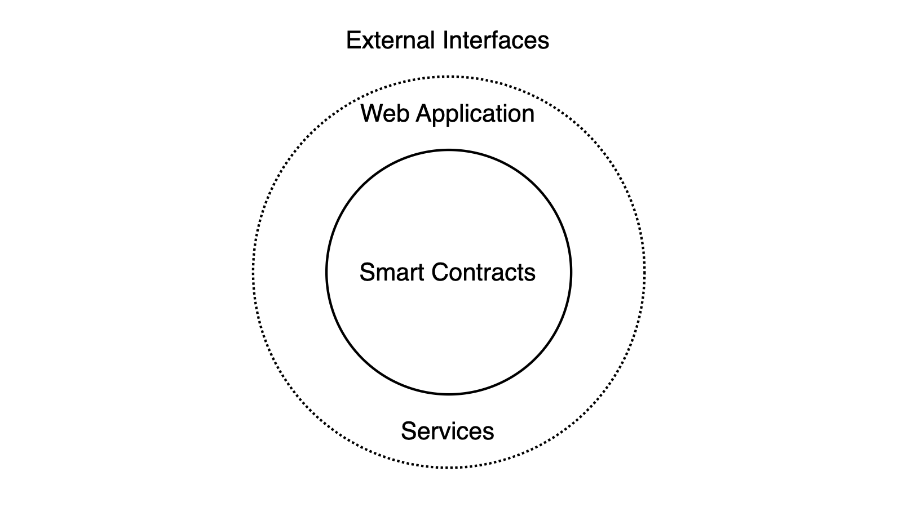

# Beefy Protocol

Beefy is first and foremost an autonomous, decentralized yield optimization protocol. Though the wider project and DAO which surround the protocol are central to Beefy's operations and identity, in fact the protocol functions entirely independently of any such individuals, and will continue to do so on blockchain in perpetuity, even after all other stakeholders are left (even if very, very broken at that stage).

This page provides a short summary of the protocol, designed to onboard novice users as to how the protocol will put their inputs to use. The detail on this page is simplified, and is generally non-technical in nature.

## What is included in the protocol?

As described above, the core of the protocol is the collection of live smart contracts on the blockchain. Beefy's contracts accept user deposits, put funds to work in automated yield farming processes, and then pay out fees to the various on-chain stakeholders in the process. As the smart contracts exist independently of the rest of the project, the protocol can continue operating autonomously, even if all of the supporting stakeholders stopped maintaining them.

<figure><figcaption>
A simplified map of the layers of the Beefy protocol.
</figcaption></figure>

However, in order for the smart contracts at the heart of the protocol to be maintained and remain accessible to ordinary users, additional services are required. These services typically require ongoing human intervention to deliver and maintain them, and so are typically performed by Beefy's contributor team. These include:&#x20;

* maintenance of existing smart contracts, such as pausing vulnerable or malfunctioning contracts, or performing live changes or upgrades to facilitate to improve performance;
* development and deployment of new contracts, both to replace and supplement the existing protocol;
* provision of a functional web application or user interface, which assists users in accessing the smart contracts and seeing live information about their functioning (e.g. rates of return);
* maintenance of live servers and databases to store and distribute necessary and relevant data about all other aspects of the protocol, including services like application programming interfaces (**APIs**); and
* operation of automated contract interactions, such as bots to watch for and trigger profitable compounding events in Beefy's vaults.

Though the protocol may continue to operate without any one of the above services for a certain period of time, all of these services are required to keep the smart contracts of the Beefy protocol safe, operational, accessible and comprehensible.&#x20;

Beyond these internal services, external services often build on top of Beefy's protocol to deliver access to its products to users elsewhere. This can include other smart contracts (which deposit funds or act as on-chain stakeholders in the protocol), other web applications (which may point users direcly to Beefy's smart contracts) and other information services (e.g. user dashboards, or comparison sites like DefiLlama). By virtuing of being external to Beefy, all of these services are not considered to be a part of Beefy's protocol.

## How does the protocol work?

The protocol involves the transmission of funds through various wallets and smart contracts to deliver on its two core functions:&#x20;

1. To perform automated yield farming, and to optimize the yield received by users from that process, such that they earn more with Beefy than they would elsewhere or doing the same process themselves; and
2. To reward and incentivize the on-chain stakeholders in the protocol for supporting and facilitating its ongoing operations.

<figure><figcaption>
A simplified map of the Beefy protocol.
</figcaption></figure>

As described in [#what-is-included-in-the-protocol](protocol.md#what-is-included-in-the-protocol "mention"), the protocol can be thought of simply as just the smart contracts which exist on the blockchain to perform yield optimization. These are reflected in the middle row of the above map, and incorporate our Beefy Vault products (comprised of [vaults.md](../products/vaults.md "mention") and [strategies.md](../products/strategies.md "mention")), and then the fee batch contract, reward pool and maxi pool, which together distribute the protocol's fees.

However, in order for each of these contracts to function, the protocol is built on top of other contracts to facilitate the farming process. If all the underlying liquidity pools and farms which Beefy is built on were withdrawn and not replaced, Beefy's contracts may still exist, but no yield or fees would be being generated.

A summary of the core yield farming process in provided in the [strategies.md](../products/strategies.md "mention") section, so is not repeated here. This process in the left side of the map revolves entirely around the user's deposit and the generation of yield on that deposit through farming and swapping farm rewards.

Each time the yield farming process compounds the rewards, a small fee is charged on the rewards earned, as detailed in [beefy-finance-fees-breakdown.md](beefy-bulletins/beefy-finance-fees-breakdown.md "mention"). The strategy pays out that fee in the chain's native token directly to the harvest caller (i.e. the wallet which calls the [#harvest](../developer-documentation/strategy-contract/#harvest "mention") function), the strategist (i.e. the user who deployed the Beefy Vault), and the fee batch. The role of the fee batch is to accumulate fees from lots of strategies, and then process larger quantities (batches) altogether to efficiently distribute the remainder of the fees.

Where the fee batch is sufficiently full, it will also be harvested, which sends a proportion of the fees to the "reward pool" (also known as the Earnings Pool on the web application), and the remainder to the Beefy [treasury.md](../community-governance/treasury.md "mention"), by way of a liquidity pool to swap the native tokens for the Treasury's stablecoin of choice.&#x20;

The reward pool holds $BIFI deposits on behalf of tokenholders, and pays out fees as rewards to the tokenholder in proportion with their holding. The default position is that rewards are paid out in the same native token, though the BIFI Maxi Vault was designed and implemented to automatically swap those native rewards into more $BIFI tokens, in order to facilitate an autocompounding effect for the user.
