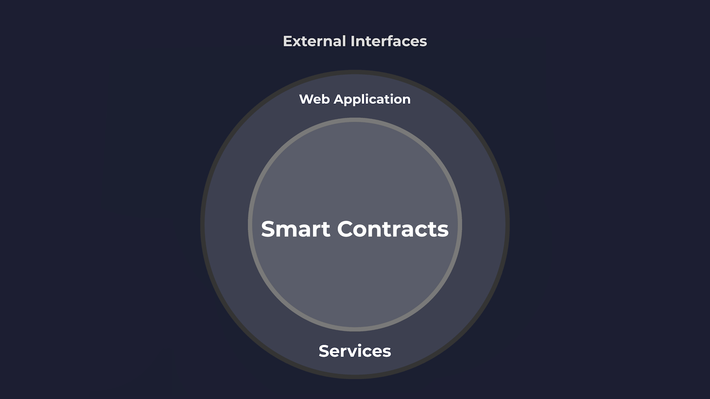
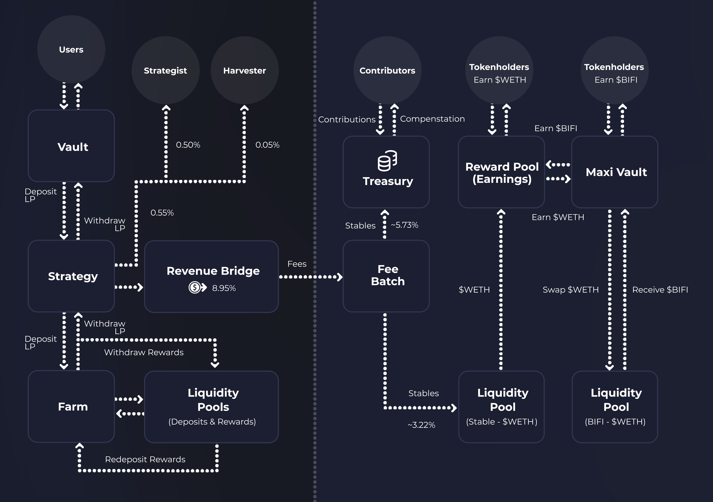

# Beefy Protocol


Note that the $BIFI migration discussed in these documents is ongoing, and so information in this page may be liable to change in the final implementation. This page has been released early for informational purposes, to assist users and tokenholders to understand the details of the planned migration.


Beefy is first and foremost an autonomous, decentralized yield optimization protocol. Though the wider project and DAO which surround the protocol are central to Beefy's operations and identity, in fact the protocol functions entirely independently of any such individuals, and will continue to do so on blockchain in perpetuity, even after all other stakeholders are left (even if very, very broken at that stage).

This page provides a short summary of the protocol, designed to onboard novice users as to how the protocol will put their inputs to use. The detail on this page is simplified, and is generally non-technical in nature.

## What do we mean by the "protocol"?

As described above, the core of Beefy's protocol is its collection of live [vaults.md](../../beefy-products/vaults.md "mention") and associated smart contracts on the blockchain. Beefy's contracts accept user deposits, put funds to work in automated yield farming processes, and then pay out fees to the various on-chain stakeholders in the process. As the smart contracts exist independently of the rest of the project, the protocol operates autonomously, even if all of the supporting stakeholders stopped maintaining them.

<figure><figcaption>
A simplified map of the contextual layers of the Beefy protocol.
</figcaption></figure>

However, in order for the smart contracts at the heart of the protocol to be maintained and remain accessible to ordinary users, additional services are required. These services typically require ongoing human intervention to deliver and maintain them, and so are typically performed by Beefy's contributor team. These include:&#x20;

* maintenance of existing smart contracts, such as pausing vulnerable or malfunctioning contracts, or performing live changes or upgrades to facilitate to improve performance;
* development and deployment of new contracts, both to replace and supplement the existing protocol;
* provision of a functional web application or user interface, which assists users in accessing the smart contracts and seeing live information about their functioning (e.g. rates of return);
* maintenance of live servers and databases to store and distribute necessary and relevant data about all other aspects of the protocol, including services like application programming interfaces (**APIs**); and
* operation of automated contract interactions, such as bots to watch for and trigger profitable compounding events in Beefy's vaults.

Though the protocol may continue to operate without any one of the above services for a certain period of time, all of these services are required to keep the smart contracts of the Beefy protocol safe, operational, accessible and comprehensible.&#x20;

Beyond these internal services, external services often build on top of Beefy's protocol to deliver access to its products to users elsewhere. This can include other smart contracts (which deposit funds or act as on-chain stakeholders in the protocol), other web applications (which may point users direcly to Beefy's smart contracts) and other information services (e.g. user dashboards, or comparison sites like DefiLlama). By virtuing of being external to Beefy, all of these services are not considered to be a part of Beefy's protocol.

## How does the protocol work?

The overarching process and flow of the Beefy protocol is as follows:

<figure><figcaption>
A simplified flowchart mapping out the Beefy protocol.
</figcaption></figure>

The protocol involves the transmission of funds through various wallets and smart contracts to deliver on its two core functions:&#x20;

1. To perform automated yield farming, and to optimize the yield received by users from that process, such that they earn more with Beefy than they would elsewhere or doing the same process themselves (left side); and
2. To reward and incentivize the on-chain stakeholders in the protocol for supporting and facilitating its ongoing operations (right side).

Each of these are described below in [#how-does-the-yield-farming-function-work](./#how-does-the-yield-farming-function-work "mention") and [#how-does-the-stakeholder-incentives-function-work](./#how-does-the-stakeholder-incentives-function-work "mention").

As described in [#what-is-included-in-the-protocol](./#what-is-included-in-the-protocol "mention"), the protocol can be thought of simply as just the smart contracts which exist on the blockchain to perform yield optimization. These are reflected in the middle row of the above flowchart, and incorporate our Beefy Vault products (comprised of [vaults.md](../../beefy-products/vaults.md "mention") and [strategies.md](../../beefy-products/strategies.md "mention")), the [revenue-bridge.md](revenue-bridge.md "mention") contracts, the [fee-batch.md](fee-batch.md "mention") contract, and ultimately our [governance-pools.md](governance-pools.md "mention") and [treasury.md](../../dao/treasury.md "mention").

However, in order for each of these contracts to function, the protocol is built on top of other external contracts which facilitate the farming process. These contracts are reflected in the bottom row of the above flowchart. If all of the underlying liquidity pools and farms which Beefy is built on were withdrawn and not replaced, Beefy's contracts would still exist, but no real yield or fees would be being generated.

## How does the yield farming function work?

A summary of the core yield farming process in provided in the [strategies.md](../../beefy-products/strategies.md "mention") page (see [#how-do-liquidity-pool-strategies-work](../../beefy-products/strategies.md#how-do-liquidity-pool-strategies-work "mention")), so is not repeated here.&#x20;

The yield farming process is shown in the left side of the flowchart above. It revolves around the user's deposit, and the generation of on-chain yield through farming with that deposit and swapping farm rewards back to the principal asset.&#x20;

Each time the yield farming process compounds the rewards, a small fee is charged on the rewards earned, as detailed in [beefy-finance-fees-breakdown.md](../beefy-bulletins/beefy-finance-fees-breakdown.md "mention"). The strategy pays out that fee in the chain's native token directly to the harvest caller (i.e. the wallet which calls the [#harvest](../../developer-documentation/strategy-contract/#harvest "mention") function), the strategist (i.e. the user who deployed the Beefy Vault), and the [revenue-bridge.md](revenue-bridge.md "mention") contracts to facilitate the distribution of stakeholder incentives.&#x20;

## How does the stakeholder incentives function work?

The stakeholder incentives function aims to facilitate and incentivize the development and maintenance of the protocol and wider project, including both technical and non-technical contributions.

As mentioned above, the [strategies.md](../../beefy-products/strategies.md "mention") themselves distribute incentives to strategists and harvest callers, which sit outside of the remit of the DAO. Otherwise, once fees are received by the [revenue-bridge.md](revenue-bridge.md "mention") on each chain, the protocol then works to bridge those fees back to the Ethereum [fee-batch.md](fee-batch.md "mention"), and distribute them to the DAO both by way of the [governance-pools.md](governance-pools.md "mention") and the [treasury.md](../../dao/treasury.md "mention").

Once the Revenue Bridge holds a viable amount of tokens, it performs a few functions to allocate and prepare them for bridging. The bridge itself contains multiple different bridging services, and will use the preferred method which has been specified to the contract. The bridge can either bridge directly to Ethereum, or back via any number of intermediate chains.&#x20;

On Ethereum, the fees arrive to the Fee Batch, which aggregates all of the protocol's fees. Once a sufficient amount of tokens are batched token, the Fee Batch distributes them both to Treasury and - after swapping back to native $ETH - to the Governance Pools.

The governance pools holds $BIFI deposits on behalf of tokenholders, and pays out protocol fees as incentives to the tokenholder for participating in Beefy's [governance.md](../../dao/governance.md "mention"), in proportion with their $BIFI holding. The default position is that incentives are paid out in $ETH, though the BIFI Maxi Vault was designed and implemented to automatically swap those funds into more $BIFI tokens, in order to facilitate an autocompounding effect for the user.

## Who are the stakeholders in the protocol?

The protocol identifies and engages with the following selection of stakeholders, whose interests and needs must be continually balanced:

* **Users** - users are the primary beneficiaries of the protocol, because they enjoy and benefit from its services. The protocol primarily aims to cater to users by building and maintaining products that they like, though can also incentivize them through fee adjustments and peripheral incentives, such as [boost.md](../../beefy-products/boost.md "mention") programmes;
* **Tokenholders** - tokenholders are the secondary beneficiaries of the protocol, who control the Beefy DAO and its assets and operations, and therefore have rights over the fees generated by the protocol. The protocol primarily rewards tokenholders through incentives in the [governance-pools.md](governance-pools.md "mention"), though they may also benefit from specific uses of the [treasury.md](../../dao/treasury.md "mention");
* **Contributors** - contributors are the final core group of beneficiaries of the protocol, who enjoy the benefit of interesting and profitable work. Contributors primarily benefit through experience and remuneration, and are generally subject to the whims of the DAO and the resources of the Treasury.

From experience, these different categories of stakeholders frequently crossover, as regular users become token holders or contributors, and vice versa. Altogether, the different groups of stakeholders reflect the Beefy community at large.

It is also worth considering that there are many external parties that assume some form of stake in the Beefy project, though with less of a direct connection. For instance, the exchanges which Beefy builds on top of frequently receive increased liquidity from Beefy's user base, meaning the exchange's relationships with users and Beefy become intertwined. Similarly, many of the chains Beefy launches on come to rely on and appreciate Beefy as a core player in their ecosystem. Finally, many of our commercial partners for things like infrastructure see Beefy as a key demonstration of their own products' virtues, and are therefore interested in ensuring it suceeds.

## What is the distinction with Beefy DAO?

Beefy DAO is the organisational form of Beefy, which encompasses our contributors, members and (to a lesser degree) community. Much as the protocol would survive without the DAO, the DAO exists independently of the protocol, and has its own shared cultures, practices, assets and activities.

Though the DAO has primary responsibility for maintaining the protocol, users should be careful to delineate between what's in the control of the DAO and what's purely the domain of the protocol. For instance, where users choose to interact with immutable and independent smart contracts in the Beefy protocol, and incidentally send funds to that contract which are then lost, it is often the case that the DAO has no power or right to recover those funds. As such, caution is advised when dealing with the protocol, and all users are generally advised to use [the Beefy frontend web application](https://app.beefy.com/) to manage such interactions.
