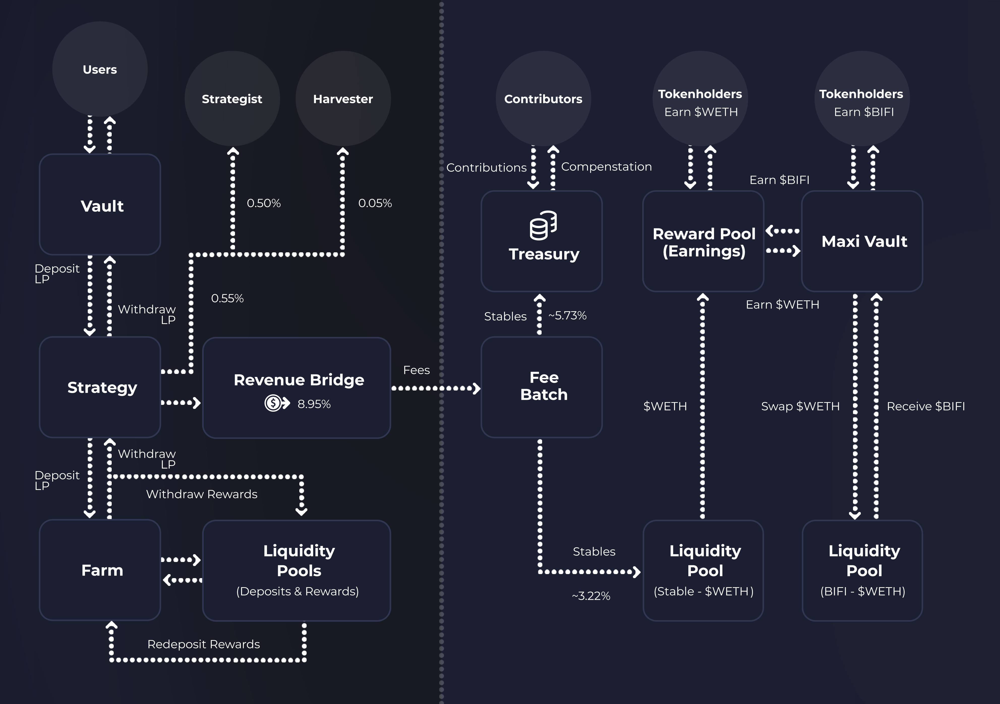

# Incentive Programmes

The final core component of the [.](./ "mention") which is needed to distribute vault fees from our various chains is our incentive programmes, which are used to reward and incentivize [bifi-token](../bifi-token/ "mention") holders for their participation in the Beefy project.&#x20;

## What are incentive programmes?

Beefy's incentive programmes are the smart contracts which facilitate the protocol's distribution of governance incentives. Where we refer to "incentive programmes", we mean collectively:

* **The BIFI Pool** - which pays out governance incentives to tokenholders in the form of $WETH; and
* **The BIFI Vault** - which autocompounds the governance incentives for tokenholders into more $BIFI tokens.

Each are contracts which exist solely for the purpose of safely holding the [bifi-token](../bifi-token/ "mention") on behalf of tokenholders and gradually distributing the value accruing from vault fees using the preferred method of the holder (either native rewards or autocompounding $BIFI).

## Why pay out incentives?

Since Beefy's inception, the [.](./ "mention") has always envisaged incentivising community members to take an interest in the project and act as a stakeholder in its operations. Though a standard governance token model permits tokenholders to interact with the project through the governance process, in practice this rarely aligns the incentives of each side, leading to conflicts and ineffective decisions.

Likewise, leaving control of a project's governance to wholly distributed tokens that are out there in the ether can lead to disruptive behaviours and negative externalities. For instance, where users seek to borrow using their governance tokens as collateral, their debt's health (or lack of) can have significant impacts on the governance of the project, as cascading liquidations damage pricing and cause panic. In the reverse, freely available tokens present an opportunity for a parasitic takeover of the project, such as how Convex was able to gain control over Curve.

Beefy's solution is to incentivize tokenholders to deposit their tokens with Beefy itself, leaving them with no functional uses beyond participation in governance. By having protocol smart contracts custody the tokens, and tokenholders receive regular and tangible reward, Beefy mitigates the desire to look elsewhere, and maximizes concentration on the project and protocol. Similarly, by tying the amount of rewards payable to the amount of revenue earned (which is itself a function of the project's efficacy in deploying vaults, managing harvests and locking value), the system achieves a close align of incentives across all of the project's core stakeholders.

## How do incentives programmes work?

As described in previous [.](./ "mention") pages, fees generated by our [vaults.md](../../beefy-products/vaults.md "mention") flow from the [strategies.md](../../beefy-products/strategies.md "mention"), through each chain's [revenue-bridge.md](revenue-bridge.md "mention"), back to the [fee-batch.md](fee-batch.md "mention") before reaching the incentive programmes and [treasury.md](../../dao/treasury.md "mention"). This is shown in the below diagram:

<figure><figcaption>
A simplified flowchart mapping out the Beefy protocol.
</figcaption></figure>

Prior to the $BIFI token migration in 2023, fees flowed into the Fee Batch contract as native tokens, which were deposited directly into the Reward Pool. Now, fees flow into the Fee Batch as stables, meaning they must be swapped for native before reaching the Reward Pool. Once the native tokens arrive in the BIFI Pool, they vest as incentives and become claimable for tokenholders in a linear fashion. Tokenholder claims must pay the gas required to transfer the incentives to them.

The BIFI Vault sits on top of the BIFI Pool, actually depositing all of the $BIFI tokens into the BIFI Pool. Beyond that, the vault regularly and automatically claims the native incentives from the BIFI Pool, routes them through a liquidity pool to swap for $BIFI, and then redeposits the $BIFI in the BIFI Pool, to unlock the autocompounding effect.
