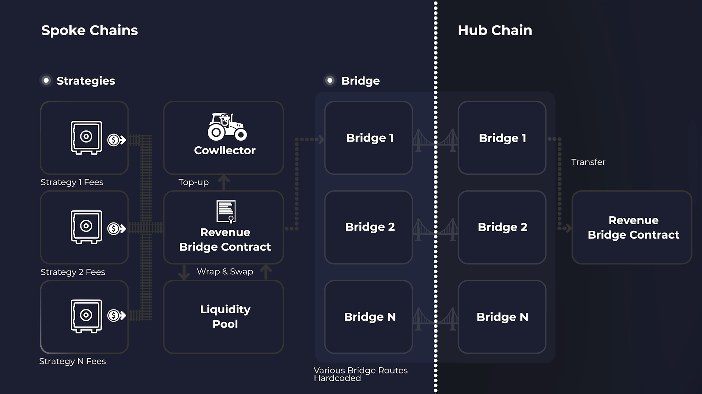
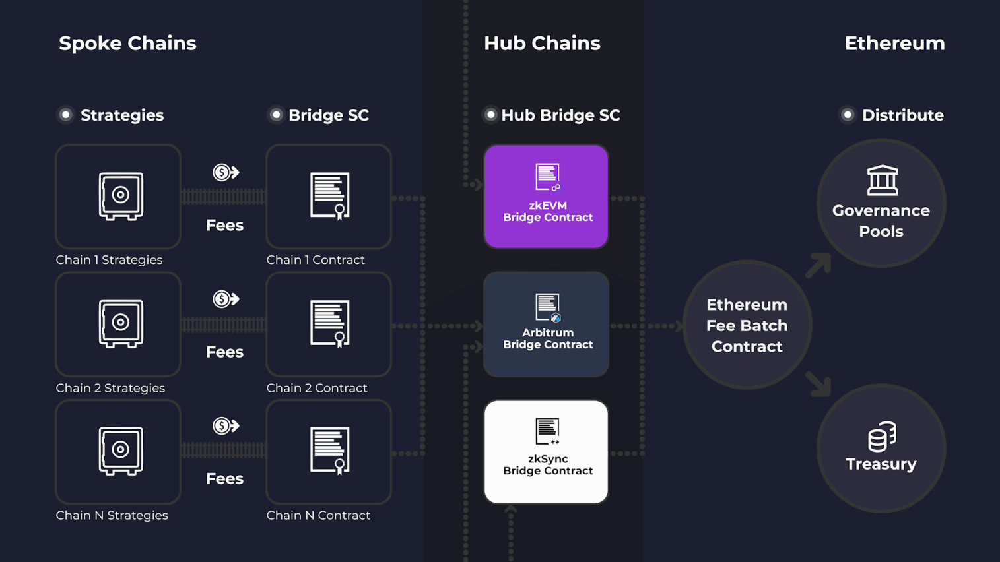

# Revenue Bridge


Note that the $BIFI migration discussed in these documents is ongoing, and so information in this page may be liable to change in the final implementation. This page has been released early for informational purposes, to assist users and tokenholders to understand the details of the planned migration.


The Beefy Revenue Bridge is one of a few core components in the wider [.](./ "mention") which help to distribute vault fees from each of our deployed chains back to our Ethereum [governance-pools.md](governance-pools.md "mention") and [treasury.md](../../dao/treasury.md "mention"). In doing so, the Revenue Bridge acts in one direction, to move earnings away from deployed chains and back to Beefy's native Ethereum. Its core purpose is to facilitate the transfer of assets across blockchains.

## What does the Revenue Bridge do?

As described above, the Revenue Bridge's main purpose is to facilitate the transfer of assets between blockchains in a profitable manner. Within this, it has five key functions:

* **Fee Batch** - the Revenue Bridge receives all of the fees from each strategy on the relevant chain, and gathers them together into batches to share the handling costs throughout the distribution process;
* **Wrap Native** - the Revenue Bridge wraps any native chain tokens it receives to ensure they are ERC-20 compliant, allowing them to be manipulated more easily by protocol contracts;
* **Top Up Cowllector** - the Revenue Bridge also now assumes the roles of keeping the Beefy Cowllector fed with gas. Before any fees are bridged, the Revenue Bridge first tops up the Cowllector's balance to the configured minimum level;
* **Swap to Specified Token** - the Revenue Bridge also contains functionality to specify a preferred token for bridging - typically a common stablecoin like USDC or USDT. The bridge swaps the native token received as fees into this token ready for bridging; and
* **Bridge Fees** - the Revenue Bridge finally transfers the accumulated fees in the required token to its preferred bridging or messaging solution, to bridge those funds to the specified chain. The bridge contract includes several hardcoded bridging and messaging solutions.

## How does the Revenue Bridge work?

The _BeefyRevenueBridge.sol_ smart contract handles each of the functions described above. The core workflow of the Revenue Bridge is its _harvest()_ function, which first wraps any native tokens held by the contract, then checks whether it can top up the Cowllector, before finally bridging the tokens.

The Revenue Bridge also contains permissioned functions that allow Beefy's Core team to configure workflow, including changing the preferred bridging or messaging solution for the transfer, changing the stablecoin used for bridging, changing the swap pool and changing the destination chain and address.

Though the Revenue Bridge has a number of different bridging solutions hardcoded at launch, the world of cross-chain bridging and messaging is still an experimental one, where critical changes can be needed on short notice. As such, the Revenue Bridge is deployed as a proxy contract, allowing critical upgrades to be implemented by Beefy's Development Council (through it's multi-signature wallet), should the need arise.

The Revenue Bridges are also designed to incorporate the permit pattern established by [EIP-2612](https://eips.ethereum.org/EIPS/eip-2612), which allows for gasless permit approvals by way of signatures. This means that users can approve transactions with the bridge without paying gas. More specifically, the contracts inherit this functionality by way of OpenZeppelin's [ERC20Permit.sol](https://github.com/OpenZeppelin/openzeppelin-contracts/blob/master/contracts/token/ERC20/extensions/ERC20Permit.sol) abstract contract.&#x20;

## What bridging method(s) does the Revenue Bridge use?

The Revenue Bridge is designed to serve as flexible and resilient on-chain infrastructure, which can adapt to use different services in response to current market conditions over time. On launch, the Revenue Bridge supports the following bridging and messaging services:

* LayerZero's [omnichain interopability protocol](https://layerzero.gitbook.io/docs/) (message passing);
* Axelar's [cross-chain gateway protocol](https://docs.axelar.dev/) (message passing);
* Circle's [cross-chain transfer protocol](https://developers.circle.com/stablecoin/docs/cctp-getting-started) (message passing);
* Interopability's [Synapse bridge](https://docs.synapseprotocol.com/protocol/synapse-bridge) (message passing);
* Polygon's [zkEVM bridge](https://wiki.polygon.technology/docs/category/zkevm-bridge/) (canonical bridge); and
* Matter Lab's [zkSync Era bridge](https://era.zksync.io/docs/reference/concepts/bridging-asset.html) (canonical bridge).&#x20;

## What happens on the source chains?

As detailed in [#what-does-the-revenue-bridge-do](revenue-bridge.md#what-does-the-revenue-bridge-do "mention"), the Revenue Bridge has several core functions, which it applies to fees transferred by strategies on each chain.

<figure><figcaption></figcaption></figure>

<figure><figcaption>
Flowchart showing the movement of fees through a typical Revenue Bridge, and one of numerous bridging/messaging solutions.
</figcaption></figure>

As detailed in the flowchart above, once fees are received they are first used to top up the Beefy Cowllector, to support harvesting operations on the chain. Afterwards, they are swapped to the relevant stablecoin to prepare for bridging.&#x20;

At the point of bridging, the Revenue Bridge sends to just the one live bridging solution assigned in the contract. The other bridging functionality remains hardcoded, and Beefy's Development Council have the power to switch the assigned solution at any time. Depending on the chain and the asset, the bridge takes one of a number of possible routes back to Ethereum.

## What happens between chains?

As revenue flows back to Ethereum, the protocol distinguishes between three tiers of chain:

* **Home Chain** - Ethereum is the ultimate destination for all vault fees earned by the protocol;
* **Hub Chains** - chains which send fees directly to Ethereum, and aggregate fees from other chains; and
* **Spoke Chains** - which do not receive fees from other chains, and typically send all fees on to hub chains.

<figure><figcaption>
Flowchart showing the movement of fees from spoke chains to hub chains and onward to Ethereum for distribution
</figcaption></figure>

Through its use of hub chains, the Revenue Bridge can aggregate larger volumes of fees from several chains, and minimize the number of costly bridge transactions into Ethereum. Arbitrum is the current default hub chain for efficient batching of fees and bridging to Ethereum.

At the time of writing, there are two exceptions to using Arbitrum as a hub: both Polygon zkEVM and zkSync have canonical bridges which immediately and securely settle to Etherum, meaning this is the most secure method of bridging fees from these chains. Others may follow this model in the future, though the default position remains that batching on the core hub chain is the most efficient means of bridging fees to Ethereum.&#x20;

In some cases, the token being received in the hub may not be the optimal token to return to Ethereum. For example, with fees denominated in $USDCe (i.e. non-native $USDC on Arbitrum), the protocol will tend to deliver these fees to a swapper contract to first swap back to native $USDC before delivering the fees to the bridge contract. Likewise, Axelar-bridged tokens (e.g. $axlUSDC) are sent to Polygon PoS for transfer to their native form, before being transferred on to Arbitrum.

## What happens on Ethereum?

Once the fees from the hub chains reach Ethereum, they are sent directly to Ethereum's [fee-batch.md](fee-batch.md "mention") contract for onward distribution to the [governance-pools.md](governance-pools.md "mention") and the [treasury.md](../../dao/treasury.md "mention").
