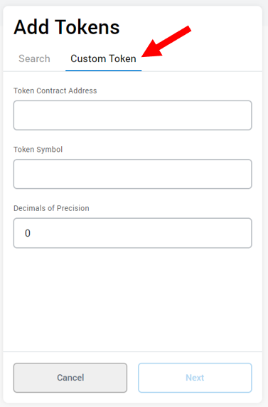
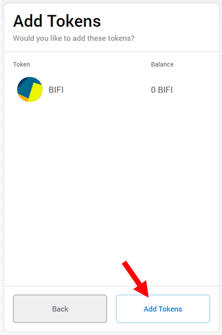

# Como adicionar uma moeda personalizada à metamask

## Guia Visual

#### 1. Abra a Metamask e clique em 'Ativos' para ver as moedas na sua carteira

.png>)

#### 2. Role para baixo até a parte inferior e clique em 'Adicionar Token'.

#### 3. Clique em 'Custom Token'

#### 4. Cole o endereço do contrato da BIFI no campo 'Endereço do contrato de token'

Endereço de contrato da moeda BIFI na BNB Chain : [0xCa3F508B8e4Dd382eE878A314789373D80A5190A ](https://bscscan.com/token/0xCa3F508B8e4Dd382eE878A314789373D80A5190A)

O endereço dos contratos da moeda BIFI em outras redes pode ser encontrato aqui [#enderecos-dos-contratos](../../ecosystem/bifi-token/contract-addresses.md#enderecos-dos-contratos "mention")

#### 5. Clique em 'Next'&#x20;

#### 6. Clique em 'Adicionar Tokens' para adicionar a nova moeda

#### 7. M0000o! A BIFI deve aparecer na sua lista de ativos assim fica mais fácil de rastrear e usar

