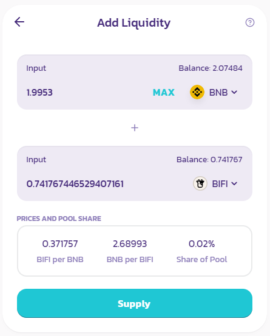
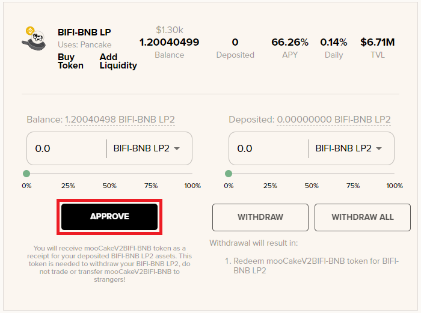
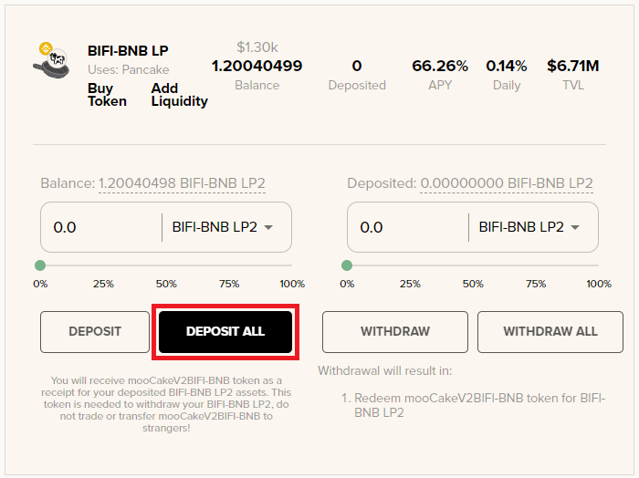
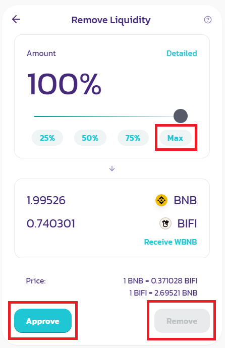

# Como adicionar e remover liquidez


Este guia ainda usa imagens da interface antiga da Beefy e deve ser atualizado em breve. No entanto, as etapas continuam semelhantes.


Como exemplo, vamos usar BIFI-BNB LP neste guia. Em uma pool de liquidez, tanto a BIFI quanto a BNB precisam ser fornecidas em um valor de proporção de 50/50. Como começamos com 100% de BNB, este guia também abrange a troca de BNB por BIFI.

## Adicionando liquidez

### 1. Clique em "Buy Token"

### 2. Confirme a tela "Token imported" no PancakeSwap

### 3. Troque BNB por BIFI

Nossa carteira atualmente possui 4,0757 BNB; usaremos um total máximo de 4 BNB para fornecer liquidez. Como precisamos fornecer liquidez em um valor de proporção de 50/50, precisaremos trocar 2 BNB por BIFI primeiro.

Clique Swap na próxima tela.

### 4. Clique "Add Liquidity"

### 5. Clique em "MAX" no BIFI input, clique em "Approve" BIFI e clique "Supply"

### 6. Confirme o Supply

### 7. O cofre agora mostra o seu saldo!

Clique no cofre para abrir o menu de depósito e de retirada.

### 8. "Approve"

### 9. "Deposit All"

É isso! Agora criamos liquidez e depositamos BIFI-BNB LP no cofre. Você pode verificar [este guia ](how-to-check-harvesting-compounding-rate.md)para ver quando o cofre coletará recompensas e reinvestirá em mais moedas BIFI-BNB LP.

## Removendo Liquidez

### 1. "Withdraw All"

Observação: as taxas de retirada serão deduzidas do valor da moeda depositada.

### 2. Vá de novo para a [PancakeSwap](https://exchange.pancakeswap.finance/#/pool)

e vá para a seção Liquidez. Ele mostrará as moedas BIFI-BNB LP em "Your Liquidity"

### 3. Clique em "Remove"

Na próxima tela, clique em "Max" e Aprovar e depois em "Remover".

### 4. Opcional: Troque BIFI de volta para BNB

