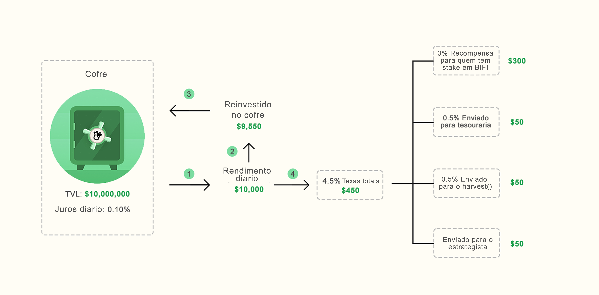

# Infográficos

Esta página ajuda a explicar vários aspectos chave dos cofres, ferramentas e protocolo da Beefy, usando infografias fáceis de entender e descrições curtas. Embora os serviços que oferecemos sejam avançados e altamente técnicos, concordamos com o adágio de que _"se você não consegue explicar de forma simples, você não entende o suficiente"_.

## As etapas dos Cofres

\[CORRECTIONS TO THE IMAGE ABOVE: Usuario = Usuário\
LP stake  em um smart contract com rendimento = moedas LP depositadas em um contrato inteligente com rendimento\
LP stake gera randa com taxas e incentivos de liquidez da pancakeswap (CAKE) "cake icon" + Fees = moedas LP depositadas ganham com as taxas de troca e incentivos de liquidez da pancakeswap (CAKE) "cake icon" + taxas\
Juros Cake = CAKE de recompensa\
Juros de CAKE e taxas compõem automaticamente em mais ... = Taxas recebidas e o CAKE de recompensa são reinvestidos automaticamente em mais ...]&#x20;

Na Beefy, 'você ganha o que deposita', independentemente de ser uma moeda de pool de liquidez (LP) ou uma moeda única. Neste exemplo, depositar CAKE-BNB LP resultará em mais CAKE-BNB LP ao longo do tempo. Isso aumenta efetivamente sua parcela da pool de liquidez e, portanto, permite mais e mais recompensas ao longo do tempo. Tudo isso com a Beefy fazendo o trabalho necessário, enquanto você pode sentar e relaxar!

## A estrutura das Taxas dos cofres explicadas

\[CORRECTIONS TO THE IMAGE ABOVE: Juros diario = Rendimento diário\
Rendimento diario = Rendimento diário\
"4.5%" and "0.5%" to "4,5%" and "0,5%"\
Recompensa para quem tem stake em BIFI = Recompensa para quem tem BIFI depositado]

Mais sobre as taxas dos cofres [aqui](../produtos/vaults.md#qual-e-a-estrutura-de-taxas-do-cofre).

## Beefy Zap

Nossa ferramenta Beefy ZAP faz automaticamente as posições de depósito que você precisa para poder usar nossos cofres a partir de outras moedas, assim te poupando tempo, energia e o custo de obter essas moedas e de fazer essa posição de liquidez você mesmo. Aqui está o nosso guia de [how-to-beefy-zap.md](guias-praticos/how-to-beefy-zap.md "mention").

\[CORRECTION TO THE IMAGE ABOVE: "1. Escolha seu cofre LP preferido" to "1. Escolha o cofre LP que deseja".

"3. Beefy zap automaticamente cria a LP necessaria e inicia o stake no cofre" to "3. O Beefy Zap cria a LP necessária automaticamente e deposita ela no cofre"]

O ZAP V1 cria automaticamente suas moedas de pool de liquidez (LP) a partir do depósito de uma das moedas contidas na LP, como a BNB para o CAKE-BNB LP2 mostrado acima. Quando chegar a hora em que você quer retirar de um cofre de LP, o ZAP V1 também permite a retirada de volta para apenas uma das moedas, como CAKE ao invés de BNB. Isso evita o incômodo de adicionar e remover manualmente a liquidez em uma pool incentivada.

<figure><figcaption></figcaption></figure>

\[IMAGE TRANSLATION:

ZAP V2 Vaults = Cofres ZAP V2            Select token = Escolha a moeda      In your wallet = Na sua carteira         ZAP V2 Magic = Mágica do ZAP V2        Supports ZAP v2 = Suporta ZAP v2

&#x20;Choose Your LP vault = Escolha o seu cofre LP      Choose Your Asset = Escolha a sua Moeda

ZAP Creates and Stakes LP With One Click = O ZAP Cria e Deposita a LP com Um Clique

Deposit Successful = Depósito Sucedido

ZAP Out To Any Asset, Anytime = Saia do Cofre com o ZAP para qualquer moeda, a qualquer hora

One Click ZAP - Ready For You When You Are = ZAP em Um Clique - Pronto para Você quando Você Estiver

The fastest & easiest way to grow in DeFi = A forma mais rápida e fácil de crescer na DeFi]

A ferramenta ZAP V2 leva isso um passo adiante ao usar o poder de agregadores de DEXes como o 1inch para adicionar outras trocas ao processo, permitindo que usuários usem moedas de primeira linha (ex: WBTC, ETH), moedas nativas da rede (ex: MATIC, BNB) ou moedas estáveis (ex: USDC, USDT, DAI) para criar a posição de liquidez nas moedas subjacentes. Dessa forma, você pode acessar nossos retornos líderes de mercado em novos produtos sem manusear nada além das moedas e estáveis já disponíveis na sua carteira.

A quota do ZAP que é mostrada durante o processo de depósito ou de saque já inclui a taxa do ZAP calculada. Adicionalmente, a taxa do ZAP é deduzida apenas das trocas de moedas. As taxas primeiro são acumuladas em um lote de tesouro, depois são trocadas para moedas estáveis e enviadas para o [tesouro da Beefy](https://app.beefy.com/treasury). O ZAP V1 original continua de uso gratuito.


Ao utilizar o Zap, cheque sempre o seu pedido! Embora o Zap o proteja contra o 'deslize' do mercado (alterações de preço entre o momento do pedido da transação de troca e o momento da execução), ele **não** o protege contra o impacto no preço (o quanto sua transação alterará o preço das moedas na pool de liquidez).


## Beefy Boost

\[CORRECTIONS TO THE IMAGE ABOVE: How it Works: Beefy Launchpool Boost = Como funciona: Beefy Launchpool _Boost_ \
Usuario = Usuário\
CAKE Deposit = Depósito de CAKE\
by partner = pelo parceiro\
mooToken staked para gerar tokens parceiros (boost) = mooToken depositada para ganhar moedas do projeto parceiro (_Boost_/Impulso)\
Gera BNB = Ganhe BNB\
Stake = Deposite\
2x Base APY = APY base\
2x Boost APY = APY do impulso\
Boosted (total) APY = APY total com o impulso]\

Quando um cofre é impulsionado no Boost da Beefy, você ganha a moeda base e a moeda do projeto parceiro! Para obter mais informações, leia as perguntas frequentes do Boost [aqui](../produtos/launchpool.md).
