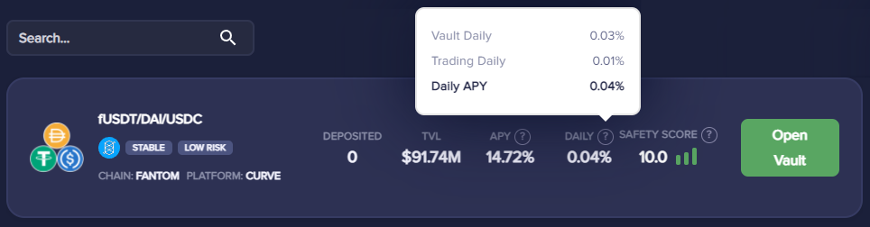

# General

## Is Beefy audited?

Our first auditor was DefiYield, which audited $BIFI token, the RewardPool and all the timelocks.

Beefy is also audited by Certik, which guarantees the robustness of our smart contracts and the safety of funds invested through Beefy.

Certik has audited some of the most complex and reusable investment strategies used within the platform. This ensures the safety and sturdiness of important smart contract aspects that the majority of our users interact with.

[All Beefy audits can be found here.](https://github.com/beefyfinance/beefy-audits)

## What is a yield optimizer?

A yield optimizer is an automated service that seeks to gain the maximum possible return on crypto-investments, much more efficiently than attempting to maximize yield through manual means.

Each vault has its own unique strategy for farming, which normally involves the reinvestment of crypto assets staked in liquidity pools. At the most simple level, it farms the rewards given from staked assets and reinvests them back into the liquidity pool. This compounds the amount of interest received and increases the amount staked that the yield is based on. A yield optimizer can repeat this up to process up to thousands of times a day.

This fairly simple method is the principle reason behind the large APYs found on Beefy. Compounding fees are amortized among all vault participants, making it cheaper for the user.

## What’s the difference between APR and APY?

APR (Annual Percentage Rate) is the yearly interest, minus fees. This does not include compounding effects that occur from reinvesting profits. If you were to invest $100 with 100% APR, you would make $100 in profit in a year time.

If you however reinvest your profits regularly, you will compound your interest. This calculated over a year gives you your APY (Annual Percentage Yield). The more often you compound your interest, the greater the difference between APR and APY.

## How does APY work?

APY is the annual percentage yield offered from a particular investment. This takes into account compound interest, giving you an accurate idea of your returns compared to simple interest.

Large APYs in the percentage of thousands are possible with investments that provide daily yields of 1% or more. Due to your liquidity pool rewards being constantly farmed and reinvested, the interest compounds on larger and larger amounts.

## What do Vault Daily and Trading Daily mean?

Trading Daily means how much your liquidity tokens will increase in value. Liquidity pools share trading fees amongst all liquidity providers, as introduced by the [Uniswap liquidity model](https://docs.uniswap.org/protocol/V2/concepts/advanced-topics/fees). Trading Daily is affected by trading volume and the percentage of swap fees allocated to liquidity providers.

Vault Daily means how much your token will increase in number. Due to the vault constantly farming rewards, and reinvesting that, your deposited token amount will increase. Vault Daily is affected by the yield farm rewards (i.e. additional incentives besides trading fees), such as CAKE on Pancakeswap.

Trading Daily and Vault Daily can be multiplied by 365 to compute Trading APR and Vault APR. Vault APR is then converted to Vault APY to factor in compound interest. The displayed total APY percentage is calculated as follows:

$$
APY = (1 + vaultAPY) * (1 + tradingAPR) - 1
$$


To calculate the Trading APR, Beefy uses on-chain data and a 24 hour period to determine the trading volume and subsequent fees, whereas most DEXes use a 7 day period. This may lead to differences in the displayed APY when compared with a DEX, but know that it is due to the calculation method. In fact, we argue that Beefy is more accurate because it uses a shorter time span which reflects changes in Trading APR sooner.


A handy tool to convert APR to APY is: [APRtoAPY.com](https://www.aprtoapy.com)

## How do I contribute to Beefy?

Beefy Finance is a community powered project from day one. If you want to join the ever growing pool of contributors, it depends what you would like to work on. We have open places for Solidity devs, or devs wanting to start a career in Solidity, to join as strategist and deploy vaults (and earn passive income from the strategist fees). Beefy is on a lot of chains and there are often opportunities for simple and complex vaults. You can start with simple ones and then progress to the harder ones as your knowledge of Solidity grows. You don't have to be the best right at the start, and rest assured that there is a rigorous review process in place to ensure safety and quality. You can reach out to our lead strategists in [Beefy's Discord](https://discord.gg/yq8wfHd) in #strategy-devs.

Beefy would also like people to work on non-strategy projects; pretty much anything you can think of can be formulated into a grant. Speak with others in the cowmoonity about projects and join one of the teams or lead one up yourself, you can be paid for any work you do to make Beefy better. A quick list of previous grants: [here](https://forum.beefy.finance/c/grant-ideas/11) and [here](https://forum.beefy.finance/c/grant-requests-b1/10). Beefy V2 is an ongoing project that requires all kinds of devs, not just technical ones; design input is crucial to improve the UI/UX.

Beefy's [GitHub](https://github.com/beefyfinance) embraces the idea of open collaboration, hence many of the repositories are open-source. We use CONTRIBUTING.md files to allow people to just make contributions or recommendations by means of Pull-Requests. You can get started even just by updating the Git docs or fixing a typo, it helps you get closer to the team of contributors.

If you have an interest in business development you could help with partnerships and proposing business decisions to the DAO. Beefy is still a relatively new business that can use talented people to help advise the core team.

There is marketing that you can contribute to too, if you can write a decent tweet then you can help out in #tweet-development. The [Discord](https://discord.gg/yq8wfHd) has a #social-watch channel where links to Beefy mentions on social media are posted, you can help out with user queries there or in the [Discord](https://discord.gg/yq8wfHd) or [Telegram](https://t.me/beefyfinance) itself. Moderators of Discord and Telegram are (variably) paid positions too and are usually the first line of customer support.

The best way to get involved is to just go ahead and get started, help where you can, contribute to discussions and collaborate with everyone.

## What is the difference between a Vault and an Earnings Pool?

In a Vault you earn more of what you deposited into it, with compound interest (APY). In an Earnings Pool you earn a different token than the asset you deposited, with linear interest (APR).

An example is the BIFI Maxi Vault, in which you earn more BIFI exponentially, and the many BIFI Earnings Pools, in which you earn linear interest in the form of $ETH, $BNB, $AVAX and more.

## Why does it cost so much gas to deposit into a Beefy vault?

Many of Beefy's vaults "Harvest on Deposit". This means that when you deposit into the vault, you are also calling the harvest function.  Calling the Harvest function is more complex than a simple deposit and thus has a higher gas limit/fee.  Beefy does this so that it is impossible for malicious actors to steal yield so a withdrawal fee is not required. This greatly benefits long-term investors.

Almost all of the vaults on more inexpensive chains like Fantom and Polygon harvest on deposit. You can also tell if a vault harvests on deposit if there is no withdrawal fee.

As the Harvest Caller, you will also receive some of the wrapped native chain token in as a reward for calling the harvest. See [beefy-finance-fees-breakdown.md](../ecosystem/beefy-bulletins/beefy-finance-fees-breakdown.md "mention") for more information on the Harvest Caller.

## How can I find out how much earnings I have accumulated?

Your rewards are added to your deposited token amount on each harvest and compound cycle. You can use a DeFi dashboard that will be able to calculate exactly how much profit you have made on your investments. External tools such as [TopDeFi](https://thetopdefi.com/) will read your wallet address and give you an accurate picture of your initial investment and current earnings.
