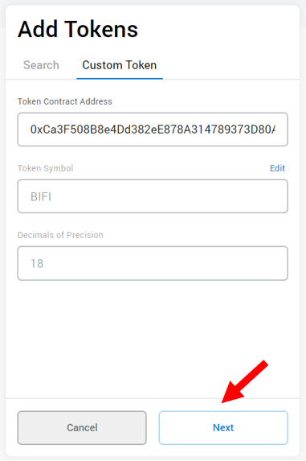
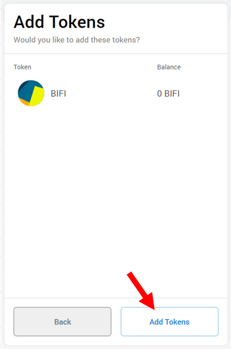
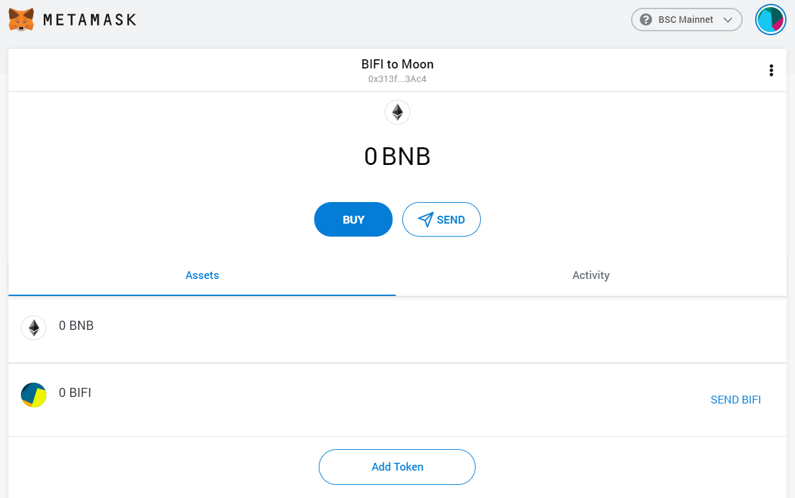

# How to Add a Custom Token to Metamask

## Visual Walkthrough

#### 1. Open Metamask and click 'Assets' to see the tokens in your wallet

#### 2. Scroll down to the bottom and click 'Add Token'.

#### 3. Click 'Custom Token'

#### 4. Past the contract address for BIFI into the 'Token Contract Address' field

BIFI Contract Address : [0xCa3F508B8e4Dd382eE878A314789373D80A5190A ](https://bscscan.com/token/0xCa3F508B8e4Dd382eE878A314789373D80A5190A)

#### 5. Click 'Next' 

#### 6. Click 'Add Tokens' to add the new token

#### 7. Moooo! BIFI should appear in your assets list so it's easier to track and use

