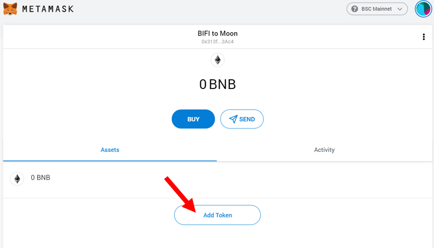
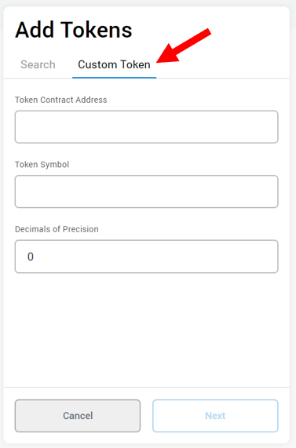
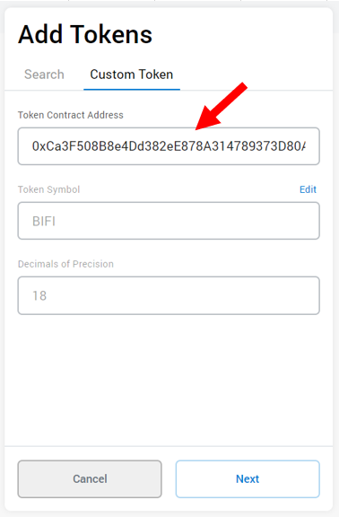
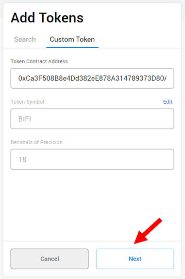
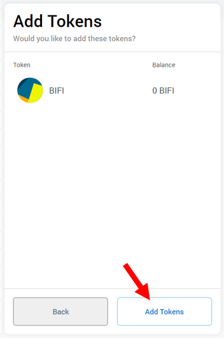
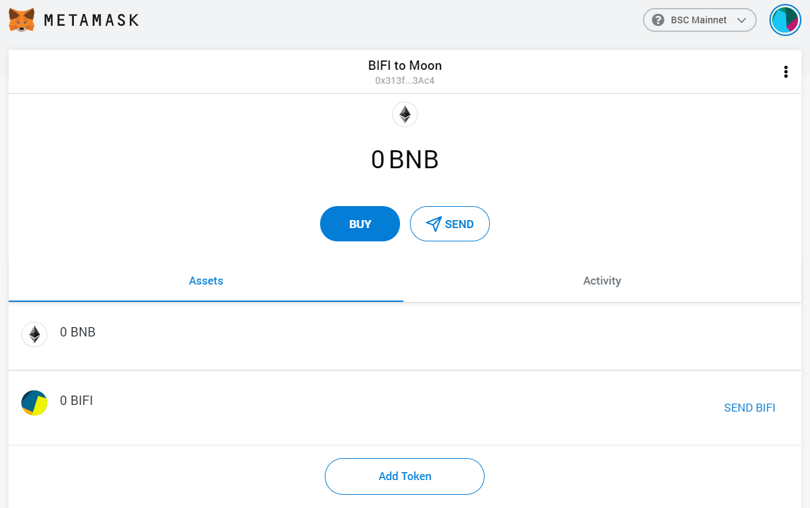

# 如何在Metamask中添加自定义代币

## 视觉导览

#### 1. 打开 Metamask 并点击“Assets”以查看您钱包中的代币

#### 2. 向下滑动到底部，点击'Add Token'。

#### 3. 点击 'Custom Token'

#### 4. 将 BIFI 的合约地址粘贴到 “Token Contract Address” 一栏中

BIFI 合约地址 : [0xCa3F508B8e4Dd382eE878A314789373D80A5190A ](https://bscscan.com/token/0xCa3F508B8e4Dd382eE878A314789373D80A5190A)

#### 5. 点击 'Next' 

#### 6. 点击“Add Tokens”以添加新的代币

#### 7. Moooo！ BIFI 现应出现在您的资产列表中，以便于追踪和使用

