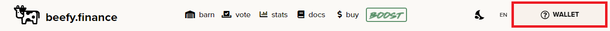
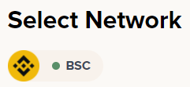
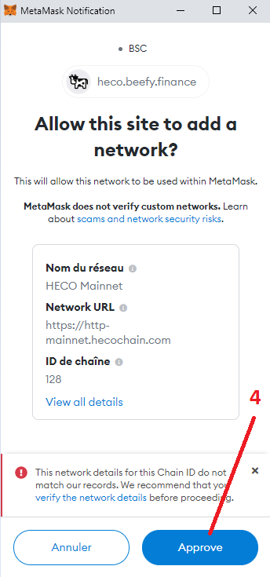
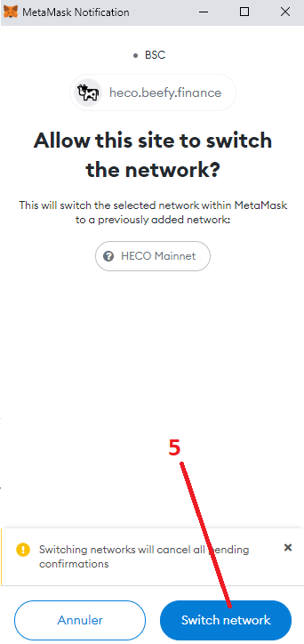

# How to add and switch networks on Beefy Finance

As Beefy Finance is a Decentralized, Multi-Chain Yield Optimizer, users will need to have properly configured wallets for each chain that they want use Beefy on. Using this guide and the Beefy Finance network switcher, new blockchain networks can be added automatically with ease. As an example the Huobi ECO chain \(HECO\) network will be used in this How-To guide, but you can repeat the same process for any other network listed in the network switcher.

## Prerequisites

* A Binance Smart Chain \(BSC\) configured Metamask wallet is needed. Beefy Finance started on BSC so you probably already have this set up, but if you do not have a configured wallet you can use the following guide from Binance Academy: [Connecting Metamask to Binance Smart Chain](https://academy.binance.com/en/articles/connecting-metamask-to-binance-smart-chain) \(you may skip the testnet section, it is not needed\).

## Walkthrough

### 1. Go to [app.beefy.finance](https://github.com/beefyfinance/beefy-docs/tree/aab629bafbc230570677e0471b162bbd46e2e0ba/faq/how-to-guides/app.beefy.finance) and connect your BSC configured Metamask wallet.

### 2. Click on the BSC icon under 'Select Network'.

### 3. Select HECO \(or any other network you want to add\).

### 4. Approve new network creation to your Metamask

### 5. Allow Beefy to switch to the HECO network

And that's it! HECO is now configured and added to your Metamask wallet. You can repeat the process for any other network that you want to add or want to switch to.

