# How to Add and Remove Liquidity

As an example, we are going to work with BIFI-BNB LP in this guide. In a liquidity pool, both BIFI and BNB need to be provided at a 50/50 ratio value wise. Since we start with 100% BNB, this guide covers swapping BNB to BIFI too.

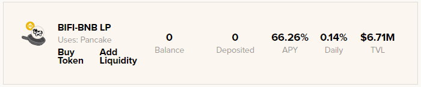

## Adding liquidity

### 1. Click "Buy Token"

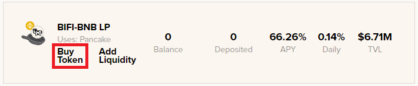

### 2. Confirm the "Token imported" screen on PancakeSwap

### 3. Swap BNB for BIFI

Our wallet currently holds 4.0757 BNB; we will use a maximum total of 4 BNB to provide liquidity. Since we need to provide liquidity at a 50/50 ratio value wise, we will need to swap 2 BNB for BIFI first.

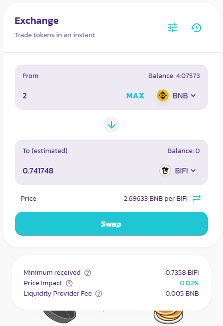

Confirm Swap in the next pop-up screen.

### 4. Click "Add Liquidity"

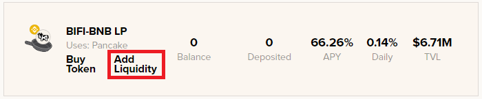

### 5. Click "MAX" for BIFI input, Approve BIFI and Supply Liquidity

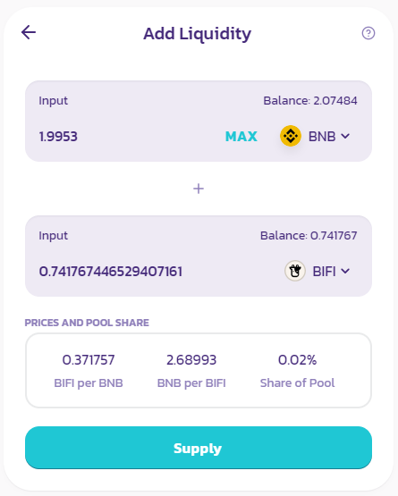

### 6. Confirm Supply

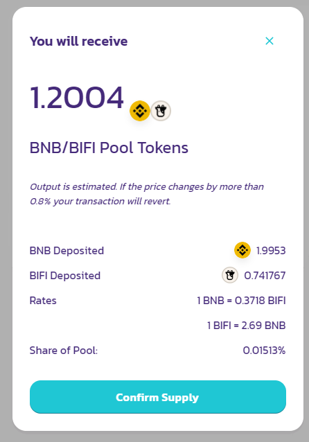

### 7. The vault now shows a balance!

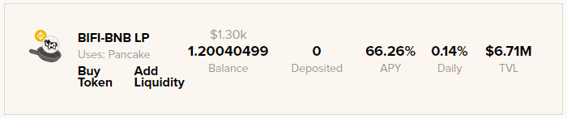

Click on the vault to open up the deposit and withdraw menu.

### 8. "Approve"

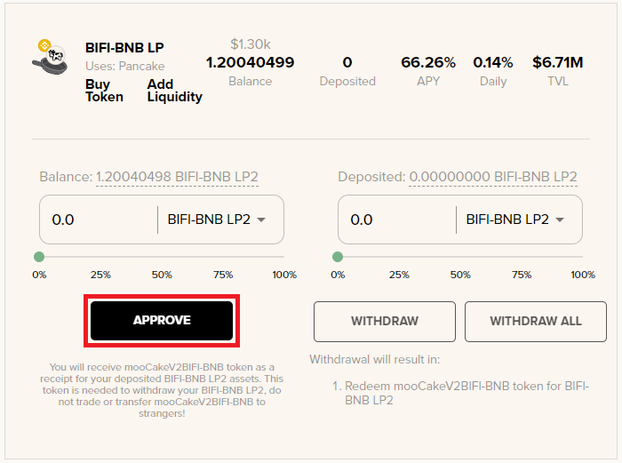

### 9. "Deposit All"

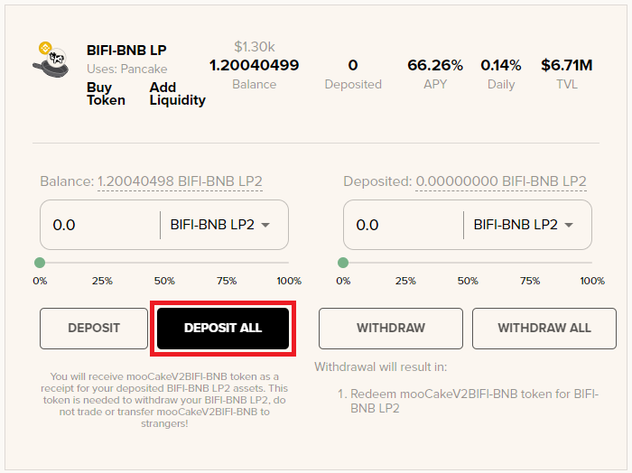

That's it! We now created liquidity and deposited BIFI-BNB LP in the vault. You can check [this guide](how-to-check-harvesting-compounding-rate.md) to see when the vault will harvest rewards and compound for more BIFI-BNB LP tokens.

## Removing Liquidity

### 1. "Withdraw All"

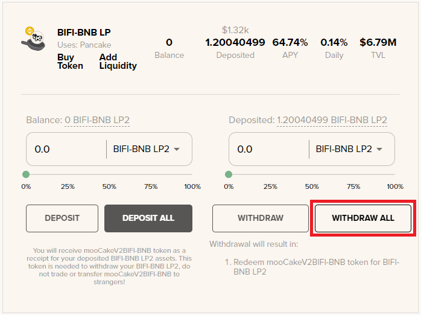

Note: withdrawal fees will be deducted from your deposited token amount.

### 2. Go back to [PancakeSwap](https://exchange.pancakeswap.finance/#/pool)

and head over to the Liquidity section. It will show the BIFI-BNB LP tokens under "Your Liquidity"

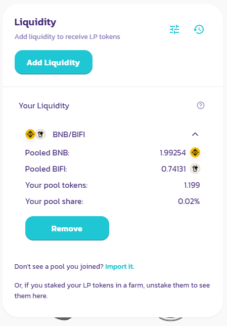

### 3. Click "Remove"

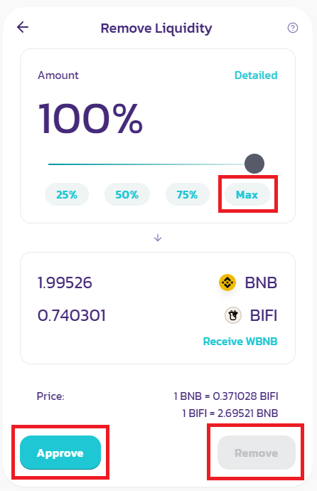

In the next screen, click "Max" and Approve", and then "Remove".

### 4. Optional: Swap BIFI back to BNB

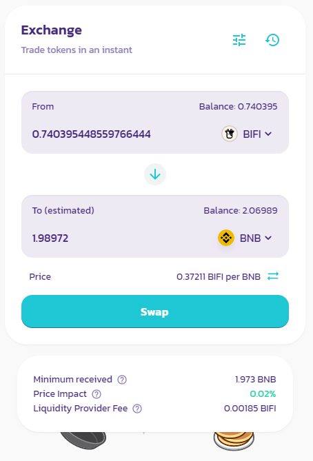

