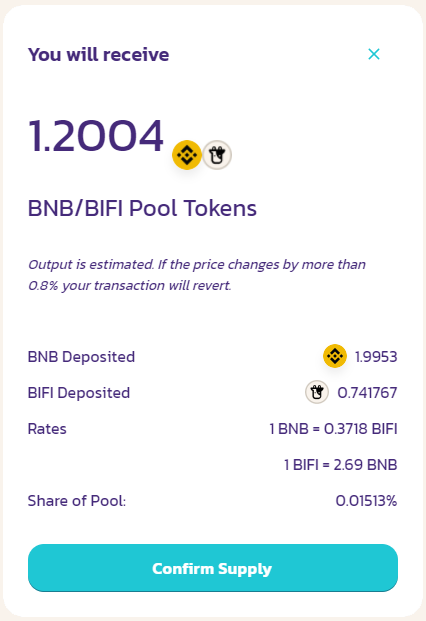

# Comment ajouter et retirer de la liquidité

À titre d'exemple, nous allons travailler avec BIFI-BNB LP dans ce guide. Dans un pool de liquidité, BIFI et BNB doivent être fournis dans un rapport 50/50 en termes de valeur. Comme nous commençons avec 100 % de BNB, ce guide couvre également l'échange de BNB contre BIFI.

## Ajout de liquidité

### 1. Cliquez sur "Acheter un jeton" (Buy Token)

### 2. Confirmer l'écran "Token importé" (Token imported) sur PancakeSwap

### 3. Echanger BNB contre BIFI

Notre portefeuille contient actuellement 4,0757 BNB ; nous utiliserons un total maximum de 4 BNB pour fournir des liquidités. Comme nous devons fournir des liquidités à un ratio de 50/50 en termes de valeur, nous devrons d'abord échanger 2 BNB contre des BIFI.

Confirmez la demande d'échange dans l'écran contextuel suivant.

### 4. Cliquez sur "Ajouter une liquidité" (Add Liquidity).

### 5. Cliquez sur "MAX" pour la saisie du BIFI, approuvez le BIFI et fournissez la liquidité.

### 6. Confirmer l'offre

### 7. Le coffre affiche maintenant le solde !

Click on the vault to open up the deposit and withdraw menu.

### 8. "Approuver" (Approve)

### 9. "Déposer tout" (Deposit All).

C'est fait ! Nous avons maintenant créé des liquidités et déposé des BIFI-BNB LP dans le coffre. Vous pouvez consulter [ce guide](how-to-check-harvesting-compounding-rate.md) pour savoir quand le coffre va récupérer les récompenses et les composer pour obtenir plus de jetons BIFI-BNB LP.

## Retirer la liquidité

### 1. " Tout retirer " (Withdraw All)

Remarque : les frais de retrait seront déduits du montant de votre jeton déposé.

### 2. Retourner à [PancakeSwap](https://exchange.pancakeswap.finance/#/pool)

et allez dans la section Liquidité. Les jetons BIFI-BNB LP apparaîtront sous "Vos liquidités" (Your Liquidity).

### 3. Cliquez sur "Supprimer" (Remove).

Dans l'écran suivant, cliquez sur "Max" et "Approuver" (Approve), puis sur "Retirer" (Remove).

### 4. Facultatif : Echanger BIFI contre BNB

