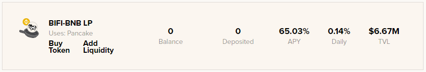
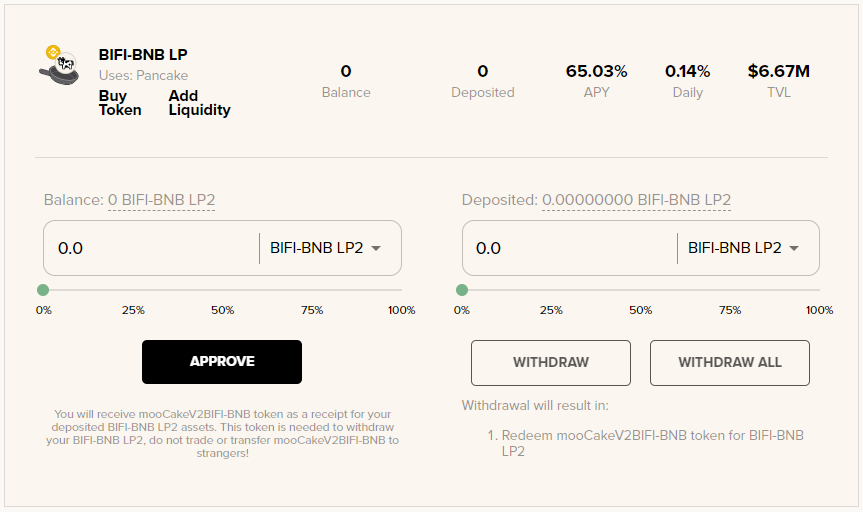
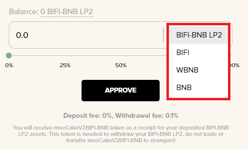
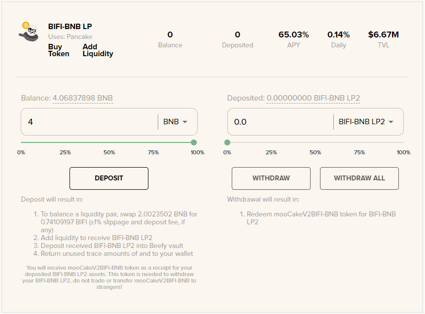
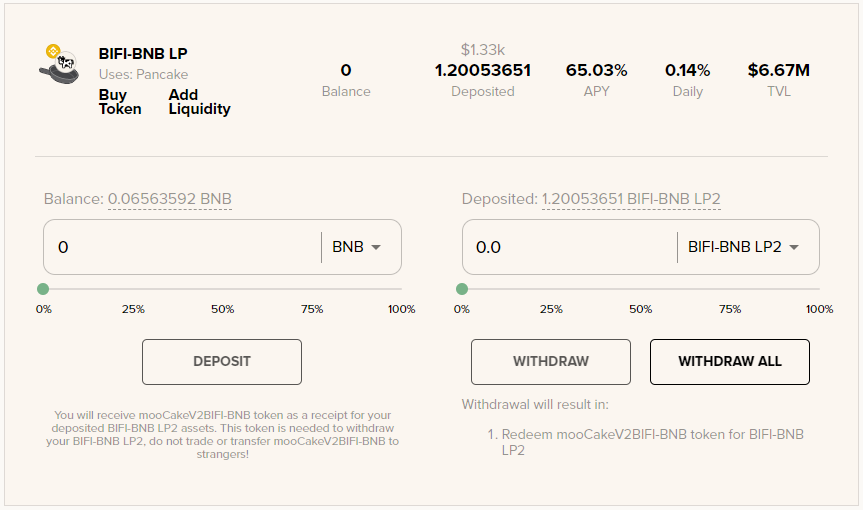
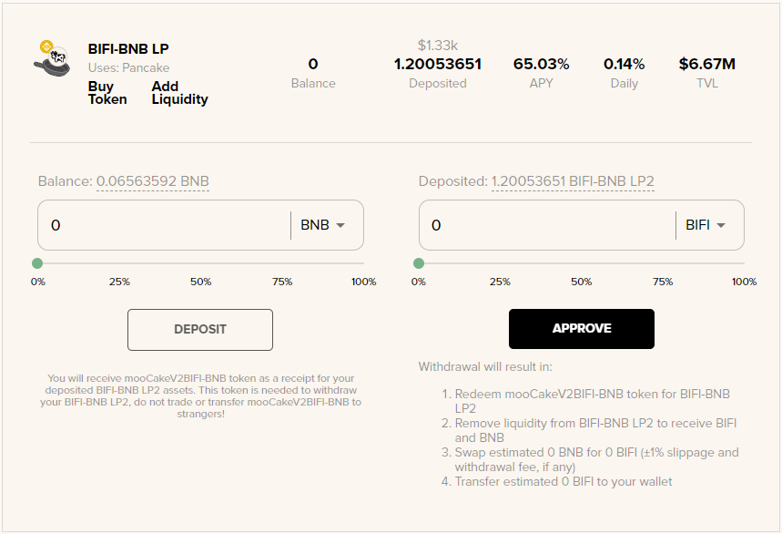
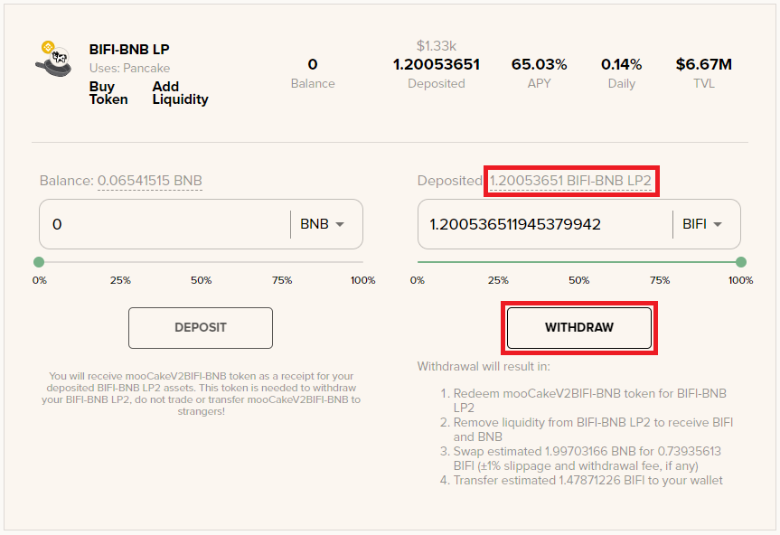
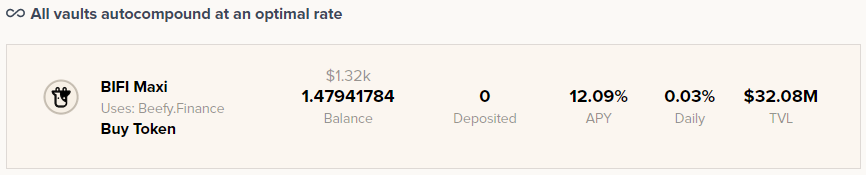

# How to use Beefy Zap

Beefy ZAP lets you create liquidity pool tokens and make Beefy vault deposits with just one transaction. You no longer need to [manually add and remove liquidity](how-to-add-remove-liquidity.md)! Beefy ZAP is a simple, quick, cheap, safe solution that eliminates the need to handle token contract addresses or even leave the comfy environs of the Beefy app.


When using Zap, always check your quote! While Zap does protect you against market slippage (price changes at the time of order and time of fulfillment), it does **not** protect you against price impact (how much your transaction will change the price of the tokens in the liquidity pool).


## Entering a LP vault

We will showcase Beefy ZAP for the [BIFI-BNB LP vault](https://app.beefy.finance/#/bsc/vault/cakev2-bifi-bnb) from PancakeSwap:

Using solely BNB as input asset, we will let Beefy ZAP create the BIFI-BNB LP tokens and make the vault deposit.

### 1. Expand the vault

Click on [BIFI-BNB LP](https://app.beefy.finance/vault/cakev2-bifi-bnb) or anywhere in the vault field to expand it and see the deposit and withdraw options.

### 2. Select "BNB" from the deposit dropdown menu

BNB does not require approval to spend, as it is the native currency on Binance Smart Chain.

### 3. Enter amount of BNB and hit "Deposit"

We currently have 4.0685 BNB, and in order to have enough to pay for transaction fees, we will use 4 BNB max.

And that's it! Deposit complete:

Beefy ZAP automatically created liquidity at Pancakeswap and deposited BIFI-BNB LP in the vault. You can check [this guide](how-to-check-harvesting-compounding-rate.md) to see when the vault will harvest rewards and compound for more BIFI-BNB LP tokens.

## Exiting a LP vault

Beefy ZAP also allows withdrawing and removing LP tokens from a vault. We will show how to withdraw from the BIFI-BNB LP vault and receive just BIFI.

### 1. Select "BIFI" from the withdraw dropdown menu

### 2. Click "Approve"

and confirm the transaction.

### 3. Select the amount of BIFI you wish to receive, or use all deposited tokens.

Click on the token amount deposited, and withdraw.

And that's all! Beefy ZAP returned 1.4794 BIFI to our wallet, which we can stake in the [BIFI Maxi vault](https://app.beefy.finance/#/bsc/vault/bifi-maxi) for example:

