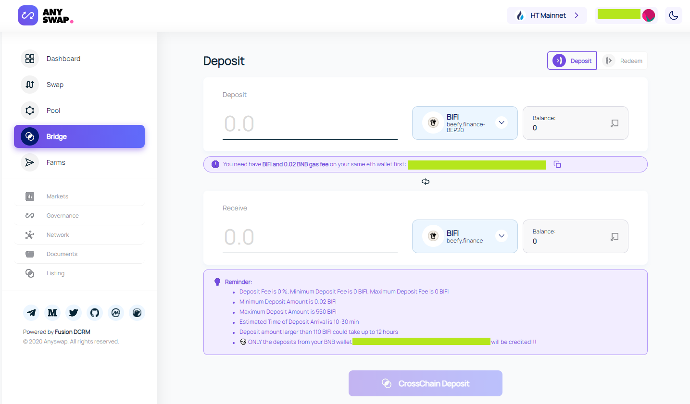
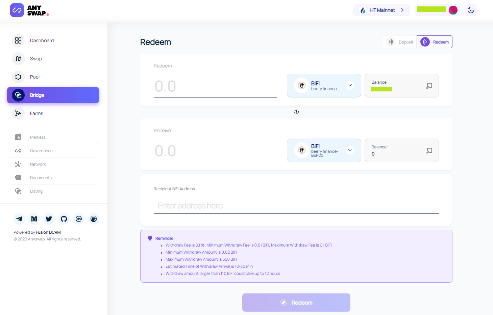

# How to send your BIFI from BSC to other blockchains and vice versa

## Prerequisites

* As an example, we are going to use HECO in this guide. You need to have the HECO network configured in your Metamask. You can use [this](../../faq/how-to-guides/how-to-add-and-switch-networks-on-beefy-finance.md) guide if you still need to add the required settings to Metamask.
* You will need some amount of Huobi tokens (HT) in your wallet to pay for HECO transaction fees to move your BIFI any further once it is bridged.

## Walkthrough

#### 1. Go to [https://anyswap.exchange/bridge](https://anyswap.exchange/bridge), make sure you are connected with your wallet under HECO network and are on the Deposit side (default).

In the figure below, select BIFI using the BEP20 BIFI token to deposit and enter the amount you wish to bridge.

The amount of BIFI you send will be taken from your BSC balance and credited as a HRC20 holding on the same address on HECO. 

#### 2. Confirm your choices and make the 'CrossChain Deposit'.

Carefully check if you consent with any possible fees, such as withdrawal fees and minimum and maximum withdrawal amounts. A 0.02 BNB transaction fee is required to complete the transfer. Now is also a good time to check 'Redeem' options for when you want to send your BIFI back again, for example: the minimum redeem amoumt is 0.02 BIFI. Once you are certain about the process and your settings, hit the 'CrossChain Deposit' button. Your BEP20 BIFI will now be sent to the HECO network!

#### 3. To send the (now HRC20) BIFI back to BSC, we simply need to reverse the process.

* Switch to the 'Redeem' side of the AnySwap Bridge.
* Select BIFI to redeem from the HECO network and enter the desired amount.
* Select BIFI using the BEP20 BIFI token to receive.
* Enter your BEP20 Metamask address as the 'Recipient BIFI Address'.
* Confirm your choices and 'Redeem'.

That's it!