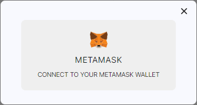
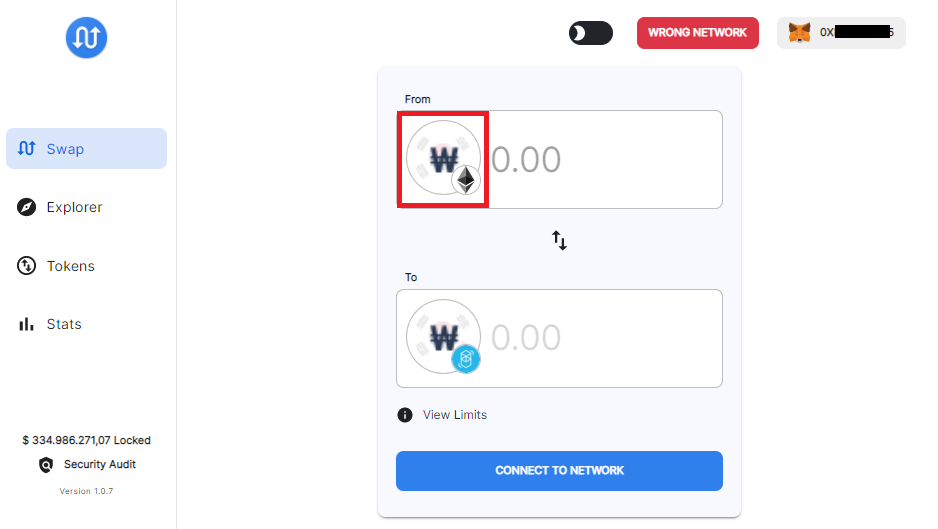
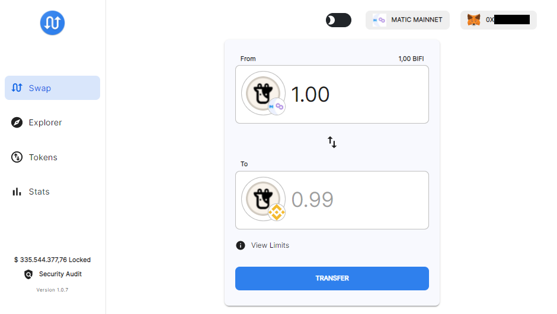

# How to bridge BIFI cross-chain

BIFI can be staked not only on Binance Smart Chain (BSC), but on every chain present in Beefy's [network switcher](../../faq/how-to-guides/how-to-add-and-switch-networks-on-beefy-finance.md). Each chain holds different opportunities for staking your BIFI, just check out the different APYs of the chain's BIFI Maxi vault! As an example, we are going to bridge BIFI from BSC to Polygon and back in this guide. 

## Prerequisites

* You need to have both the BSC and Polygon network configured in your Metamask.
* You will need BNB and MATIC to pay for transaction fees.

## BSC -> Polygon

#### 1. Visit [https://multichain.xyz/swap](https://multichain.xyz/swap)

#### 2. Connect your wallet

It might prompt you are on the "Wrong Network" afterwards, but don't pay attention to that.

#### 3. Select BIFI to send

Click the Wrapped-ETH icon in the "From" field,

and select BIFI:

The "Wrong Network" prompt is now gone too!

#### 4. Select BIFI to receive

At this step, you can select on which network you wish to receive BIFI. We select Polygon (Matic Mainnet) in this guide:

#### 5. Specify the amount to send

Either type in the amount, or click your balance.

Make sure to "View Limits" too! Pro tip: hit the switch toggle and check the limits for withdrawing now too. 

#### 6. Send it!

If you consent with all possible depositing and withdrawing fees, click the transfer button. Note: you may change the prompted gas price to 5 GWei (BSC's default at the time of writing)

That's it! Your BEP20 BIFI will now be sent to the Polygon network:

## Polygon -> BSC

To send the (now ERC20) BIFI back to BSC, we simply need to reverse the process.

#### 1. Connect to Polygon network

#### 2. Specify the amount to send

#### 3. Transfer!

