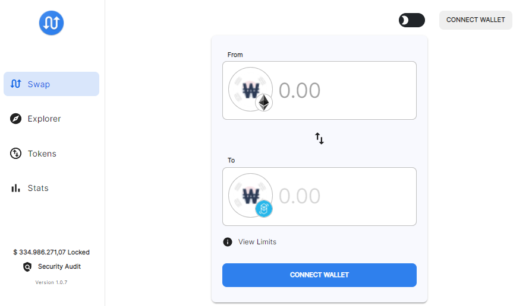
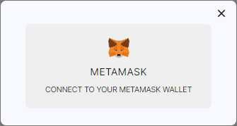
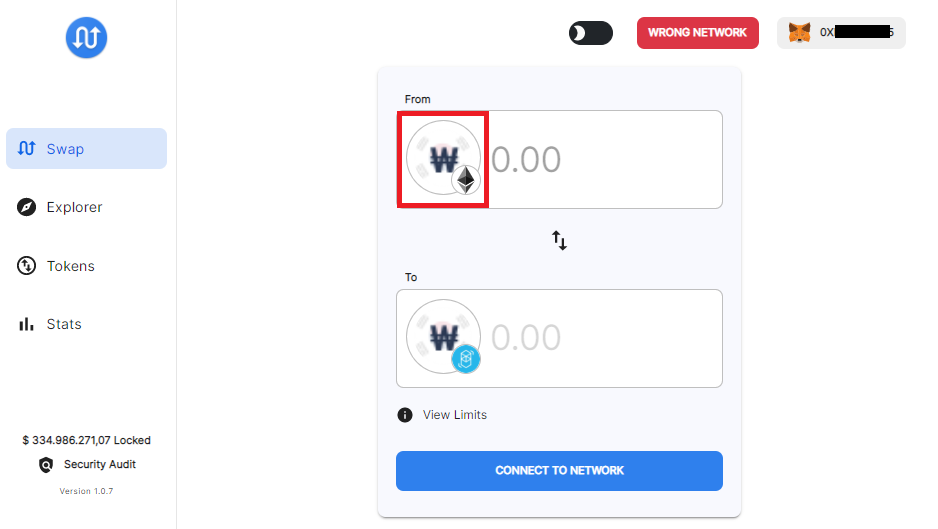
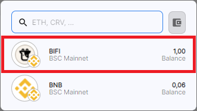
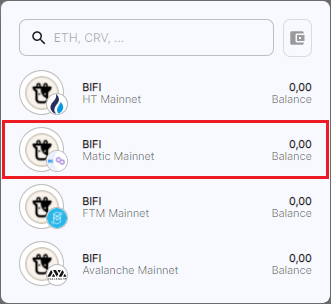
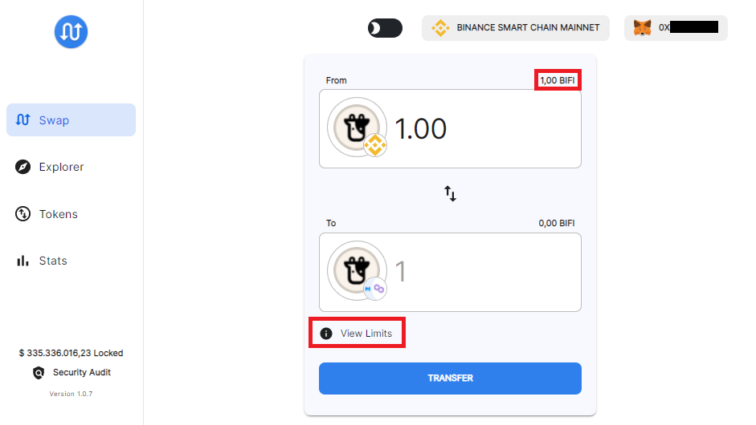
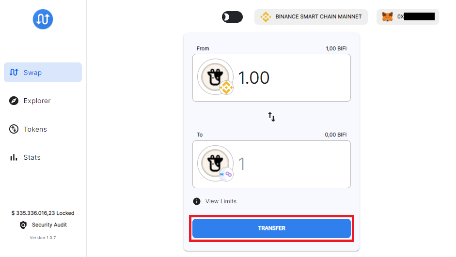
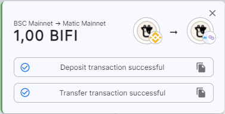
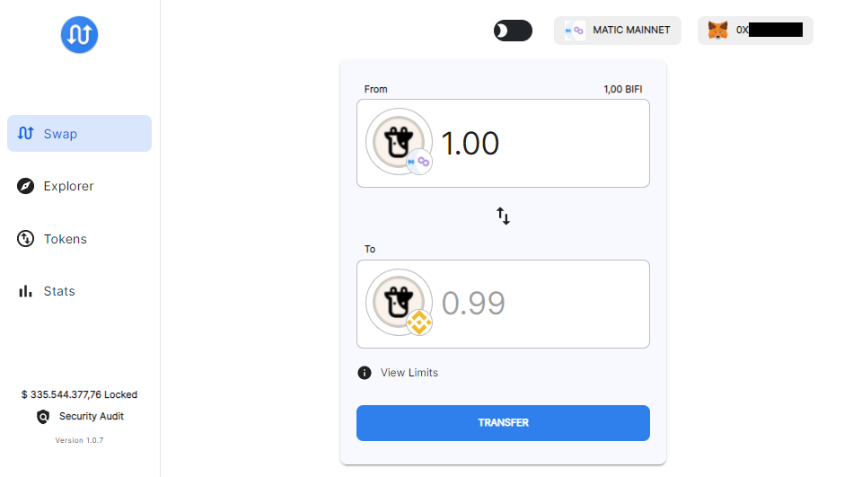

# 如何使用 BIFI 进行跨链

BIFI 不仅可以质押在币安智能链 \(BSC\) 上，还可以质押在 Beefy 的 [网络切换器](how-to-add-and-switch-networks-on-beefy-finance.md) 中的每条链上. 每条链都拥有不同的机会来质押您的 BIFI，只需查看每条链上 BIFI Maxi 金库不同的 APY 就知道了！ 例如，我们将在本指南中将 BIFI 从 BSC 跨链到 Polygon 并返回。

## 先决条件

* 您需要在 Metamask 中配置 BSC 和 Polygon 网络。
* 您将需要 BNB 和 MATIC 来支付交易费用。

## BSC -&gt; Polygon

### 1. 访问 [https://multichain.xyz/swap](https://multichain.xyz/swap)

### 2. 连接您的钱包

也将您的 Metamask 切换到币安智能链。它之后可能会提示您在“错误的网络”上，但不必注意这一点。

### 3. 选择发送 BIFI 

点击 "From "一栏中的Wrapped-ETH图标，

并选择BIFI：

“错误的网络”提示现在也消失了！

### 4. 选择接收 BIFI

在这一步，您可以选择您希望在哪个网络上接收 BIFI。 我们在本指南中选择 Polygon \(Matic 主网\)：

### 5. 指定要发送的数额

输入数额，或点击您的余额。

确保也要“查看限制”哦！ 专业提示：点击切换按钮并查看目前提取的限制。

### 6. 发送！

如果您同意所有可能存在的存款和提款费用，请点击 “transfer" 按钮。 注意：您可以将提示的gas价格更改为5 Gwei \(撰写本文时BSC的默认值\).

就这样简单！ 您的 BEP20 BIFI 现在将被发送到 Polygon 网络：

## Polygon -&gt; BSC

要把 \(现在是ERC20\) BIFI 发送回 BSC, 我们只需要把这个过程倒过来。

### 1. 连接到Polygon网络

### 2. 指定要发送的数额

### 3. 发送!

