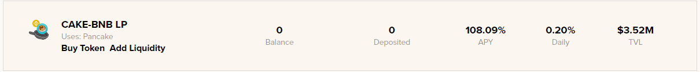
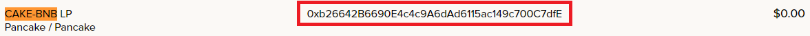
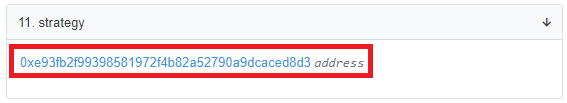
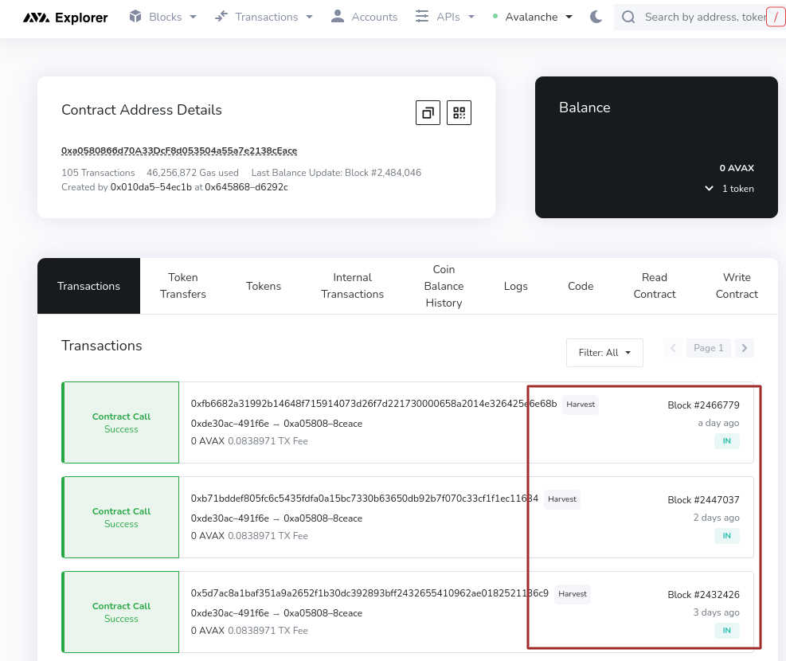

# How to check the harvesting and compounding rate of a vault

Beefy Finance's [vaults](../../ecosystem/products/vaults.md), or more specifically the investment strategy tied to the vault, will automatically increase the amount of your deposited asset by compounding arbitrary yield-farm rewards back into more of that asset. This constant cycle of harvesting rewards, and compounding, happens usually multiple times per day. In this How-To we walk you through steps to check precisely how often the compounding occurs.

## Walkthrough

NOTE: No matter which chain you choose, you can use Beefy's [dashboard.beefy.finance](https://dashboard.beefy.finance) to launch your investigation.

### Binance Smart Chain (BSC) example

Let's choose the CAKE-BNB LP vault on the Binance Smart Chain to demonstrate:

#### 1. Go to [dashboard.beefy.finance](https://dashboard.beefy.finance)

This dashboard chooses which statistics and vaults to show based on the blockchain network your wallet (e.g. MetaMask) is connected to. So if it's not now on BSC, simply switch networks to that and the dashboard page will refresh to display Beefy's statistics and vaults on BSC.

#### 2. Find the contract for the vault you wish to inspect, and click on it, opening a page in the BscScan block explorer

#### 3. On the BscScan page, open the "Contract" tab and subsequently the "Read Contract" tab

#### 4. Scroll down to find the strategy contract, and click on it

#### 5. Click on the Events tab to view the strategy events that have fired

The "StratHarvest" events are where LP-farming rewards are culled and in turn compounded into more of the underlying LPs, the initial deposited asset, and then redeposited into the Beefy vault. As the timestamps reflect, this CAKE-BNB vault compounds roughly once per hour.

### Other Chains (except Harmony, Celo, Cronos)

Each of the chains supported by Beefy may be investigated via the same method shown above for BSC. The only difference will be the block explorer opened. For example on Polygon, PolygonScan will open.

### Harmony, Celo, Cronos

The basic method shown in the BSC example above still applies, except for the last, key step 5. This owes to these chains using different block-explorer softwares. In these cases, step 5 switches to the Transactions tab to view the strategy events fired, as exemplified below

