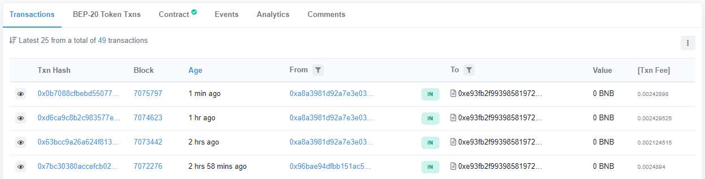
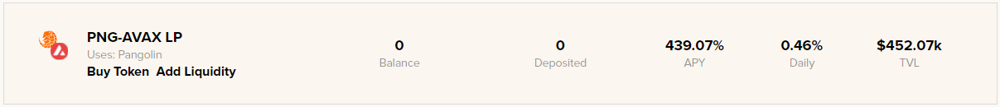
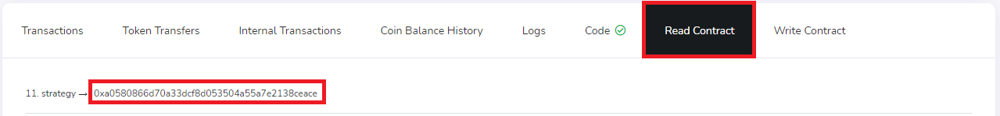
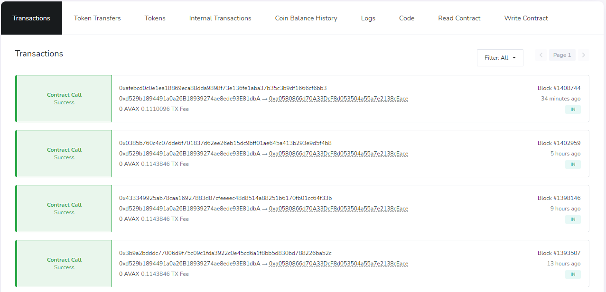

# How to check your vault's reward harvesting and compounding rate

Beefy Finance's [vaults](../../faq/products/vaults.md), or more specifically the investment strategy tied to the vault, will automatically increase your deposited token amount by compounding arbitrary yield farm reward tokens back into your initially deposited asset. This constant cycle of harvesting rewards and compounding happens multiple times a day, and in this How-to we will walk you through the steps to check the exact rate of how often this process occurs.

## Walkthrough

### Binance Smart Chain

On BSC, one can easily use Beefy Finance's [Deployed Contract Registry](../../developers/deployed-contract-registry.md). As an example, we will pick the CAKE-BNB LP vault to demonstrate the process:

*Screenshot taken on 5 May 2021*

#### 1. Go to [dashboard.beefy.finance](https://dashboard.beefy.finance)

#### 2. Find the contract for the vault you are looking at, and click on it.

#### 3. Now on BscScan, open the "Contract" tab and subsequently the "Read Contract" tab.

#### 4. Scroll down to find the strategy contract, and click on it.

#### 5. Look at the strategy contract transactions. 

All these transactions are from the vault harvesting rewards which in turn also trigger the yield compounding into the initial deposited asset. The CAKE-BNB LP vault of this example compounds roughly every hour.

### Avalanche

On Avalanche, the method for checking how often your vault harvests and compounds is slightly different. In this example we will use the PNG-AVAX LP vault:

*Screenshot taken on 5 May 2021*

#### 1. You will need go to the Avalanche block explorer for the C chain: [https://cchain.explorer.avax.network/](https://cchain.explorer.avax.network/)

#### 2. Find the contract for the vault you are looking at.

A quick hack is to search for the [mooToken](https://docs.beefy.finance/beefyfinance/faq/products/vaults#what-are-mootokens) the vault gave you. For example for PNG-AVAX LP you will just search for mooPangolinPNG-AVAX.

#### 3. Now you have the vault contract, go to the "Read Contract" tab and scroll down to find the vault "Strategy", and click on it.

#### 4. Look at the strategy contract transactions.

All these transactions are from the vault harvesting rewards which in turn also trigger the yield compounding into the initial deposited asset. The PNG-AVAX LP vault of this example compounds roughly every 4 hours.