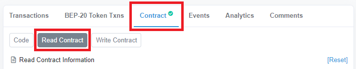

# Come controllare il tasso di raccolta e reinvestimento di una cassaforte

Le [casseforti ](../../ecosystem/products/vaults.md)di Beefy Finance, o meglio, la strategia di investimento legata ad una cassaforte, incrementerà automaticamente la quantità dei tuoi asset depositati, componendo arbitrariamente i tuoi rendimenti di quella farm. Questo costante ciclo di ritiro delle ricompense, e composizione delle stesse, avviene molteplici volte al giorno. In questa guida pratica ti guideremo nei precisi passaggi per controllare esattamente quanto spesso accade il compounding.

## Procedura dettagliata

NOTA: Indipendentemente da quale chain scegli, puoi usare la dashboard di Beefy ([dashboard.beefy.finance](https://dashboard.beefy.finance)) per avviare la tua investigazione.

### Binance Smart Chain (BSC) esempio

Come dimostrazione scegliamo la cassaforte LP CAKE-BNB LP sulla Binance Smart Chain:

#### 1. Vai su [dashboard.beefy.finance](https://dashboard.beefy.finance)

Questa dashboard sceglie quali statistiche e casseforti mostrare a seconda della rete blockchain con cui è connesso il tuo wallet (cioè Metamask). Quindi se adesso non ti trovi su BSC, puoi semplicemente cambiare e la pagina della dashboard si aggiornerò per mostrarti le statistiche e le casseforti di Beefy relative alla BSC.

#### 2. Trova il contratto per la cassaforte che vuoi ispezionare, cliccaci, si aprirà una pagina sul block explorer BscScan (Esploratore dei blocchi)

#### 3. Sulla pagina BscScan, apri la scheda "Contract" e dopo apri la scheda "Read Contract"

#### 4. Scendi giù fino a trovare il contratto della strategia e cliccaci sopra

#### 5. Clicca sulla scheda "Events" per vedere gli eventi della strategia che sono avvenuti

Gli eventi "StratHarvest" avvengono quando le ricompense del LP farming sono trasformati e a loro volta reinvestiti in più parti del sottostante del token LP, cioè l'asset del tuo deposito iniziale, e poi re-depositati nella cassaforte Beefy. Come riflette il timestamp, questa cassaforte CAKE-BNB si compone all'incirca una volta ogni ora.

### Altre chain (escluso Avalanche)

Ognuna della chain supportate da Beefy può essere investigata con lo stesso metodo mostrato sopra per la BSC. L'unica differenza è il block explorer che si aprirà. Per esempio su Polygon avremo PolygonScan.

### Avalanche

Il metodo basico mostrato per la BSC funziona, a parte per l'ultimo step, il numero 5. Ciò è dovuto dal fatto che Avalanche usa un software block explorer differente. Nel caso di Avalanche, nello step 5 dovremo cliccare sulla scheda "Transactions" per visualizzare gli eventi della strategia avvenuti, come spiegato qui sotto

