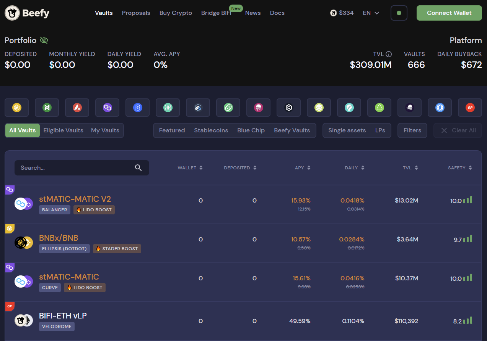
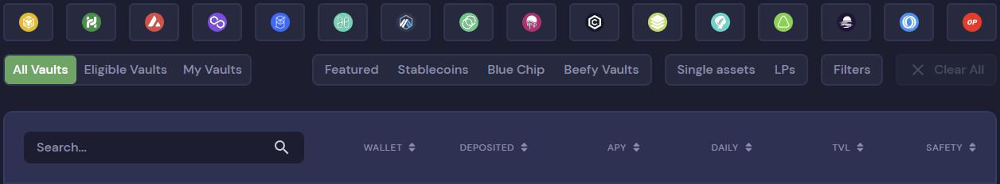
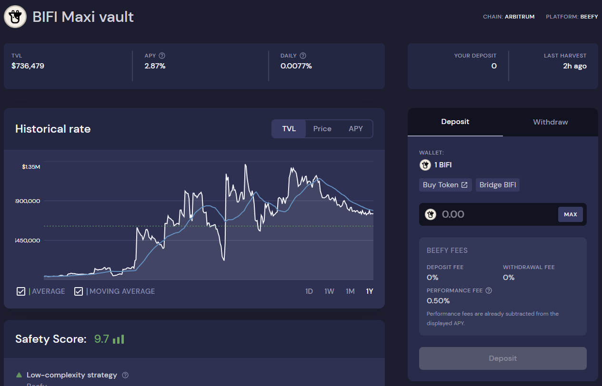
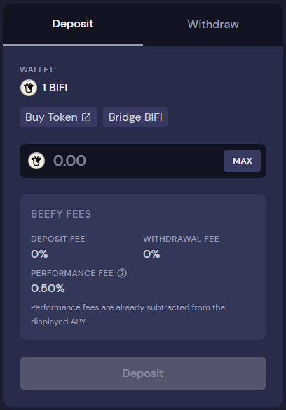
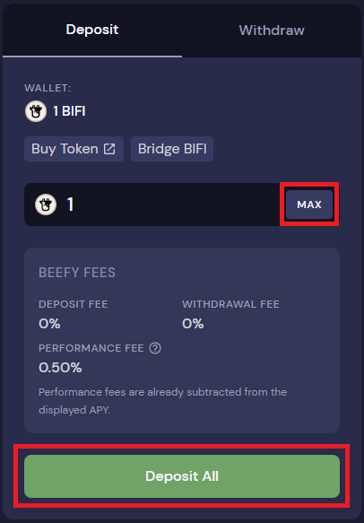
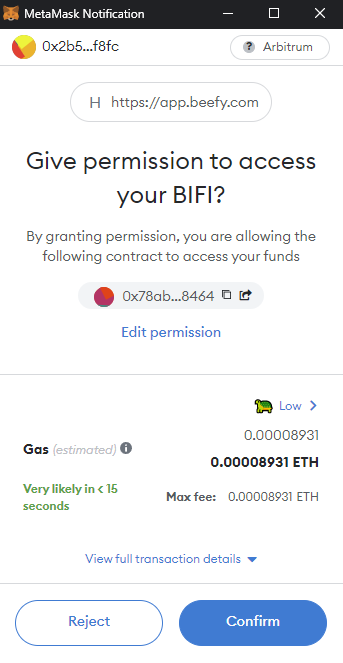
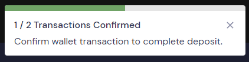
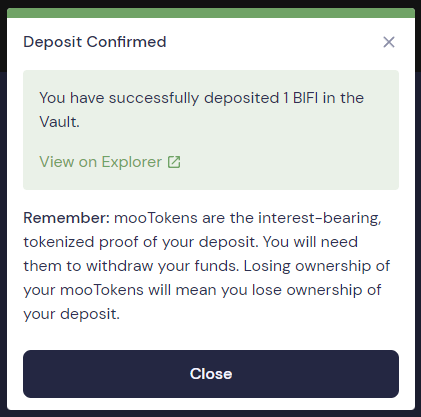
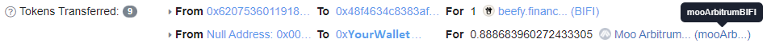

# How to deposit in a Vault

## Prerequisites

* You must have the vault's underlying token(s) in your wallet. See here how to fund your wallet: [funding-your-wallet.md](../../get-started/funding-your-wallet.md "mention")
* You must use a supported wallet, such as Metamask or Trustwallet: [connecting-your-wallet-to-beefy.md](../../get-started/connecting-your-wallet-to-beefy.md "mention").&#x20;

## Walkthrough

### 1. Go to the [Beefy app](https://app.beefy.com/) page:

<figure><figcaption>
Screenshot date: 10 October 2022
</figcaption></figure>

Again, make sure that your wallet is connected and that it is funded with tokens.

### 2. Use the filters to find a vault you want to deposit into:

<figure><figcaption></figcaption></figure>

The blockchain logos, the preset selection buttons and the search field all act as filters.&#x20;

### 3. Example of filter usage

In this guide, we will use the BIFI Maxi vault on Arbitrum as an example:

<figure><figcaption></figcaption></figure>

Note that the BIFI Earnings Pool, in which you can earn WETH by depositing BIFI, also shows up. Open the BIFI Maxi vault by clicking anywhere in the field above.

### 4. Inside the BIFI Maxi vault:

<figure><figcaption></figcaption></figure>

There is a lot of information inside the vault, such as TVL (Total Value Locked), Price and APY (Annual Percentage Yield) historical rates, the [beefy-safety-score.md](../../safety/beefy-safety-score.md "mention"), Token Asset details, and the Vault's compounding strategy ([#what-is-a-vault-strategy](../../beefy-products/strategies.md#what-is-a-vault-strategy "mention")).&#x20;

### 5. The Deposit and Withdraw module:

<figure><figcaption></figcaption></figure>

The vault already sees we have 1 BIFI available in our wallet to deposit. There is a "Buy Token" link provided in case you do not have any BIFI or wish to buy more BIFI to deposit, as well as a "Bridge BIFI" button to bridge BIFI from another blockchain to Arbitrum. A deposit field and a "Max" button are used for entering the exact amount of BIFI you want to deposit. Furthermore, the Beefy Vault Fees ([#what-is-the-vault-fee-structure](../../beefy-products/vaults.md#what-is-the-vault-fee-structure "mention")) are shown.

### 6. An example deposit:

In this example, we first click the "Max" button to deposit all the BIFI in our wallet, followed by clicking on the "Deposit All" button.&#x20;

<figure><figcaption></figcaption></figure>

When it is the first time you deposit in this vault, you need to grant permission to the vault's contract and allow it to access your funds:

<figure><figcaption></figcaption></figure>

In the next transaction you will be actually depositing in the vault:

<figure><figcaption></figcaption></figure>

In summary, depositing into a new vault always requires two transactions: one for approving the spending permission and one for the actual deposit.

### 7. Deposit confirmation:

<figure><figcaption></figcaption></figure>

Once the transaction succeeds, a message will pop up confirming the deposit and it contains a link to the transaction in the block explorer. It is very important to understand that your wallet now holds a tokenized proof of deposit called a "mooToken" ([#what-are-mootokens](../../beefy-products/vaults.md#what-are-mootokens "mention")). This mooToken is required to withdraw from the vault, don't lose it!&#x20;

On the block explorer page of the deposit transaction you can find out that the mooTokens are indeed supplied to your wallet after depositing in the vault. The token transfer will look something like this:

<figure><figcaption></figcaption></figure>

Since mooTokens are interest-bearing, they are more valuable than their "normal" token counterpart. This is also the reason why the mooToken amount does not 1:1 match with the token amount initially deposited ([#how-do-mootokens-earn-interest](../../beefy-products/vaults.md#how-do-mootokens-earn-interest "mention")).

That's it, once the harvest function on this vault is called, you are already earning yield!
