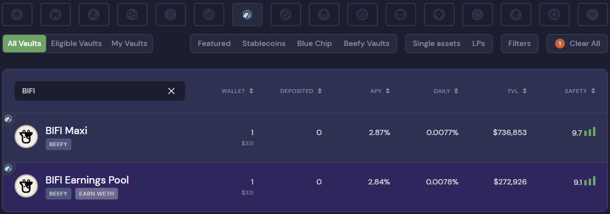

# Comment faire un dépôt dans un coffre

## Conditions préalables

* Vous devez avoir le(s) jeton(s) sous-jacent(s) du coffre dans votre portefeuille. Voir ici comment financer votre portefeuille : [funding-your-wallet.md](../../get-started/funding-your-wallet.md "mention")
* Vous devez utiliser un portefeuille supporté, tel que Metamask ou Trustwallet : [connecting-your-wallet-to-beefy.md](../../get-started/connecting-your-wallet-to-beefy.md "mention").

## Cheminement

### 1. Allez sur la page [Beefy app](https://app.beefy.com/) :

<figure><figcaption>
Date de la capture d'écran : 10 octobre 2022
</figcaption></figure>

Encore une fois, assurez-vous que votre portefeuille est connecté et qu'il est alimenté avec les jetons concernés.

### 2. Utilisez les filtres pour trouver un coffre dans lequel vous souhaitez effectuer un dépôt :

<figure><figcaption></figcaption></figure>

Les logos de la blockchain, les boutons de sélection des présélections et le champ de recherche font tous office de filtres.

### 3. Exemple d'utilisation des filtres

Dans ce guide, nous utiliserons le coffre BIFI Maxi sur Arbitrum comme exemple :

<figure><figcaption></figcaption></figure>

Notez que le BIFI Earnings Pool, dans lequel vous pouvez gagner des WETH en déposant des BIFI, apparaît également. Ouvrez le coffre BIFI Maxi en cliquant n'importe où dans le champ ci-dessus.

### 4. À l'intérieur du coffre BIFI Maxi :

<figure><figcaption></figcaption></figure>

Il y a beaucoup d'informations à l'intérieur du coffre, comme les taux historiques TVL (Total Value Locked : Valeur Totale Bloquée), Prix et APY (Annual Percentage Yield : Rendement annuel en pourcentage), le ([beefy-safety-score.md](../../safu-protocol/beefy-safety-score.md "mention")), les détails des actifs, et la stratégie de composition du coffre ([#Qu'est-ce qu'une stratégie de coffre ?](../../products/strategies.md#quest-ce-quune-strategie-de-coffre "mention")).

### 5. Le module Dépôt et Retrait :

<figure><figcaption></figcaption></figure>

Le coffre voit déjà que nous avons 1 BIFI disponible dans notre portefeuille pour le déposer. Un lien "Buy Token" est fourni au cas où vous n'auriez pas de BIFI ou que vous souhaiteriez en acheter davantage pour effectuer un dépôt, ainsi qu'un bouton "Bridge BIFI" permettant d'établir un pont entre les BIFI d'une autre blockchain et Arbitrum ([how-to-bridge-bifi-cross-chain.md](how-to-bridge-bifi-cross-chain.md "mention")). Un champ de dépôt et un bouton "Max" permettent de saisir le montant exact de BIFI que vous souhaitez déposer. En outre, les frais de coffres ([#quel-est-la-structure-des-frais-pour-les-coffres](../../products/vaults.md#quel-est-la-structure-des-frais-pour-les-coffres "mention")) sont affichés.

### 6. Un exemple de dépôt :

Dans cet exemple, nous cliquons d'abord sur le bouton "Max" pour déposer tous les BIFI dans notre portefeuille, puis sur le bouton "Deposit All".

<figure><figcaption></figcaption></figure>

Lorsque c'est la première fois que vous effectuez un dépôt dans ce coffre, vous devez accorder la permission au contrat du coffre et l'autoriser à accéder à vos fonds :

<figure><figcaption></figcaption></figure>

Lors de la prochaine transaction, vous effectuerez un dépôt dans le coffre :

<figure><figcaption></figcaption></figure>

En résumé, le dépôt dans un nouveau coffre nécessite toujours deux transactions : une pour l'approbation de l'autorisation de dépenser et une pour le dépôt proprement dit.

### 7. Confirmation du dépôt :

<figure><figcaption></figcaption></figure>

Une fois la transaction réussie, un message s'affiche pour confirmer le dépôt et contient un lien vers la transaction dans l'explorateur de blocs. Il est très important de comprendre que votre portefeuille contient maintenant une preuve de dépôt appelée "mooToken" ([#quest-ce-que-les-mootokens](../../products/vaults.md#quest-ce-que-les-mootokens "mention")). Ce mooToken est nécessaire pour retirer du coffre, ne le perdez pas !

Sur la page de l'explorateur de blocs de la transaction de dépôt, vous pouvez constater que les mooTokens sont effectivement fournis à votre portefeuille après le dépôt dans la chambre forte. Le transfert de jetons ressemblera à quelque chose comme ceci :

<figure><figcaption></figcaption></figure>

Les mooTokens étant porteurs d'intérêts, ils ont plus de valeur que leur homologue "normal". C'est également la raison pour laquelle le montant du mooToken ne correspond pas 1:1 au montant du jeton initialement déposé ([#comment-les-mootokens-rapportent-ils-des-interets](../../products/vaults.md#comment-les-mootokens-rapportent-ils-des-interets "mention")).

C'est tout, une fois que la fonction de collecte de ce coffre est appelée, vous gagnez déjà du rendement !
