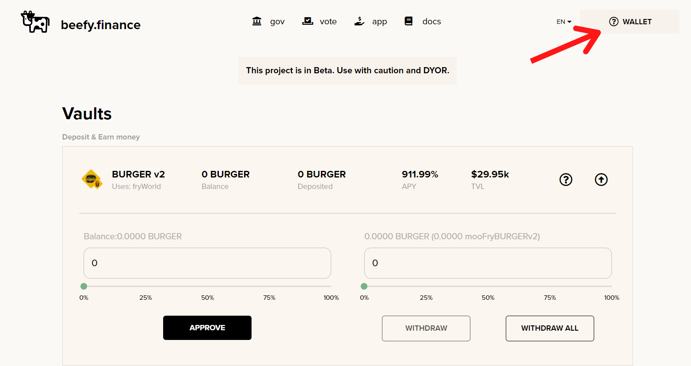
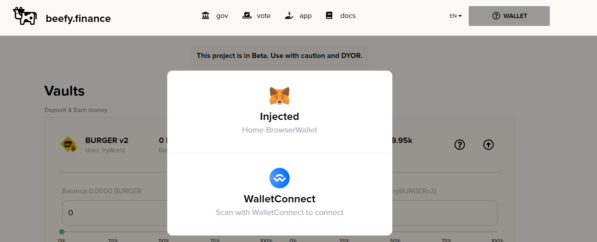
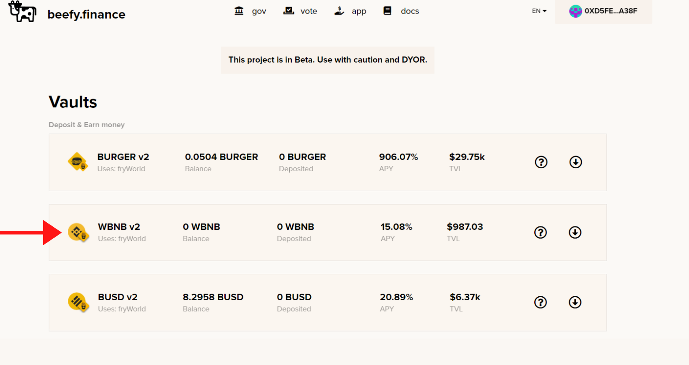
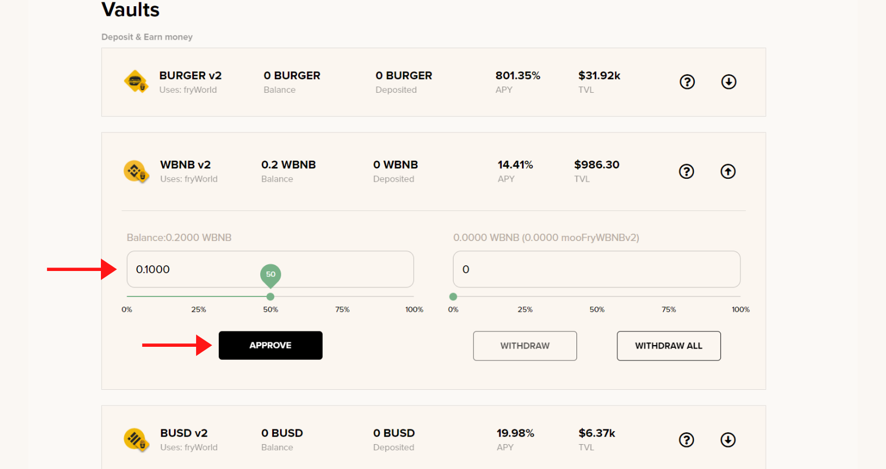
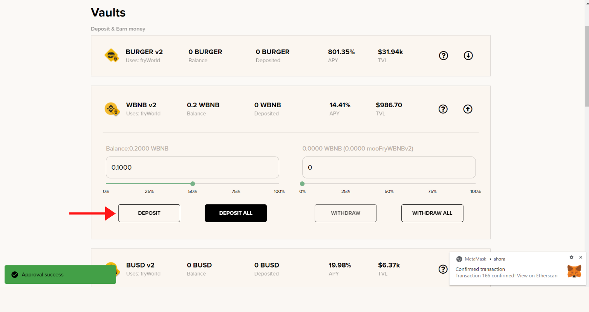
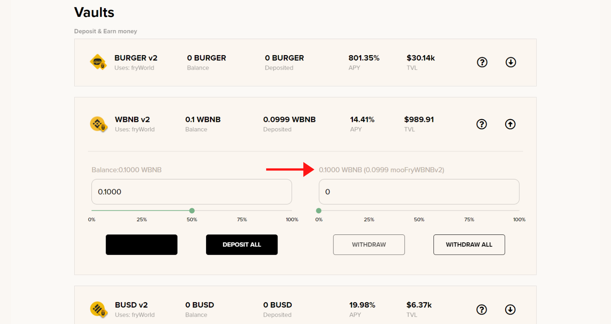

# How to participate in a mooVault

## Prerequisites

* You must have the mooVault underlying token. For WBNB mooVault, you must have WBNB.
* You must use a supported wallet, either Metamask or Trustwallet.

## Walkthrough

### 1. Go to [Beefy app](https://app.beefy.finance/) and click on “WALLET”

### 2. Choose your favorite wallet

### 3. Choose which Vault you want to deposit into, for example, the WBNB v2 Vault

### 4. Enter the amount of WBNB that you want to deposit, and click APPROVE

### 5. Confirm the transaction in your wallet and click “DEPOSIT”

Click on **25%, 50%, 75% or 100%** or any percentage _\*\*_to deposit the corresponding proportion of your wallet into the Vault.

Or click “Deposit All” if you would like to **deposit 100%** of the chosen digital asset from your wallet into the Vault. :::info Please note before you make a deposit that there is a **0.1% withdrawal fee**. The longer you leave the deposit to earn returns in the Vault, the more likely your returns will exceed the withdrawal fee. :::

### 6. Receive your mooToken \(in this case it would be mooFryWBNBv2\)

The mooToken you receive is your **share of the mooFryWBNBv2 Vault**. The amount of mooFryWBNBv2 in your wallet will **remain constant** over time but the value of it will increase as the WBNB Vault earns returns.

The amount of mooFryWBNBv2 you receive will be less than 1 per WBNB you deposited because mooFryWBNBv2 is worth more than WBNB.

That's it, once the harvest function is called, you are already earning yield.

