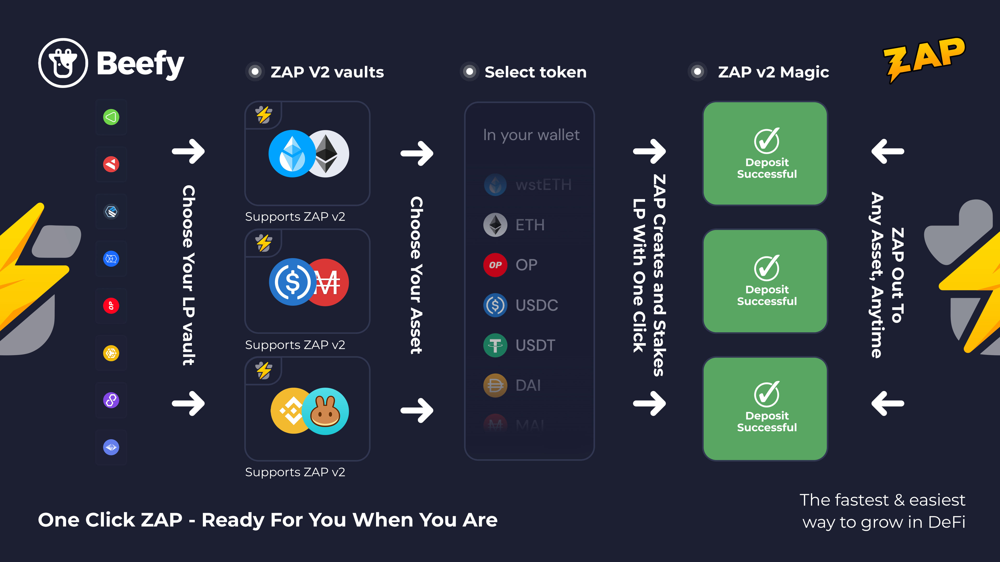

# Infographics

This page helps to explain various key aspects of Beefy's vaults, tooling and protocol using easy to understand infographics and short descriptions. Though the services we offer are advanced and highly technical, we agree with the adage that _"if you can't explain it simply, you don't understand it well enough"_.

## Vault Yield Farming

At Beefy 'you earn what you stake', regardless if this is a liquidity pool (LP) token or a single asset. In this example, staking CAKE-BNB LP will result in more CAKE-BNB LP over time. This effectively grows your share in the liquidity pool and thus allows for more and more rewards over time. All of this with Beefy doing the required work, while you can sit back and relax!

## Vault Fee Structure

<figure><figcaption>
"What you see is what you get": the fees are already accounted for in the displayed APY!
</figcaption></figure>

More on the vault fees [here](../products/vaults.md#what-is-the-vault-fee-structure).

## Beefy ZAP

Our Beefy ZAP tooling automatically builds the deposit (or withdraw) positions you need for our Beefy vaults from other assets, thereby saving you the time, energy and cost of obtaining the necessary assets and building the necessary liquidity positions yourself. Here's a guide on [How to Use Beefy ZAP](how-to-guides/how-to-beefy-zap.md).

Our ZAP V1 tool automatically builds liquidity pool (LP) tokens from any of the base deposit assets, such as from BNB for the CAKE-BNB LP2 shown above. When the time has come that you want to withdraw from a LP vault, ZAP V1 also supports withdrawing back into any base asset, for instance you can exit into CAKE instead of BNB. This saves you the hassle of manually adding and removing liquidity at a yield farm.&#x20;

<figure><figcaption>
ZAP V2 goes one step further, so users can enter supported vaults from any of a selection of blue chip, native or stablecoin assets, regardless of whether the asset forms part of the vault's asset base.
</figcaption></figure>

The ZAP V2 tool takes things one step further, using the power of DEX aggregators like 1inch to add initial swaps to the process, so users can move from common blue chip tokens (e.g. WBTC, ETH), native tokens (e.g. MATIC, BNB) or stablecoins (e.g. USDC, USDT, DAI) into the underlying tokens needed for the liquidity position. That way, you can access our market-leading returns on new products without handling anything but the tokens and stables you already have in your wallet.

The ZAP quote that's displayed during the deposit or withdraw process already has the ZAP fee taken into account. Additionally, the ZAP fee is only deducted from token swaps. The fees first accumulate in a batch treasury, and after some time are swapped to stables and sent to [Beefy's Treasury](https://app.beefy.com/treasury). The original Beefy ZAP V1 remains free to use.


When using ZAP, always check your quote! While ZAP does protect you against market slippage (price changes at the time of order and time of fulfillment), it does **not** protect you against price impact (how much your transaction will change the price of the tokens in the liquidity pool). As a general rule, the smaller the liquidity of the asset, the larger the risk of price impact.


## Beefy Launchpool Boost

When a vault gets boosted in Beefy's Boost, you earn both the base asset and the partner's token! For more info, read the Boost FAQ [here](../products/boost.md).
