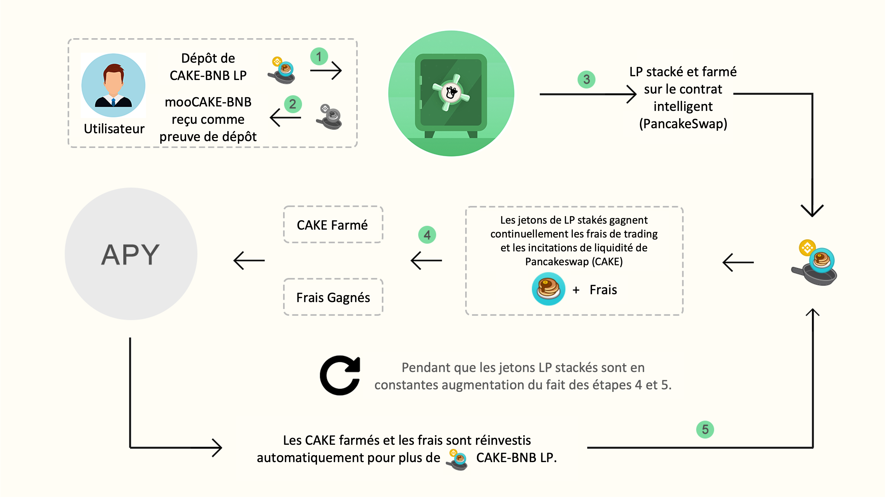
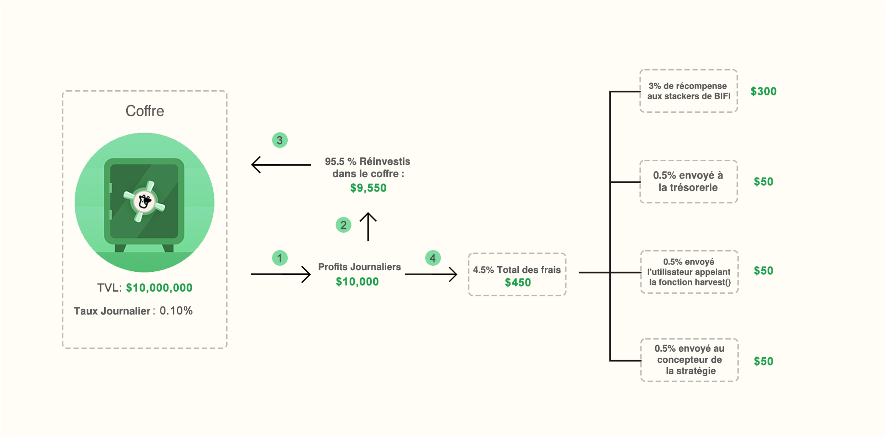
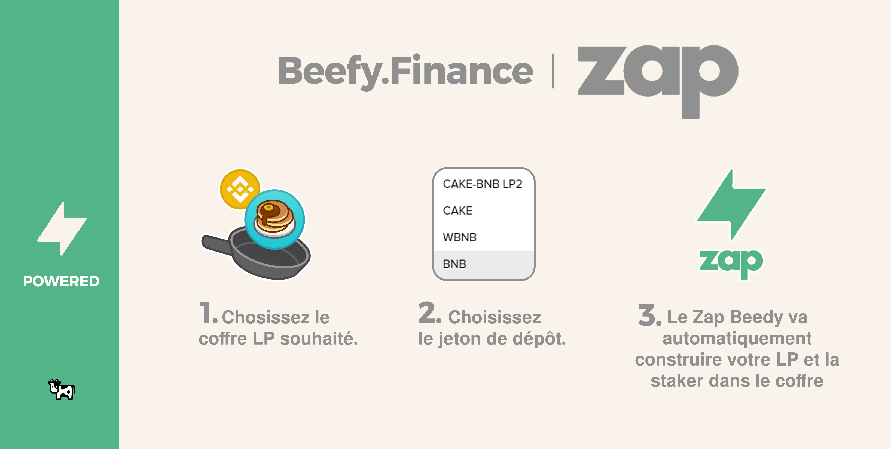
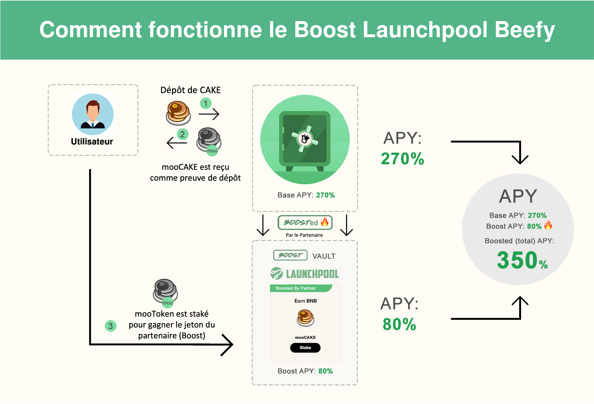

# Infographies Beefy

Ici, les différents aspects de Beefy seront expliqués à l'aide d'infographies faciles à comprendre.

## Les étapes de récolte de rendement que Beefy exécute pour vous :

Chez Beefy, "vous gagnez ce que vous mettez en jeu", qu'il s'agisse d'un jeton de fonds commun de liquidité (LP) ou d'un actif unique. Dans cet exemple, la mise de CAKE-BNB LP se traduira par plus de CAKE-BNB LP au fil du temps. Cela augmente effectivement votre part dans le pool de liquidité et permet ainsi d'obtenir de plus en plus de récompenses au fil du temps. Tout ceci en laissant Beefy faire le travail nécessaire, tandis que vous pouvez vous asseoir et vous détendre !

## La structure des frais du coffre expliqué :

Plus d'informations sur les frais de coffre [ici](../products/vaults.md#what-is-the-vault-fee-structure).

## Beefy Zap :

Beefy Zap construit automatiquement vos jetons de pool de liquidité (LP) à partir d'un actif de dépôt de base, tel que BNB. Lorsque le moment est venu de retirer des jetons d'une réserve de liquidité, Beefy Zap permet également de les retirer dans un actif de base. Cela vous évite de devoir ajouter et retirer manuellement des liquidités dans une ferme de rendement. Voici [comment utiliser Beefy Zap](how-to-guides/how-to-beefy-zap.md)


Lorsque vous utilisez Zap, vérifiez toujours votre estimation ! Bien que Zap vous protège contre le slippage du marché (les changements de prix au moment de la transaction et au moment de l'exécution), il ne vous protège **pas** contre l'impact du prix (dans quelle mesure votre transaction changera le prix des jetons dans le fonds commun de liquidité).


## Beefy Launchpool :

Quand un coffre est boosté dans le Launchpool de Beefy, vous gagnez à la fois l'actif de base et le jeton du partenaire ! Pour plus d'informations, lisez la FAQ Launchpool [ici](../products/boost.md).
