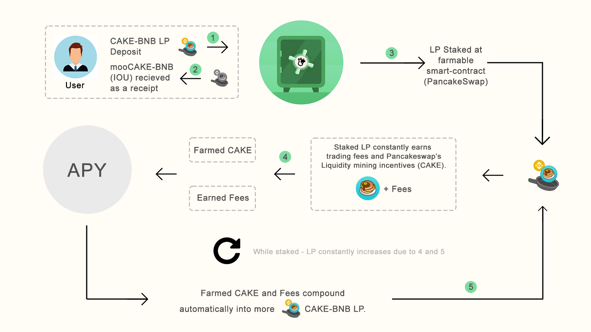
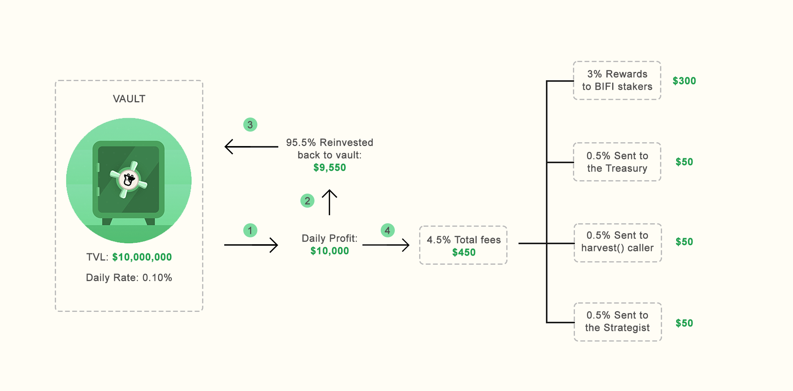
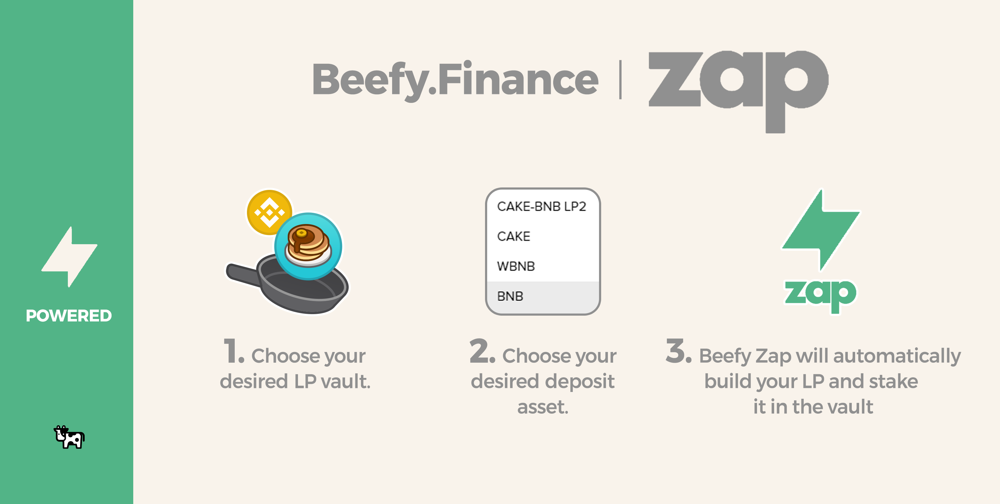
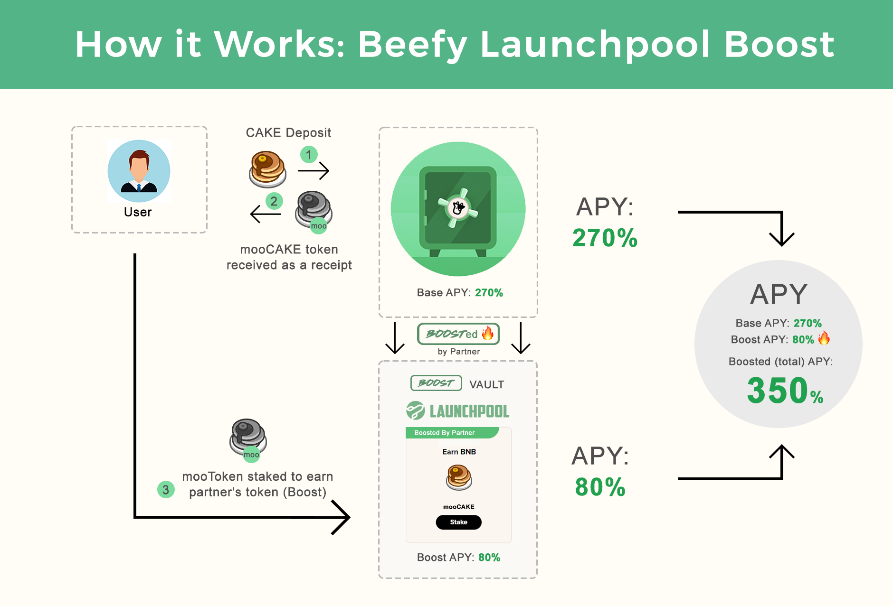

# Beefy Infographics

Here, various aspects of Beefy will be explained using easy to understand infographics.

## The yield farming steps that Beefy executes for you:

At Beefy 'you earn what you stake', regardless if this is a liquidity pool (LP) token or a single asset. In this example, staking CAKE-BNB LP will result in more CAKE-BNB LP over time. This effectively grows your share in the liquidity pool and thus allows for more and more rewards over time. All of this with Beefy doing the required work, while you can sit back and relax!

## The vault fee structure explained:

More on the vault fees [here](../ecosystem/products/vaults.md#what-is-the-vault-fee-structure).

## Beefy Zap:

Beefy Zap automatically builds your liquidity pool (LP) tokens from a base deposit asset, such as BNB. When the time has come that you want to withdraw from a LP vault, Beefy Zap also supports withdrawing back into a base asset. This saves you the hassle of manually adding and removing liquidity at a yield farm. Here's [how to use Beefy Zap](how-to-guides/how-to-beefy-zap.md)


When using Zap, always check your quote! While Zap does protect you against market slippage (price changes at the time of order and time of fulfillment), it does **not** protect you against price impact (how much your transaction will change the price of the tokens in the liquidity pool).


## Beefy Launchpool:

When a vault gets boosted in Beefy's Launchpool, you earn both the base asset and the partner's token! For more info, read the Launchpool FAQ [here](../ecosystem/products/boost.md).
