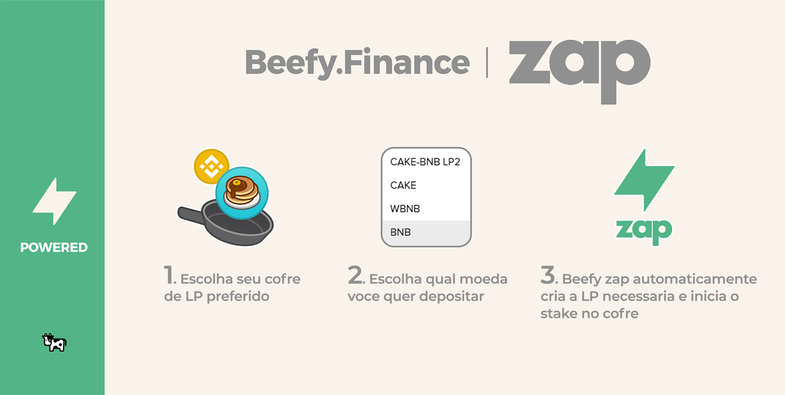

# Beefy Finance Infográficos

Aqui, vários aspectos do Beefy Finance serão explicados usando infográficos.

## As etapas de farming de rendimento que a Beefy Finance executa para você:

Na Beefy, 'você ganha o que stake', independentemente de ser um token de pool de liquidez (LP) ou um único ativo. Neste exemplo, apostar em CAKE-BNB LP resultará em mais CAKE-BNB LP ao longo do tempo. Isso aumenta efetivamente sua participação no pool de liquidez e, portanto, permite mais e mais recompensas ao longo do tempo. Tudo isso com o Beefy fazendo o trabalho necessário, enquanto você pode sentar e relaxar!

## Taxas explicadas

Mais sobre as taxas do cofre [aqui](../ecosystem/products/vaults.md#qual-e-a-estrutura-de-taxas-do-cofre).

## Beefy Zap:

O Beefy Zap cria automaticamente seus tokens de pool de liquidez (LP) a partir de um ativo de depósito básico, como BNB. Quando chegar a hora de você querer se retirar de um cofre de LP, o Beefy Zap também suporta a retirada de volta para um ativo básico. Isso evita o incômodo de adicionar e remover manualmente a liquidez em um farm de rendimento. Veja como usar o Beefy Zap


Ao utilizar o Zap, consulte sempre seu orçamento! Embora o Zap o proteja contra a derrapagem do mercado (alterações de preço no momento do pedido e no momento do atendimento), ele não o protege contra o impacto no preço (o quanto sua transação alterará o preço dos tokens no pool de liquidez).


## Beefy Launchpool:

Quando um cofre é impulsionado no Launchpool do Beefy, você ganha o ativo base e o token do parceiro! Para obter mais informações, leia as Perguntas frequentes do Launchpool [aqui](../ecosystem/products/launchpool.md).
